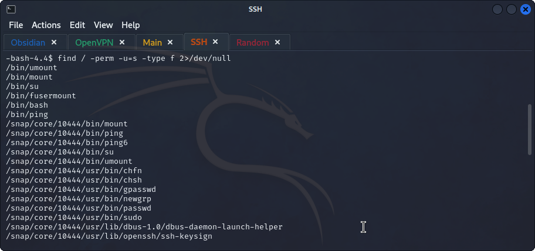
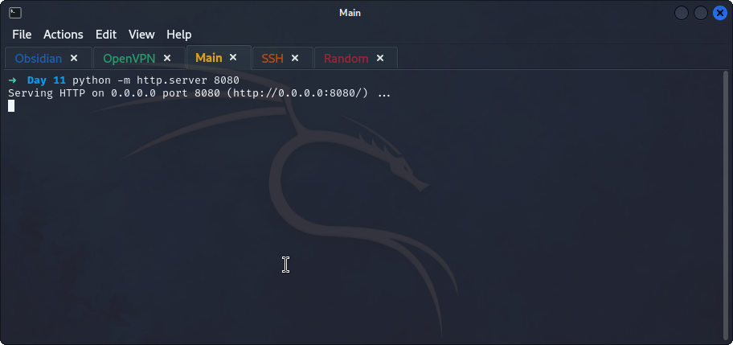
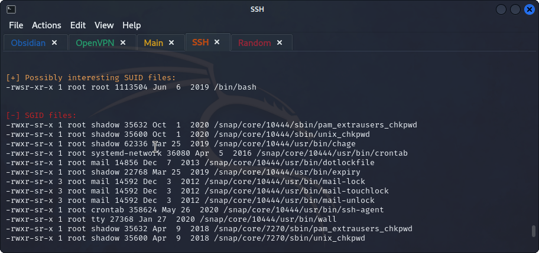
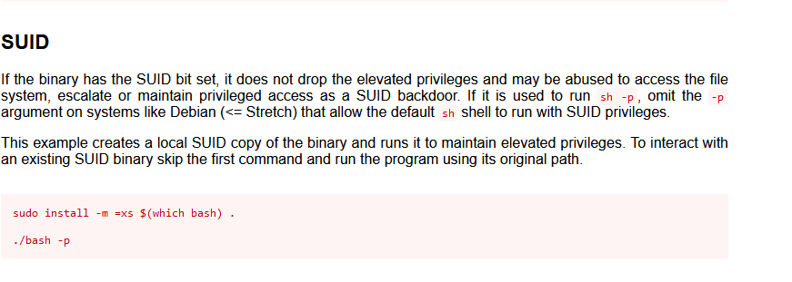
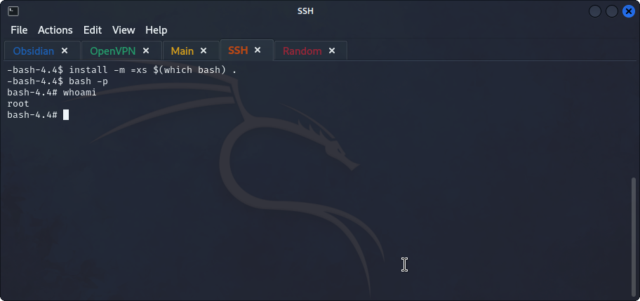

## **Enumeration**
>	- Accessing the machine through `ssh cmnatic@10.10.79.127` with the provided password.
>	- There are multiple ways of finding `SUID` files:
>		1. Using `find / -perm -u=s -type f 2>/dev/null`
>		2. Using `LinEnum.sh` and hosting it on our own machine to be downloaded.
>	- Using the first method:
>		- 
>		- `/bin/bash` and `/bin/ping` are interesting findings.
>	- Using the second method:
>		- Download `LinEnum.sh` from [GitHub](https://github.com/rebootuser/LinEnum/blob/master/LinEnum.sh).
>		- Start the HTTP server on the directory that contains the script.
>		- Use `wget` to download the script on the vulnerable machine.
>		- Run the script using `./linenum.sh`.
>			- Since this tool scans the machine for various enumeration methods and misconfigurations the output can be large.

## **Escalating Privileges**
>	- Using `GTFObins` we can search for `bash`.
>	- Multiple options available, `reverse shell`, `file upload/download`, etc... The thing we are looking for is `SUID`.
>	- Using `install -m =xs $(which bash) .` to maintain a privileged access.
>	- Flag can be found in `/root/flag.txt`.
