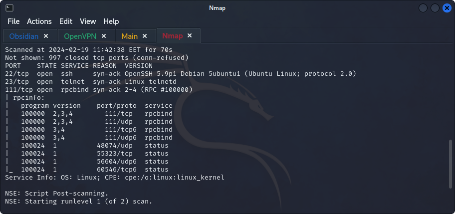
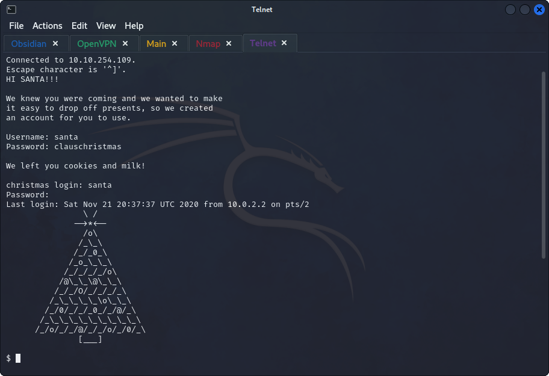
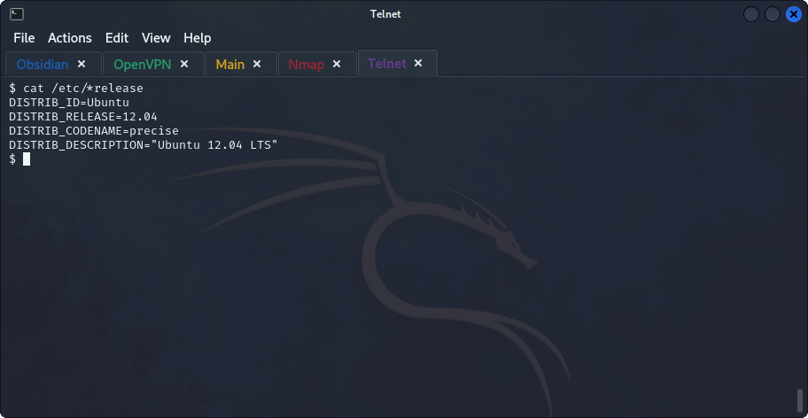
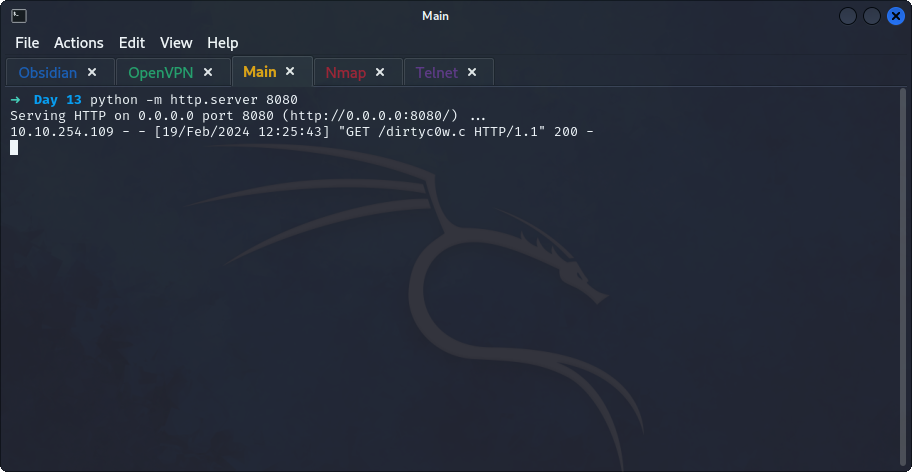
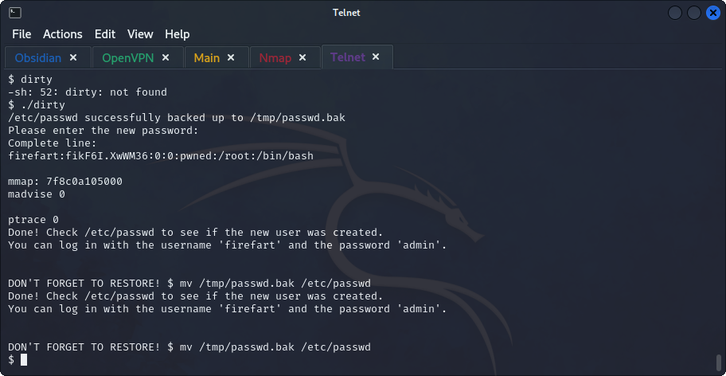

## **Port Scanning**
```
nmap -sV -sC -vv -script vuln 10.10.254.109
```
>	
>	- Old deprecated service `telnet` is being used.

## **Initial Access**
>	- Using `telnet 10.10.254.109 23`.
>	- Credentials were given in the output.

## **Enumeration**
>	- Using `cat /etc/*release`, the OS version can be found.
>	- `ls`ing shows the file `cookies_and_milk.txt`, which contains a modified version of the `diryc0w` exploit.
>	- Download the original version of `dirtyc0w` through [GitHub](https://github.com/FireFart/dirtycow/blob/master/dirty.c) and host it on the machine using `python -m http.server 8080` to be copied to the vulnerable machine with `wget`.[](wget-out.png)
>	- Compile the source with `gcc -pthread dirty.c -o dirty -lcrypt`.
>	- Run the `dirty` compiled file.
>	- Finally, the note left in `/root/` reveals what to be done.
>	- Use `tree | md5sum` to get the hash output.
