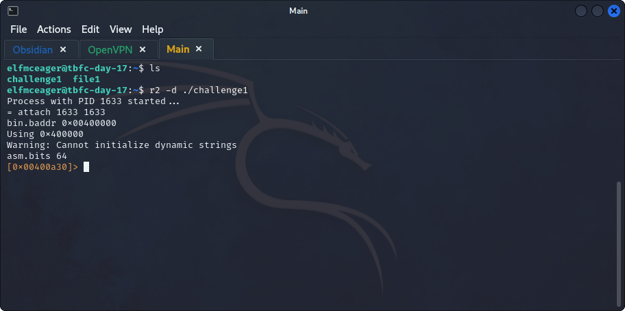
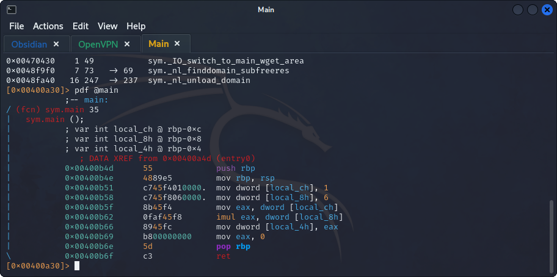
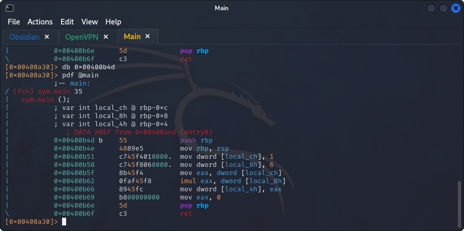
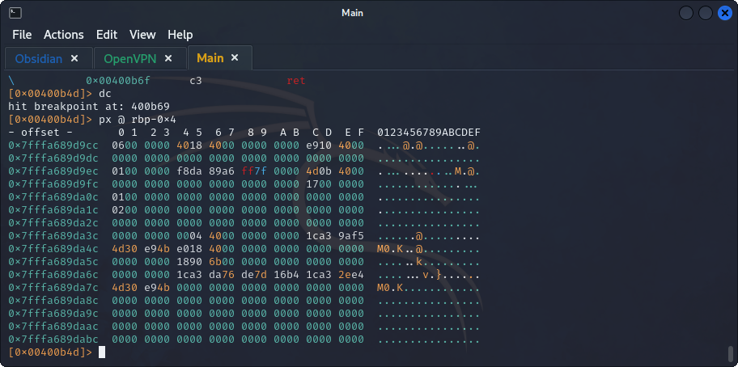

## **Analyzing the machine**
>	- Connecting to the machine using `ssh elfmceager@10.10.173.82` and the password `adventofcyber`.
>	- Using `radare2` to analyze the binaries (*Reverse Engineering*).
>	- Use the `aa` command to analyze the program.
>	- Use `afl | grep "main"` to search for the main function within the functions, then use `pdf @main` to examine the code.
>	- Put a break-point at the beginning of the code using `db 0x00400b4d`.
>	- Use `db - 0x400b4d` to remove the old break-point, then add a new one with `db 0x00400b69` at the `mov` command and execute the code.

## **Tips**
- Reload the program using `ood`.
- Remove breakpoints using `db - <memory-address>`.
- Show specific memory value using `px @ <memory-address>`
- Move through execution using `ds` and show the register variable values using `dr`.