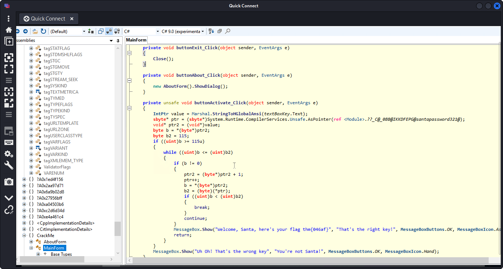

## **Analyzing the application**
>	- Using `remmina` to connect  with `rdp` to the machine with the given credentials.
>	- Use `ILSpy` to open the `TBFC_APP`.
>	- Searching through the different the functions of the `MainForm`, Santa's password and the flag can be seen through the `buttonActivate_Click` function.
>	- Password: `santapassword321`, and the flag: `thm{046af}`