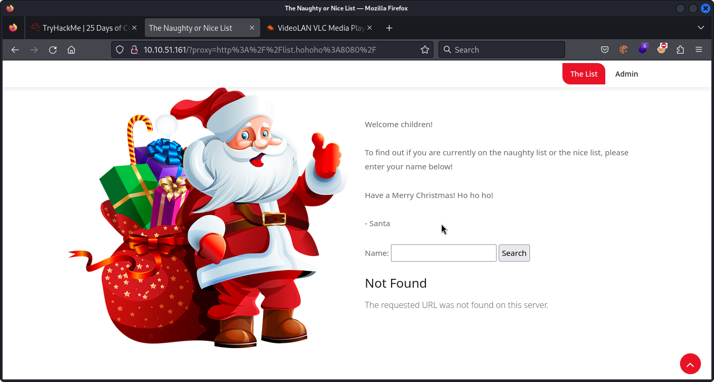

## **Accessing the website**
>	- Visiting `http://10.10.51.161/` and testing the input with a name, the URL shows an encoded parameter `http%3A%2F%2Flist.hohoho%3A8080%2Fsearch.php%3Fname%3Dtest`.
>	- Using `hURL -u http%3A%2F%2Flist.hohoho%3A8080%2Fsearch.php%3Fname%3Dtest`  to decode the value.

## **Enumeration**
>	- Testing access to the root path, encoding with `hURL -U http://list.hohoho:8080/`.
>	- `Not Found` appears instead of `{name} is on the Naughty/Nice List`.
>	- Testing different ports like `22` and `80`.
>		- Port `22` shows `Recv failure: Connection reset by peer`. Which shows that the port is open but the parameters wasn't understood.
>	- Testing `localhost` or `127.0.0.1` as the parameter value.
>	- Using `list.hohoho.localtest.me` as the parameter value to bypass the security check.
>	- Santa's password can be seen.
>	- Flag can be found after logging in `THM{EVERYONE_GETS_PRESENTS}`.