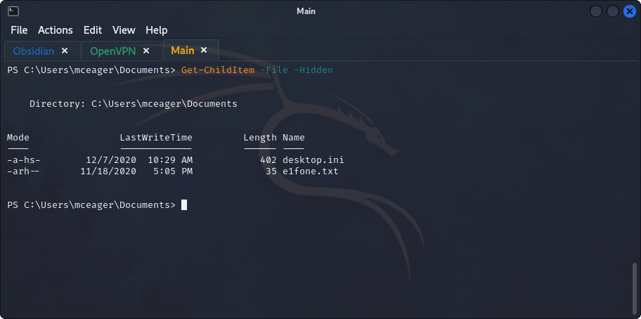
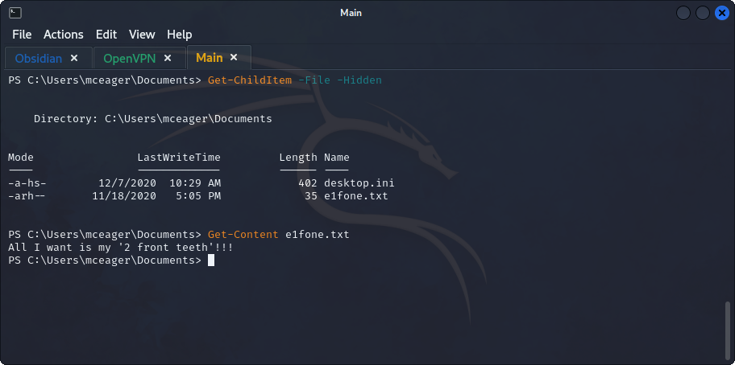
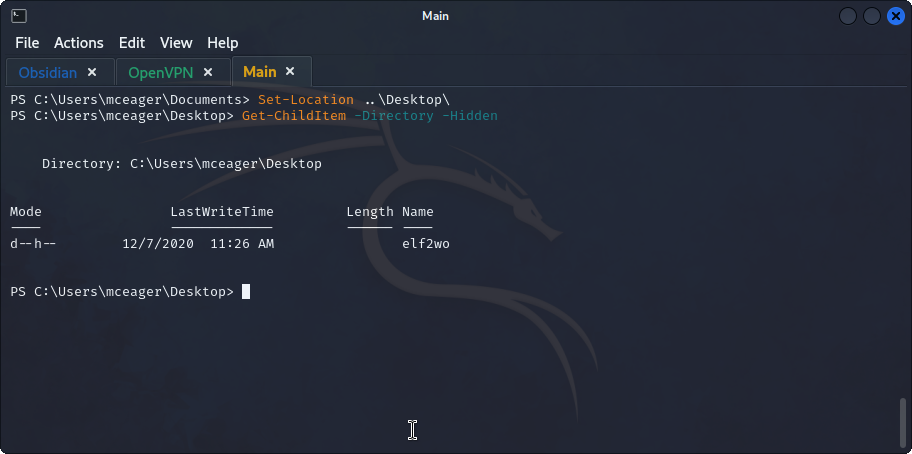
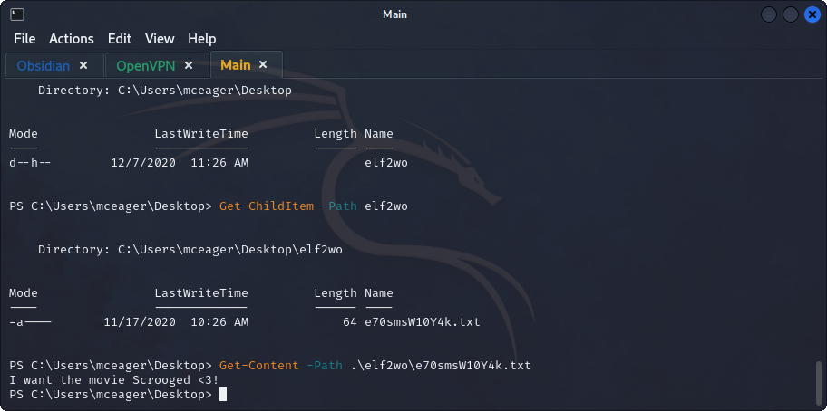
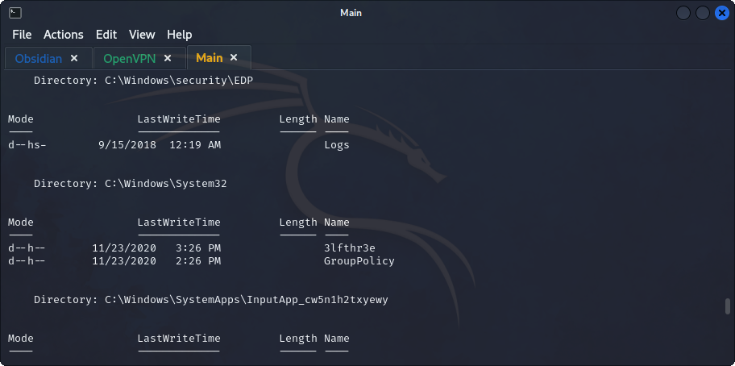
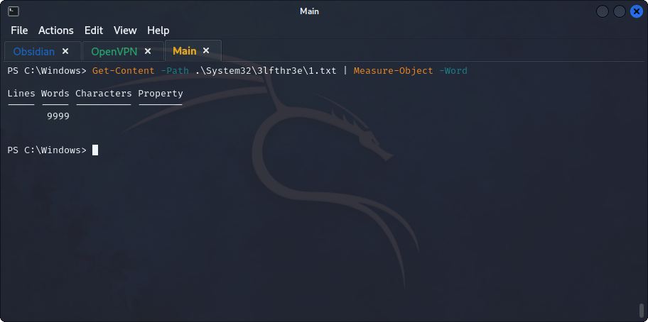
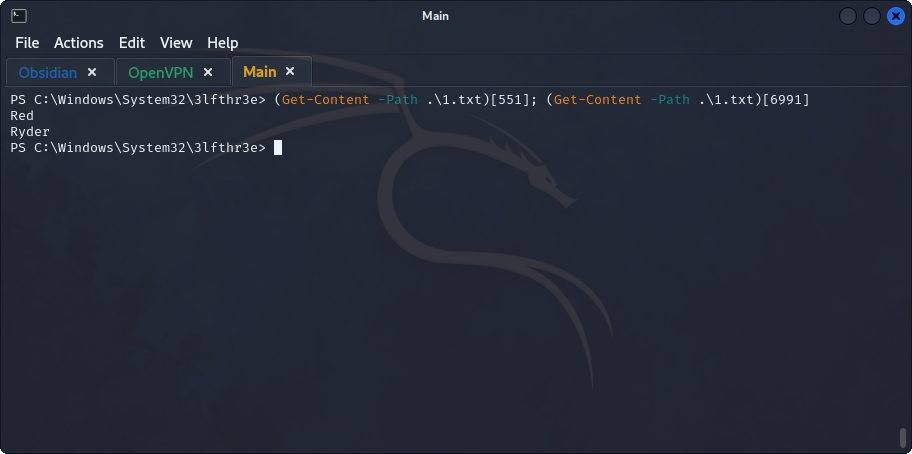
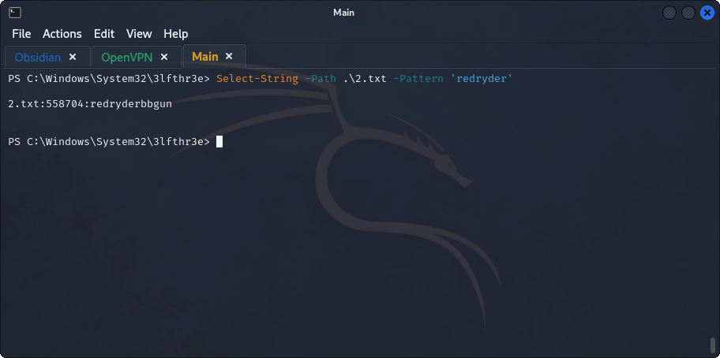

## **Enumeration**
>	- Accessing the machine using either `ssh mceager@10.10.131.5` or `ssh -l mceager 10.10.131.5` and the provided password.
>	- Open a `powershell` and change the working directory with `Set-Location .\Documents\`.
>	- Get hidden files using `Get-ChildItem -File -Hidden`, no need to specify `-Path` since we're already in the `.\Documents\` directory.
>	- Show the content of the file using `Get-Content e1fone.txt`.
>	- Changing working directory to `\Desktop\` and showing the hidden directories using `Get-Content -Directory -Hidden`.
>	- Showing the files in the found directory and getting their content.
>	- Use `Get-ChildItem -Directory -Recurse -Hidden -ErrorAction SilentlyContinue` to find the required hidden folder.
>	- Use `Get-Content -Path .\System32\3lfthr3e\1.txt | Measure-Object -Word` to count the words in the first file.
>	- Use `(Get-Content -Path .\System32\3lfthr3e\1.txt)[551]` to get the words at indexes `551` and `6991`.
>	- Use `Select-String -Path .\2.txt -Pattern 'redryder'` to get the search for the string `RedRyder` in the second file.