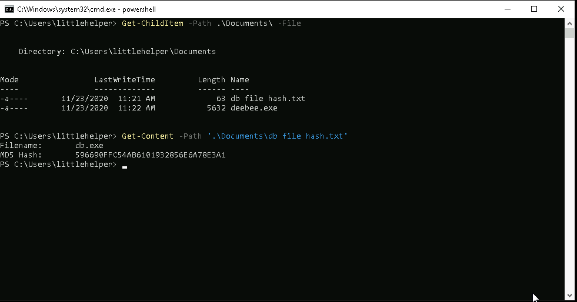
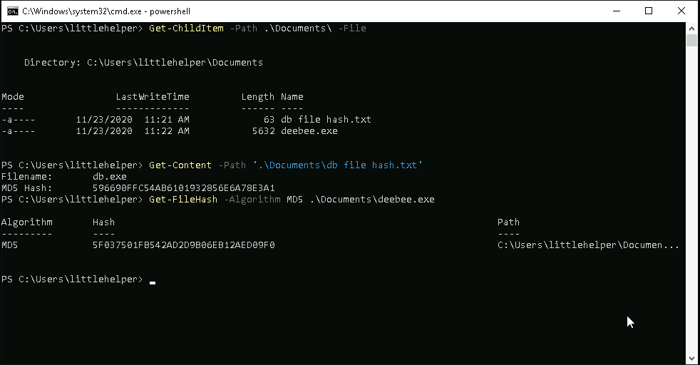
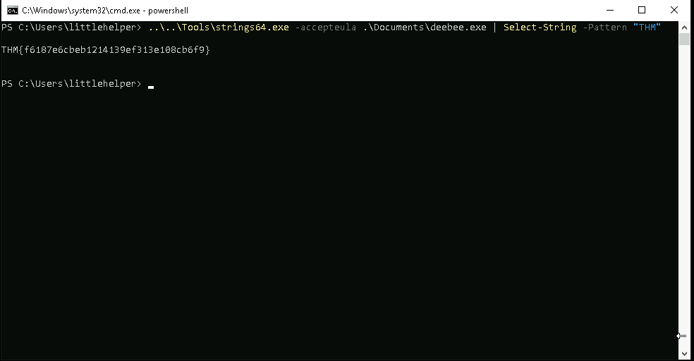
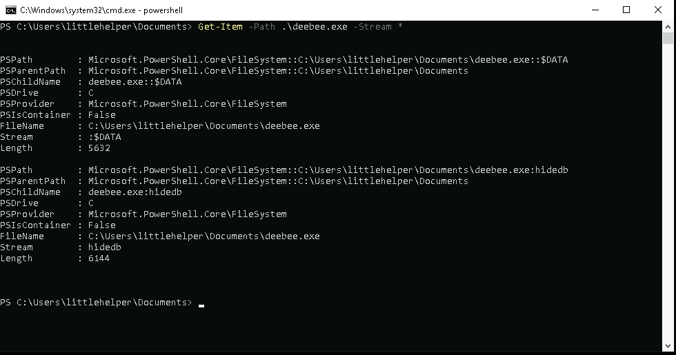
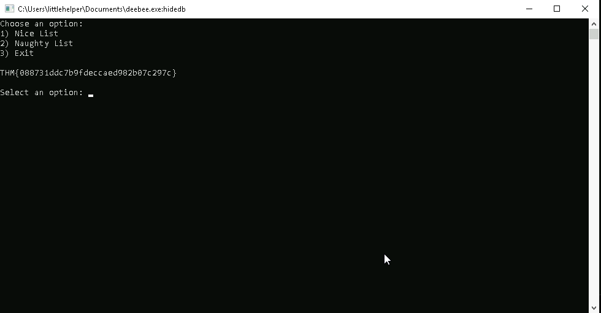

## **Enumeration**
>	- Accessing the machine using `remmina` and the provided credentials.
>	- Use `Get-Content -Path '.\Documents\db file hash.txt'` to get the show the contents.
>	- Hash the `.exe` file using `Get-FileHash -Algorithm MD5 .\Documents\deebee.exe`.
>	- To get the flag, you can use `..\..\Tools\strings64.exe -accepteula .\Documents\deebee.exe` and skim through visually till you find the flag, *OR* use `Select-String` to only capture the flag as follows `..\..\Tools\strings64.exe -accepteula .\Documents\deebee.exe | Select-String -Pattern "THM"`.
>	- Use `Get-Item -Path .\deebee.exe -Stream *` to get the streams in the executable file.
>	- Use the found stream `:hidedb` to launch the hidden executable within `ADS` as follows `wmic process call create $(Resolve-Path .\deebee.exe:hidedb)`. This will open a new `powershell` session and the old version of the db connector runs.