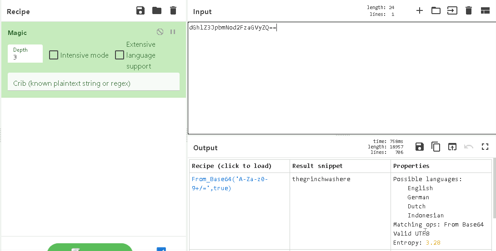
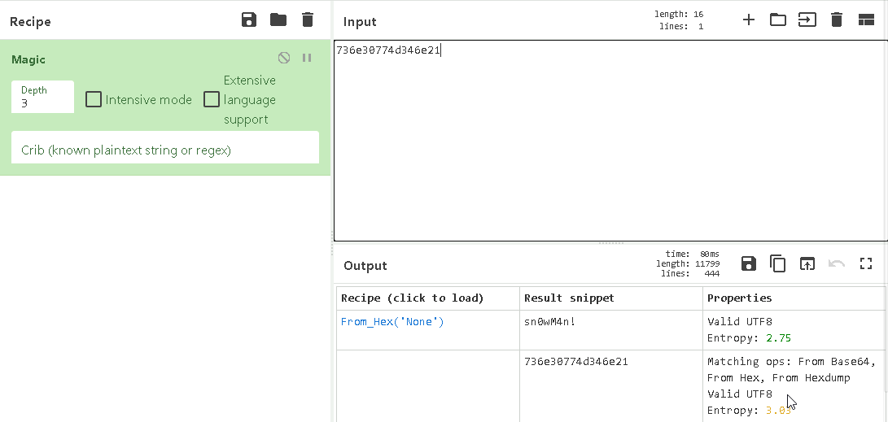
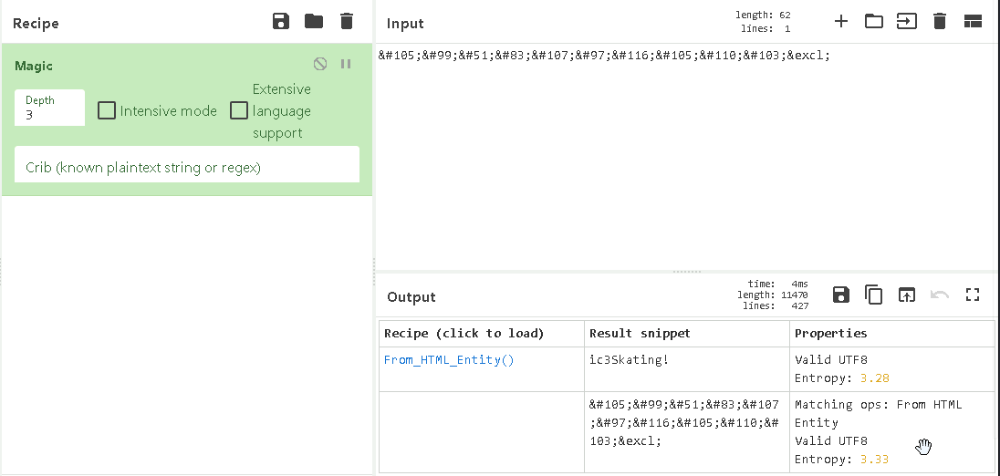
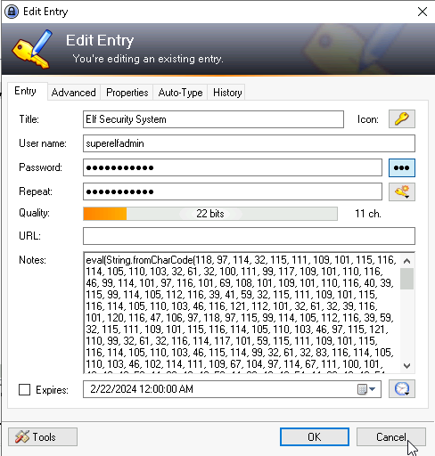
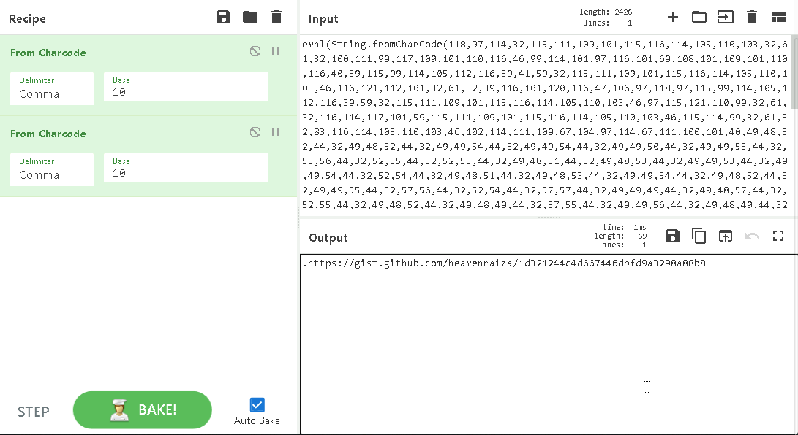

## **Enumeration**
>	- Accessing the machine using `remmina` and the provided credentials.
>	- Use `CyberChef` which opens a locally hosted html page that encodes and decodes, to decode the folder name `dGhlZ3JpbmNod2FzaGVyZQ==`.
>	- Drag the `magic` recipe to the Recipe section and add the folder name to the input to get the possible encoding.
>	- Use the decoded value of `thegrinchwashere` to access the `KeePass` password manager.
>	- Within `KeePass` you can see the left note from the Grinch, going through the different sections, in the `Network` section, the server password is encrypted as well `736e30774d346e21`.
>	- Use the same process to decrypt it.
>	- Within email section, the `elfmail` password `&#105;&#99;&#51;&#83;&#107;&#97;&#116;&#105;&#110;&#103;&excl;` can be decrypted with `magic` recipe as well.
>	- This time the last encoded password isn't in the password section, but rather in the notes.
>	- Use recipe `From Charcode` twice in order to fully decode it.
>	- Access the link to get the final flag. *The GitHub page is down*, so, the flag is `THM{657012dcf3d1318dca0ed864f0e70535}`.