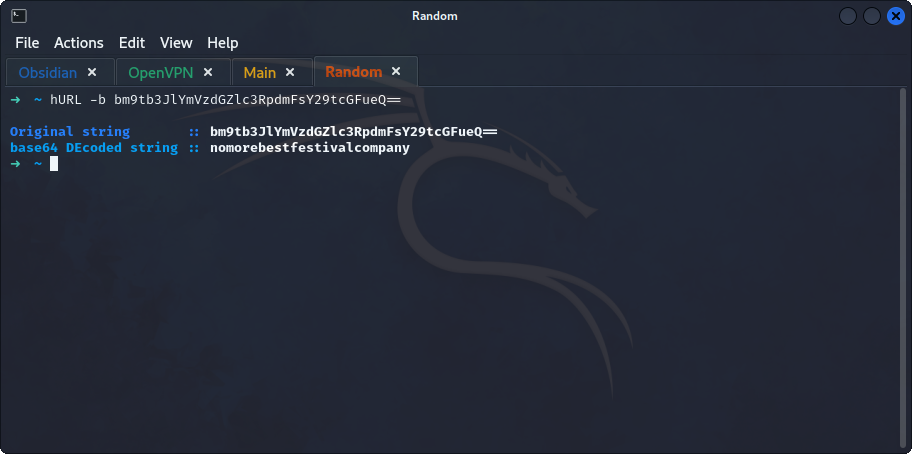
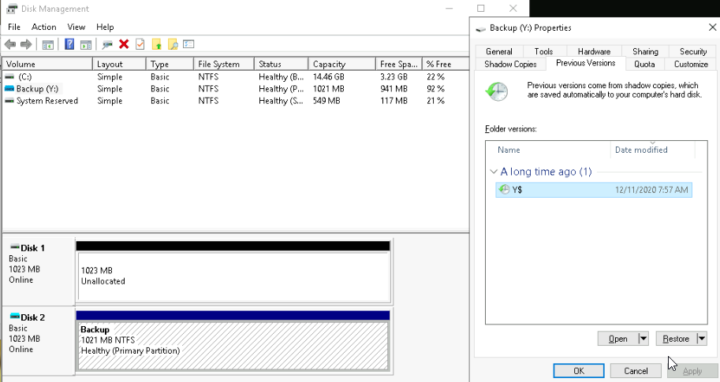
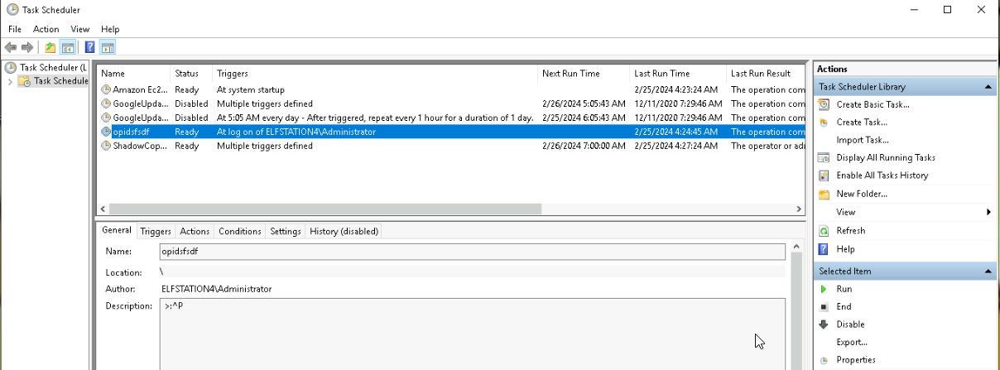

## **Enumeration**
>	- Access the machine using `remmina` with the provided credentials.
>	- Notice the `RansomNote.txt` file, contains an encoded bitcoin address, decode it using `hURL -b bm9tb3JlYmVzdGZlc3RpdmFsY29tcGFueQ==`.
>	- Going to the `Disk Management` to view the partitions available.
>	- A `backup` partition appears but can't be viewed from explorer. Assign a letter by `right-click > Change drive letter and Paths...` and choose a letter of your preference.
>	- Right click on the partition and select `properties` then go to `Previous Versions` and restore the old version.
>	- In the `Task Scheduler` a task named `opidsfsdf` can be found which is the source of the ransomware.
>	- Through the properties it can be found out that this task runs a `.exe` file located at `C:\Users\Administrator\Desktop\opidsfsdf`.
>	- By enabling `View > Hidden Items` in the File Explorer, the hidden folder `confidential` can be seen.
>	- Digging deeper by going to the properties and restoring the older version of the folder, the old password can be retrieved which is `m33pa55w0rdIZseecure!`.