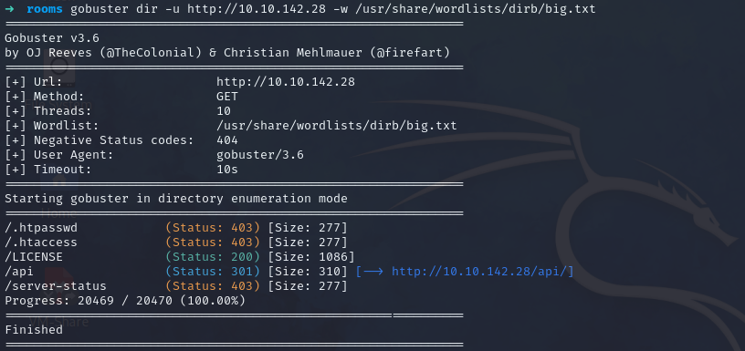
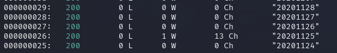

## **Gobuster**
>	- Used `gobuster` to directory search the website.
```
gobuster dir -u http://10.10.142.28 -w /usr/share/wordlists/dirb/big.txt 
```

>	- Visited `/api` to find a file named `site-log.php`.
## **Fuzzing**
>	- Used `wfuzz` with the provided word list with the date format implemented.
```
wfuzz -c -z file,advent-cyber-wordlist http://10.10.142.28/api/site-log.php\?date\=FUZZ
```
>		- `-c` for colored output.
>		- `-z` to specify the used word list.
>	- Going to the path `/api/site-log.php?date=20201125` shows the flag required `THM{D4t3_AP1}`.
>