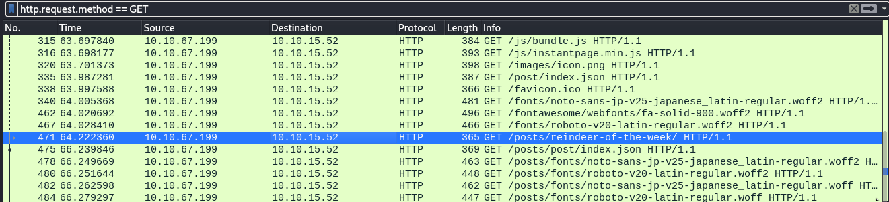
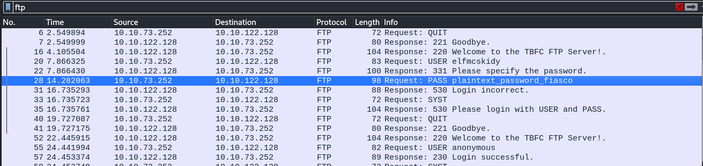
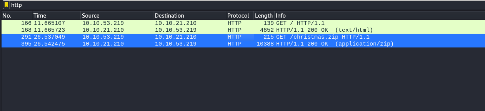
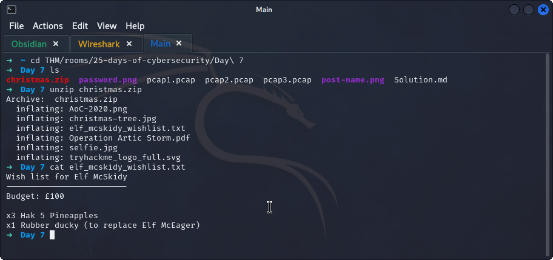

## **PCAP 1**
>	- Filter with `icmp`.
>	- Filter with `http.request.method == GET` then search for a request to `/posts/` with `HTTP GET`.

## **PCAP 2**
>	- Filter with `ftp`.
>	- Search in the `info` of requests for something relating to `password`.

## **PCAP 3**
>	- Analyzing the traffic, you would see some `SSH`, `TCP`, and `HTTP` traffic, the `HTTP` ones would be interesting.
>	- Filter with `http`.
>	- The `GET` request for `/christmas.zip` is interesting.
>	- Export the `christmas.zip` file by going to `file > Export Objects > HTTP > christmas.zip`.
>	- By extracting the `zip`, `elf_mcskidy_wishlist.txt` can be found.

