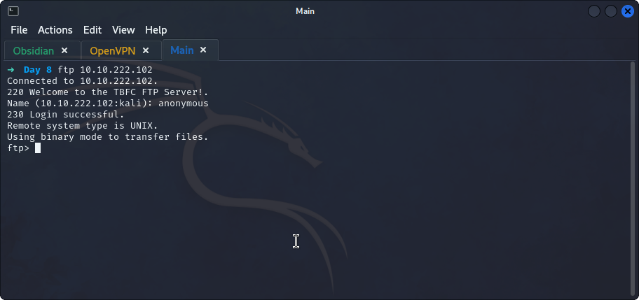
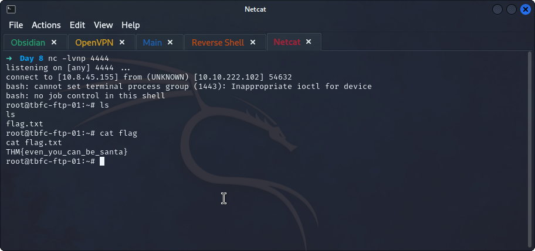

## **Accessing the machine**
>	- Accessing the `ftp` server using `ftp MACHINE_IP` with `anonymous` user.
>	- Download the `backup.sh` file from `/public/` using `get /public/backup.sh`.
## **Exploiting**
>	- Editing the file to put a reverse shell.
>	- Set up a `netcat` listener using `nc -lvnp 4444`.
>	- Upload `backup.sh` to the ftp server using `put backup.sh`.
>	- Wait for the script to run (1 min).
>	- Required `flag.txt` can be found.