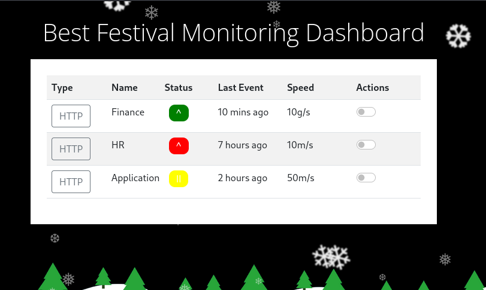

## *Cookie Exploitation*
>	- Visiting the static site provided and registering a new account.
>	- Viewing the Developer Tools to see the cookie created.
>	- Using CyberChef to get the encoding type.
>	- From the decoded output, it is in JSON format.
>	- Using the decoded output and changing the username to `admin` to get the cookie and login as that user.