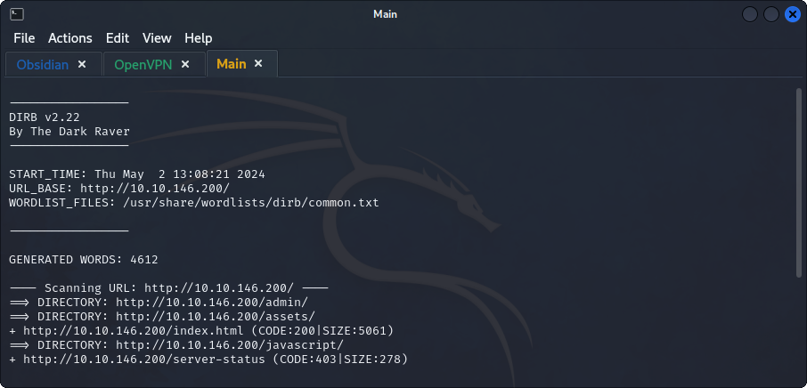
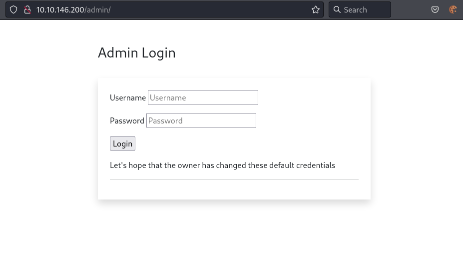
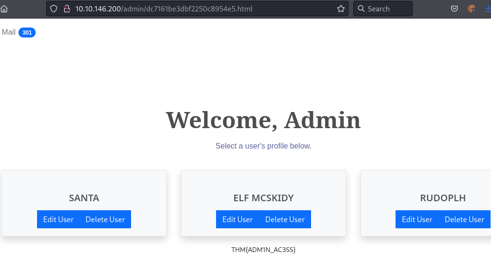

## *Content Discovery*
>	- Using `dirb` to recursively check for hidden directories and files.
>	- An `/admin` login page is found.
>	- Trying some default credentials, the obvious being `administrator:administrator`.