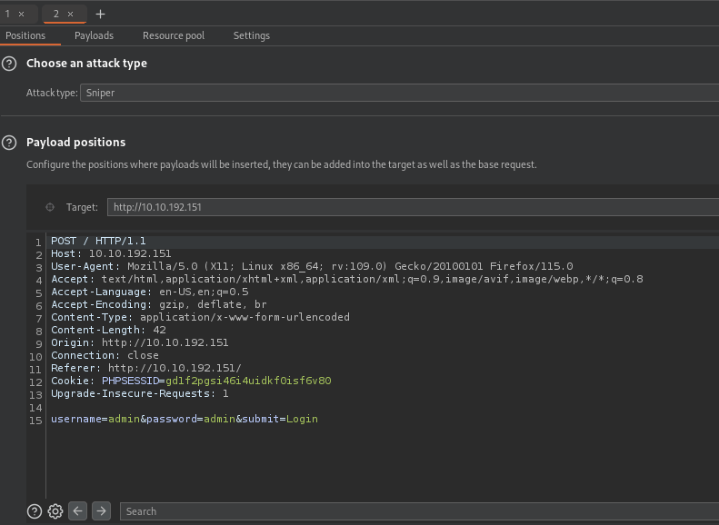
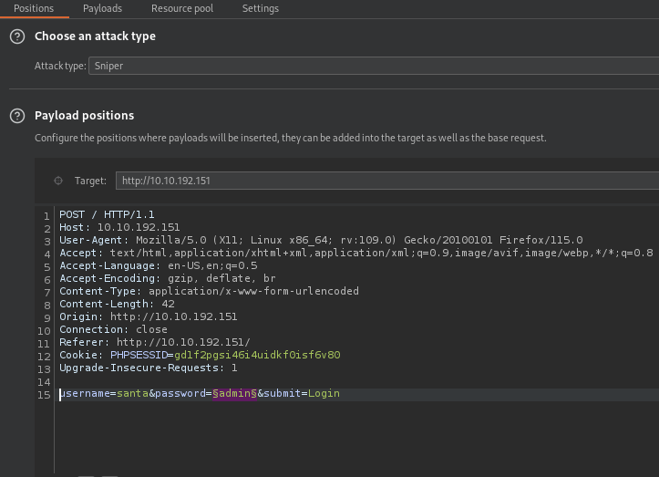
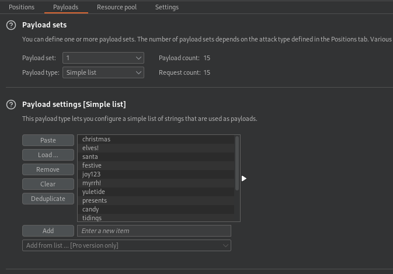
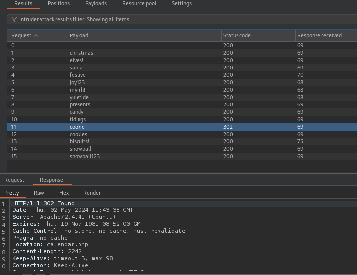

## *Fuzzing*
>	- Using Burpsuite to bruteforce the credentials of the login page.
>	- Grab the POST request and send it to the intruder using `CTRL + I`.
>	- Setting the variable on the password parameter value.
>	- Loading the provided passwords list as the payload and starting the attack.
>	- Santa's password found, the only request that its equivalent response  had a redirect and no "Invalid username and password" output.
>	- Accessing with the found credentials to get the flag.
>	- 