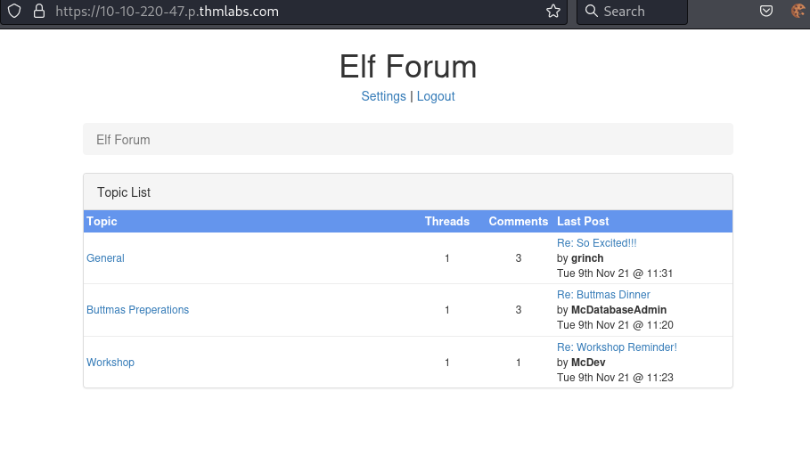
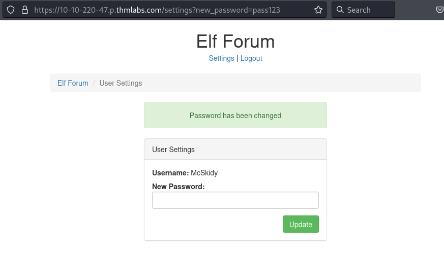
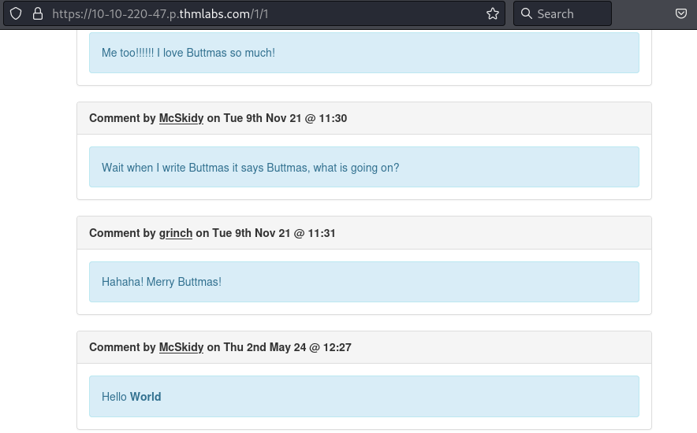
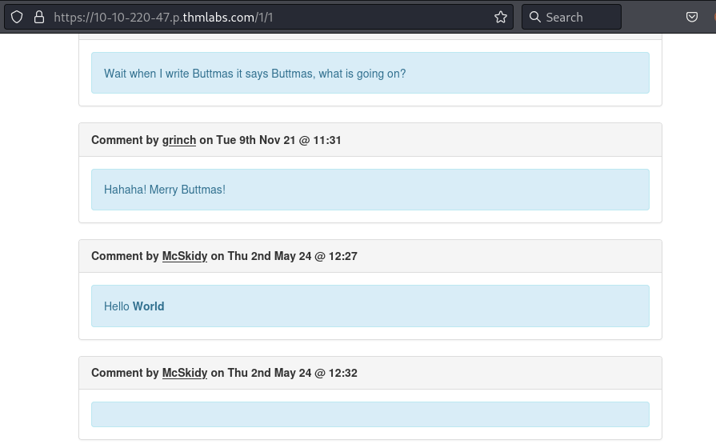
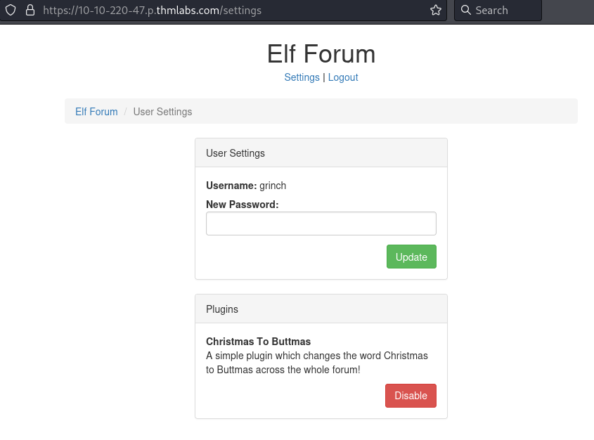
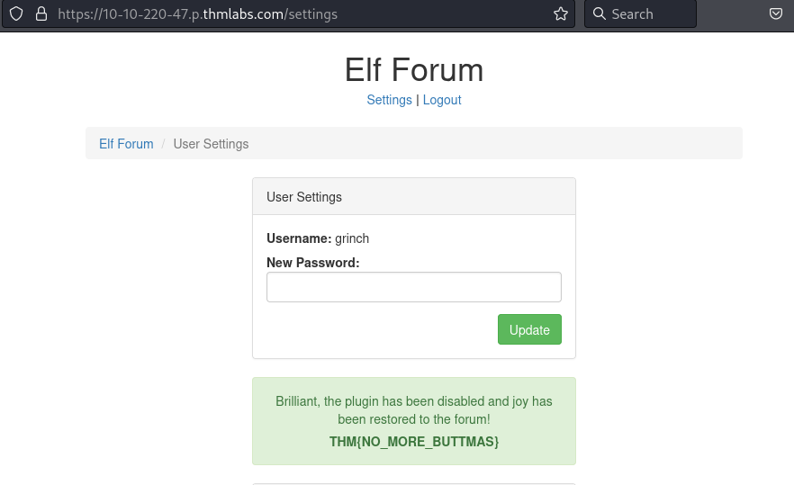

## *XSS*
>	- Accessing the website and logging in with the provided credentials.
>	- Going to the Settings page and trying to change password, shows the new password as a query in the URL.
>	- Visiting the threads and trying to embed an html tag in a comment using `Hello <b>World</b>`.
>	- Now using the found vulnerability in the Settings page to change The Grinch's password.
>	- Adding a comment `` which would send a request for anyone that views the thread with that comment to change their password to `pass123`.
>	- After a couple of seconds, Try to login with the credentials `grinch:pass123`.
>	- Going to the Settings page, the plugins are present, disable the `Christams to Buttmas` plugin.
>	- The flag can be seen after disabling the plugin.