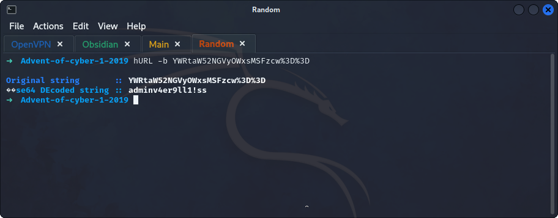

## **Enumeration**
>	- Accessing the website `http://10.10.34.43:3000`, and registering a random account
>	- Going to any cookie editor can give us the name of the authentication cookie which is `authid`.
>	- Decoding the cookie value with `hURL -b YWRtaW52NGVyOWxsMSFzcw%3D%3D`.
>	- Notice the cookie has the `username` used when registering and a *fixed* part which is `v4er9ll1!ss`.
>	- Using `Cyberchef` to encode a cookie value for `mcinventory`.
>	- Editing the cookie to gain access to `mcinventory`'s account.