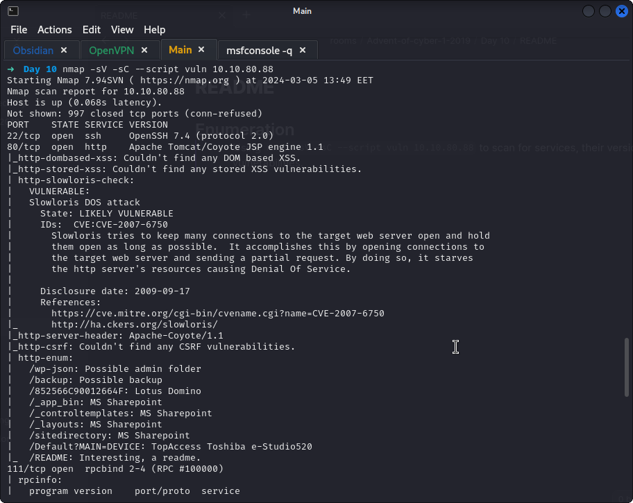
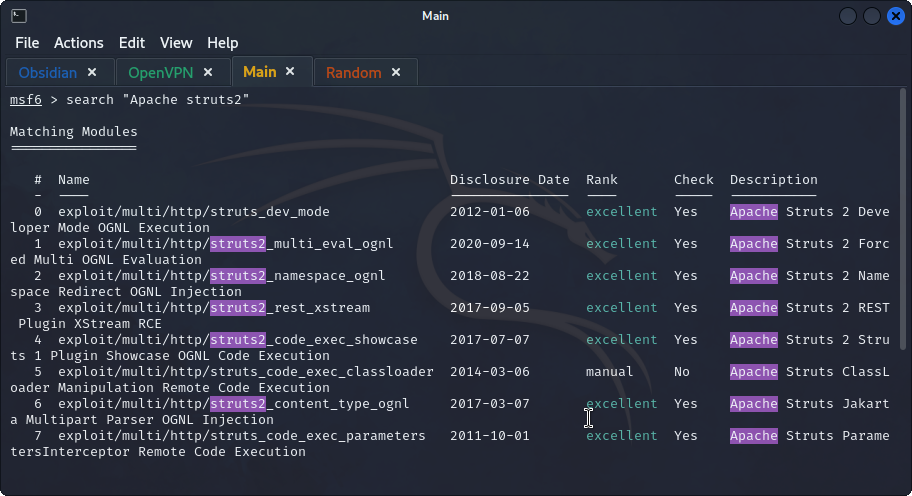
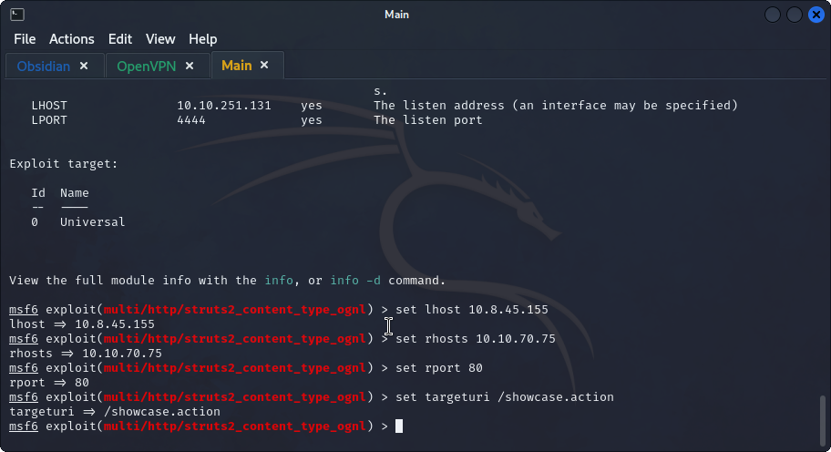
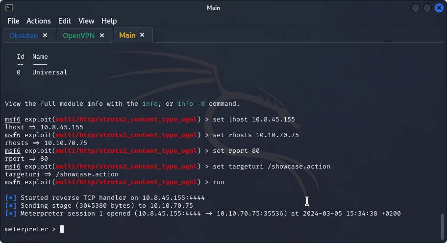
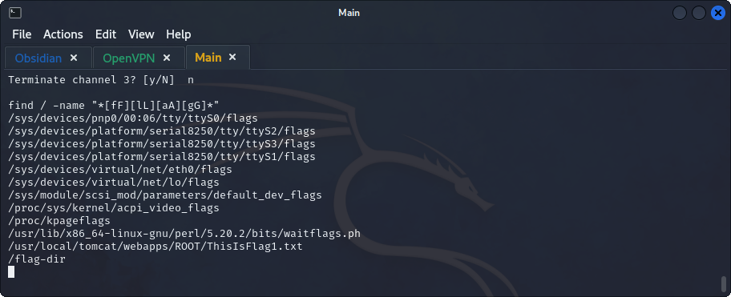
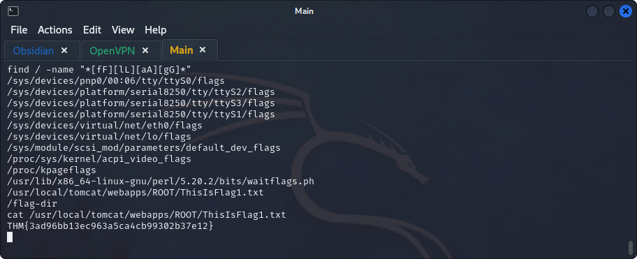
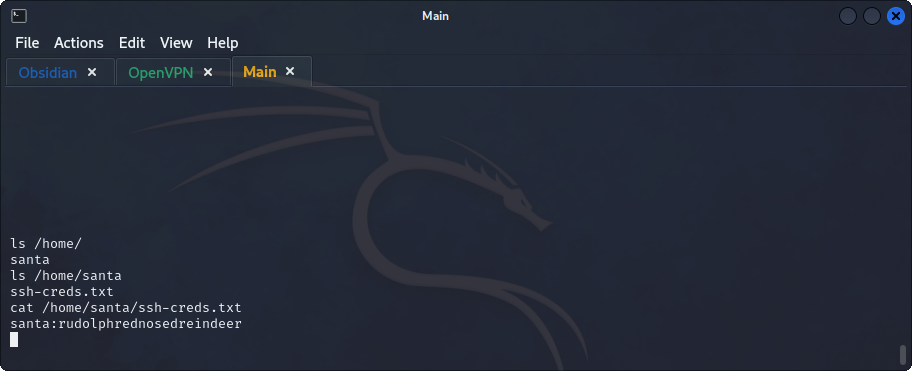
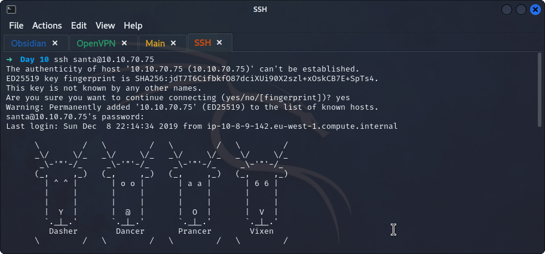
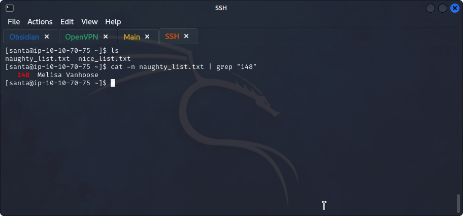
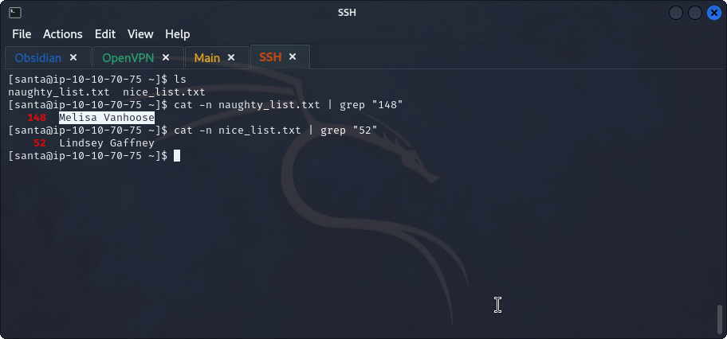

## **Enumeration**
>	- Using `nmap -sV -sC --script vuln 10.10.80.88` to scan for services, their versions, and vulnerabilities.
>	- Searching for `Apache struts2` in `msfconsole`.

## **Exploitation**
>	- After a couple of tries, we use the module `exploit/multi/http/struts2_content_type_ognl` and change the parameters appropriately.
>	- We run the command and get the `meterpreter` session.
>	- Searching for the flag using `find / -name "*[fF][lL][aA][gG]*` to find any variations of the name.
>	- The flag can be found at `/usr/local/tomcat/webapps/ROOT/ThisIsFlag1.txt`.

## **Enumeration v2**
>	- Searching for users' directories using `ls /home/`, `santa` user can be found, digging deeper, a file containing `santa`'s ssh credentials can be found.
>	- Using the found credentials to log in.
>	- Both `naughty` and `nice` lists can be found, using `cat -n naughty_list.txt | grep "148"` to find the 148th entry in the `naughty_list.txt`.
>	- Use the same concept to get the 52nd entry in the `nice_list.txt`.
