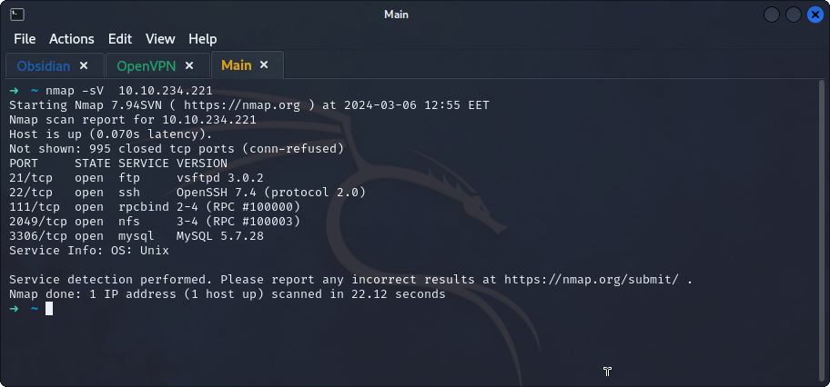
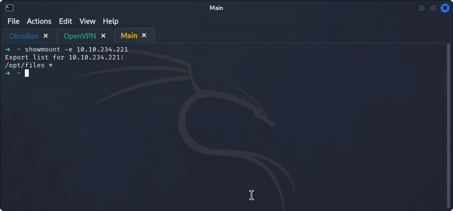
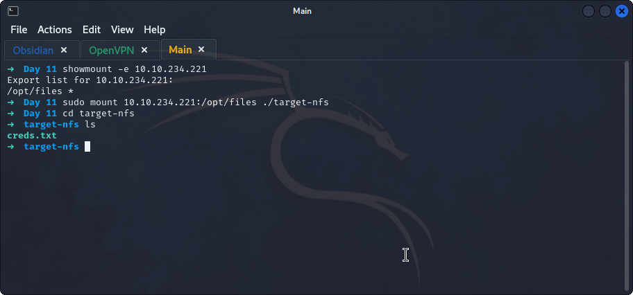
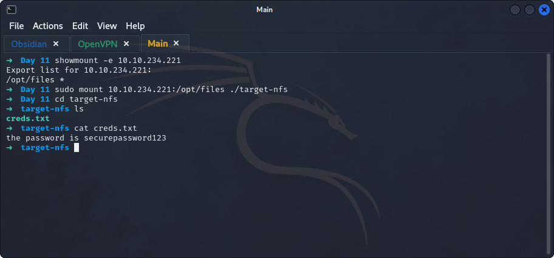
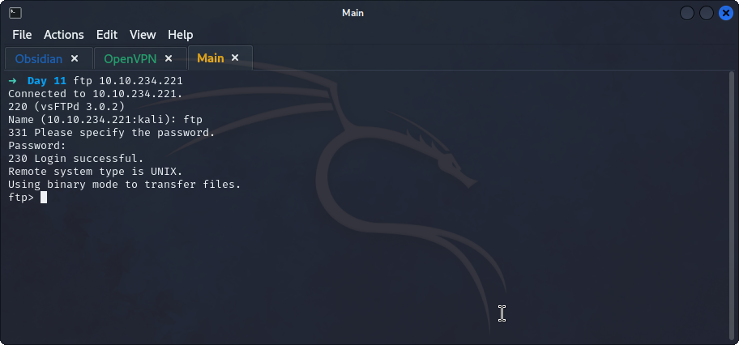
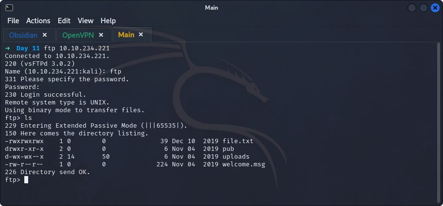
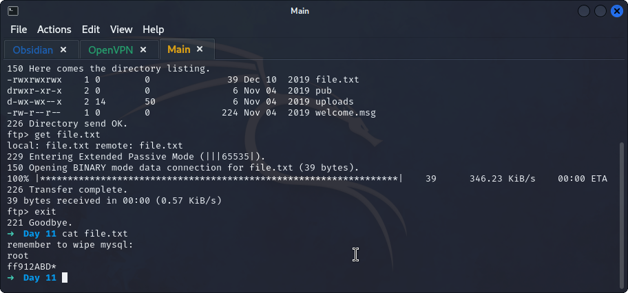
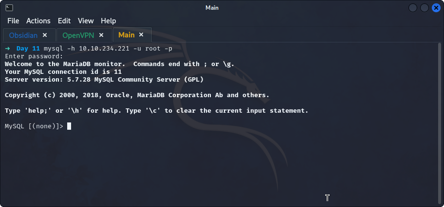
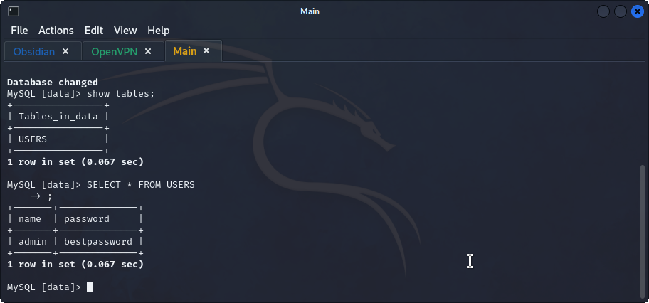

## **Enumeration**
>	- Using `nmap` to scan for services and their versions.
```
nmap -sV 10.10.234.221
```
>	- 
>	- An NFS service is running, use `showmount -e 10.10.234.221` to view all shareable NFS directories.
>	- Mount the found directory to a local directory for viewing using `sudo mount 10.10.234.221:/opt/files ./target-nfs/`.
>	- The password can be found.
>	- From the previous scan, an `FTP` server can be seen, try to access it with the found password `securepassword123`.
>	- The required file an be found.
>	- Using `get file.txt` to download the file on our machine.
>	- Again, from the previous scan, `MySQL` server is running on port `3306`, try to access the server using `mysql -h 10.10.234.221 -u root -p` and when prompted for the password, enter the one gained from the `FTP` text file.
>	- Enumerating the database to view interesting data, the database called `data` contains a table called `USERS` which contains usernames and passwords.
