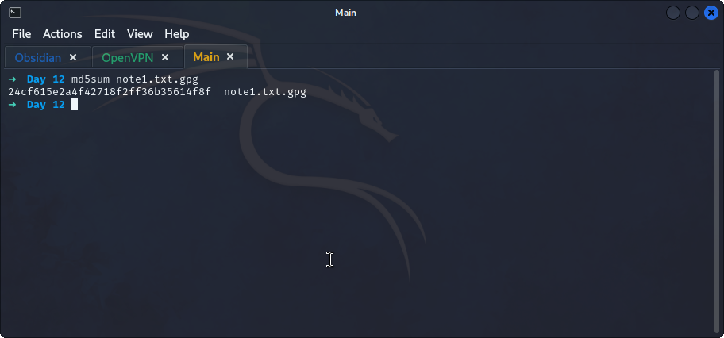
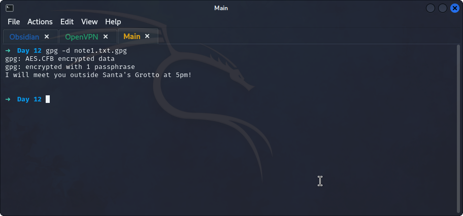
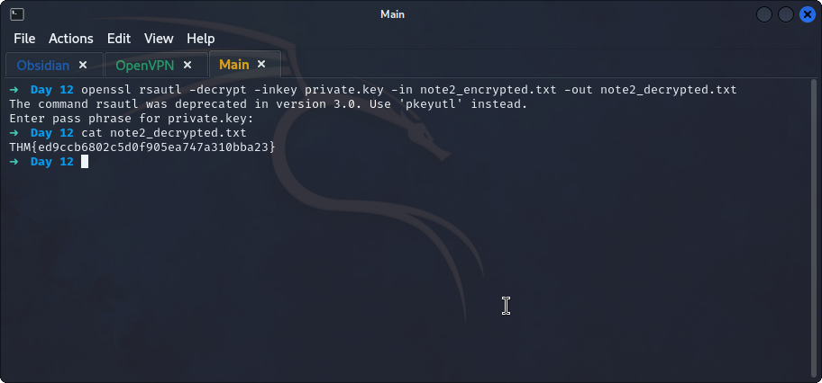

## **MD5**
>	 - Use `md5sum note1.txt.gpg` to get the hash value of the file.

## **GPG**
>	- Using `gpg -d note1.txt.gpg` and the secret key `25daysofchristmas` to decrypt the file.

## **Openssl**
>	- Using `openssl rsautl -decrypt -inkey private.key -in note2_encrypted.txt -out note2_decrypted.txt` and when prompted the password is `hello` to decrypt the file.