## **Enumeration**
>	- Using `nmap` to scan for services and their versions.
```
nmap -Pn -sV 10.10.1.110
```
>	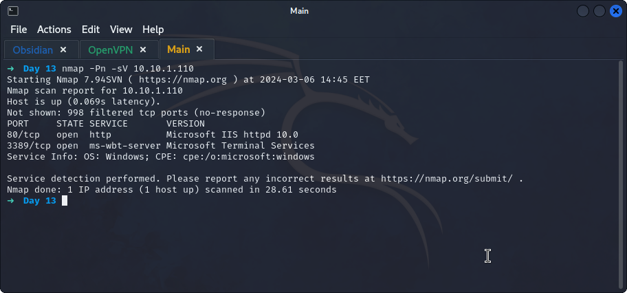
>	- A web server can be found running on port `80`.
>	- Using `gobuster dir -u http://10.10.1.110/ -w /usr/share/wordlists/dirbuster/directory-list-1.0.txt --no-error` to search for hidden directories.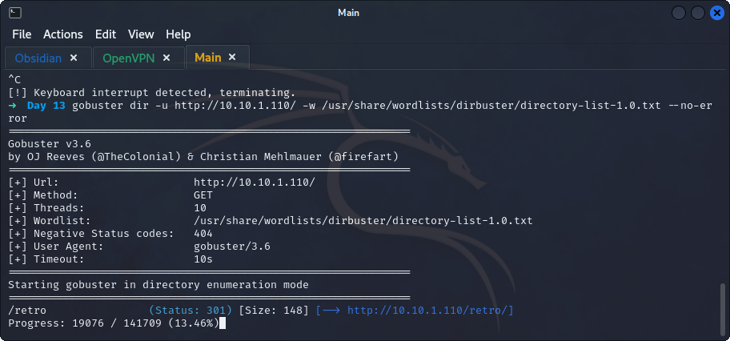
>	- Going through the posts on the blog, it seems that the user `Wade` owns this website. Digging deeper through his posts and comments, one blog comment seems interesting.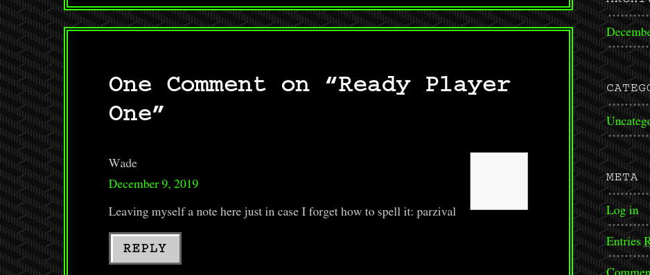
>	- Performing another `gobuster` search on the found path.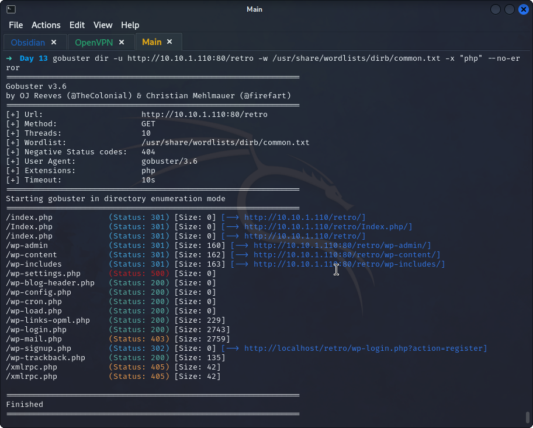
>	- *Interesting* directories found :
>		- `wp-admin`, `wp-content`, and `wp-includes` had no permissions to access them.
>		- `wp-login.php`
>		- `wp-signup` which redirects to a `localhost` website.
>	- Using the credentials `wade:parzival` to access the `wp-admin` dashboard.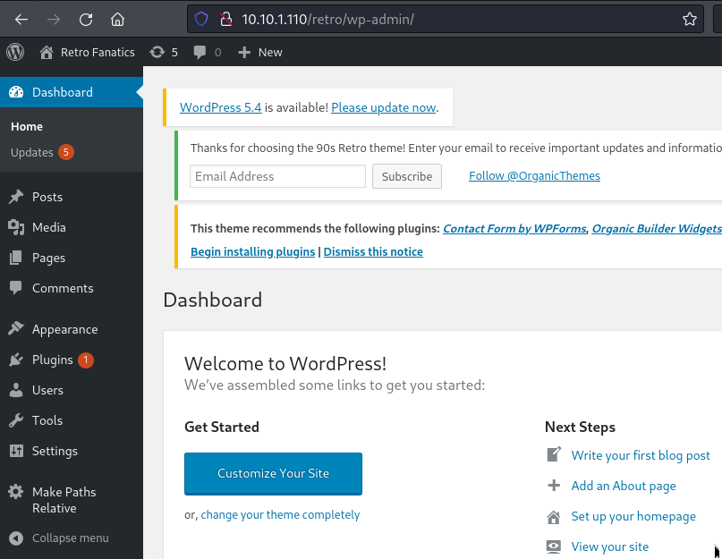
>	- Didn't find anything of interest.
>	- Trying to `RDP` using `remmina` on the host.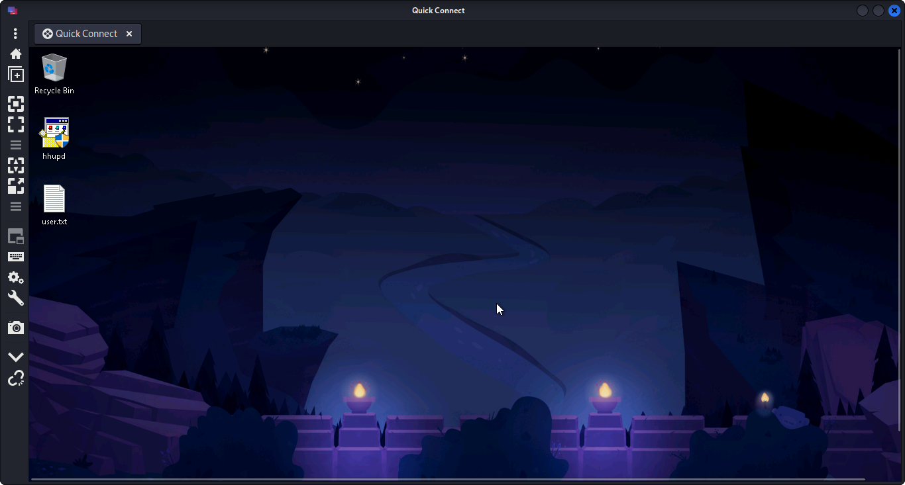
>	- `User.txt` file found.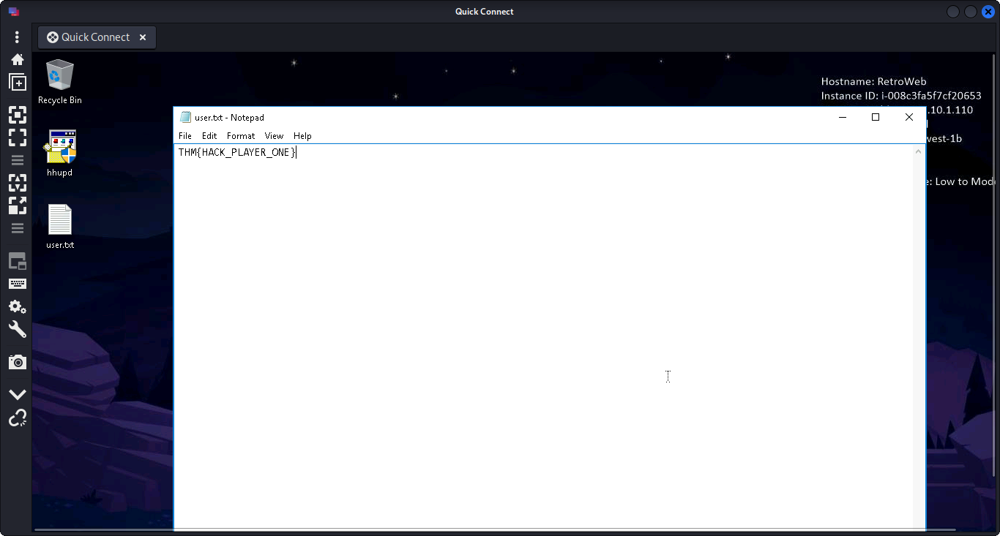

## **Privilege Escalation**
>	- From the given hint, check the web history which shows that the user tried to search for a patch for `CVE-2019-1388`.
>	- A quick search on the CVE shows the vulnerability.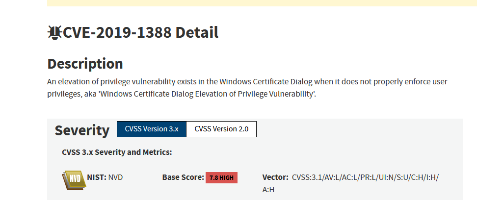
>	- The vulnerability exploits the Windows Certificate Dialog process to open up a system process that opens a web page, which can be abused by trying to save the page and while in the `Save file` dialog open up `cmd` as administrator.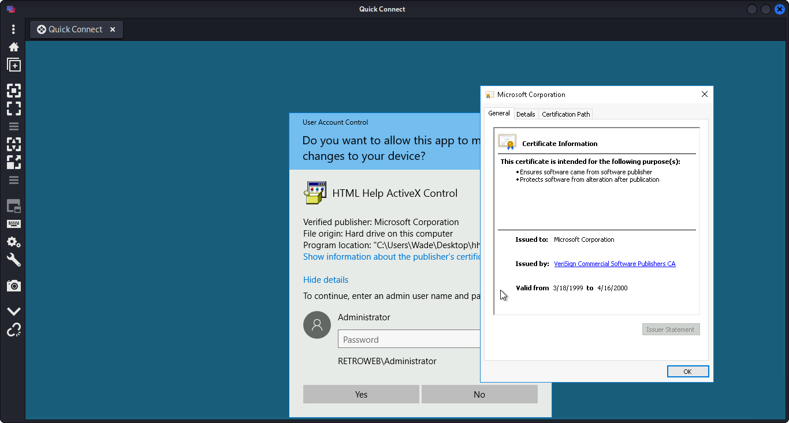
>	- 
>	- 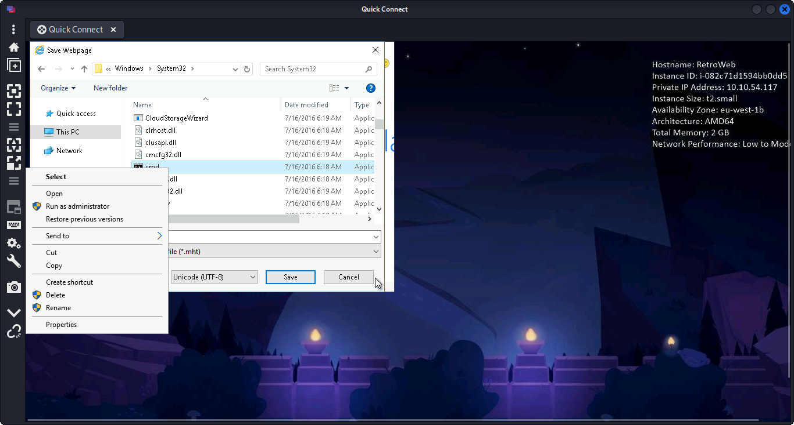
>	- 
>	- 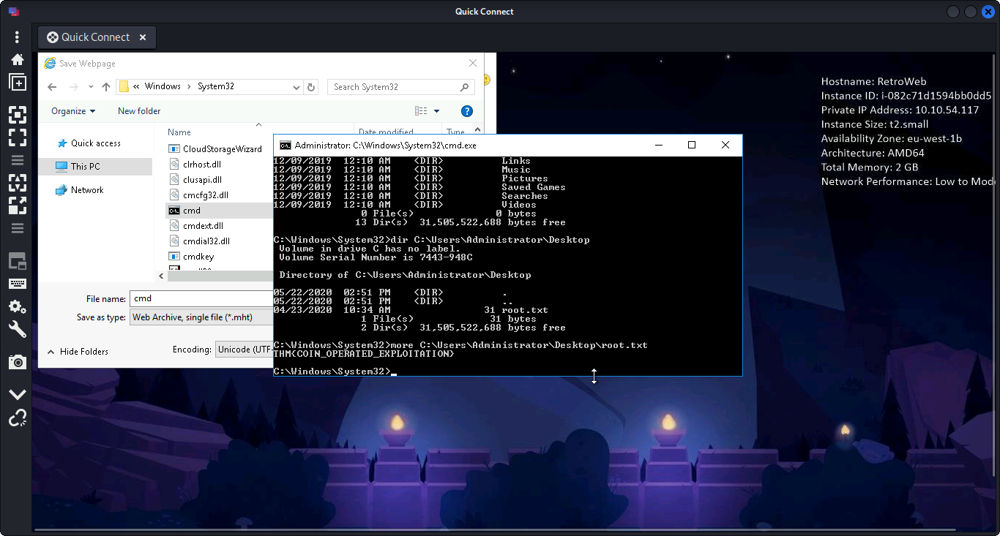