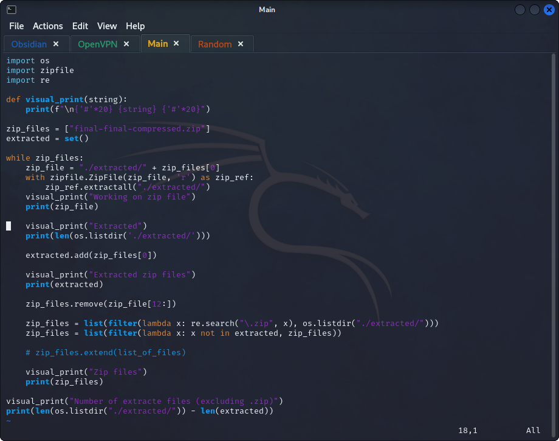
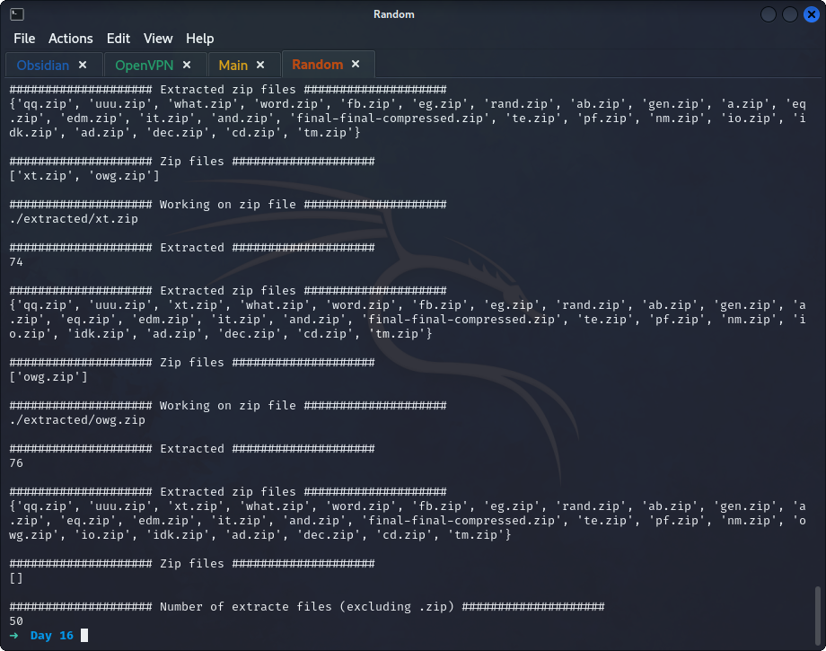
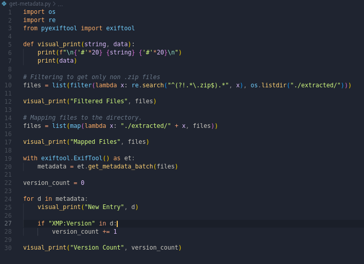
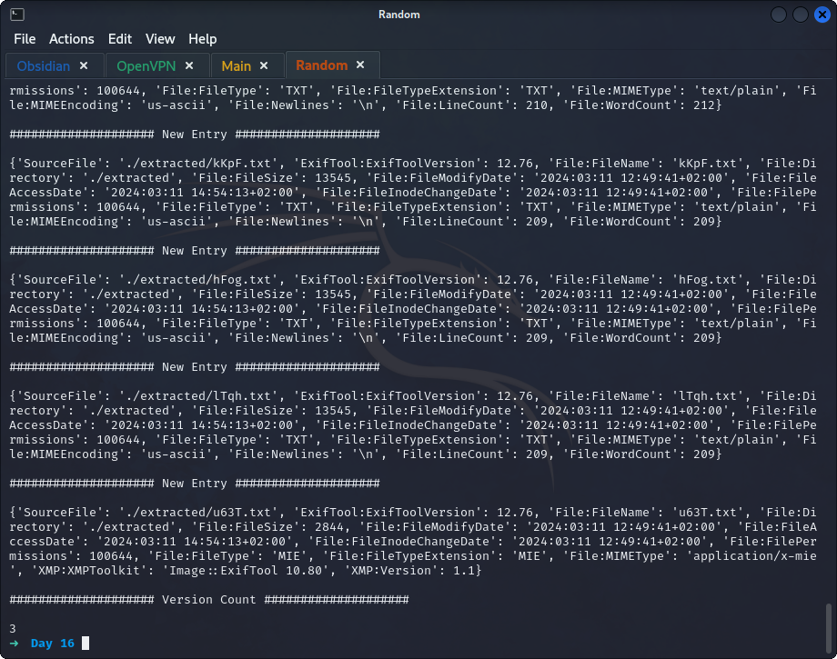
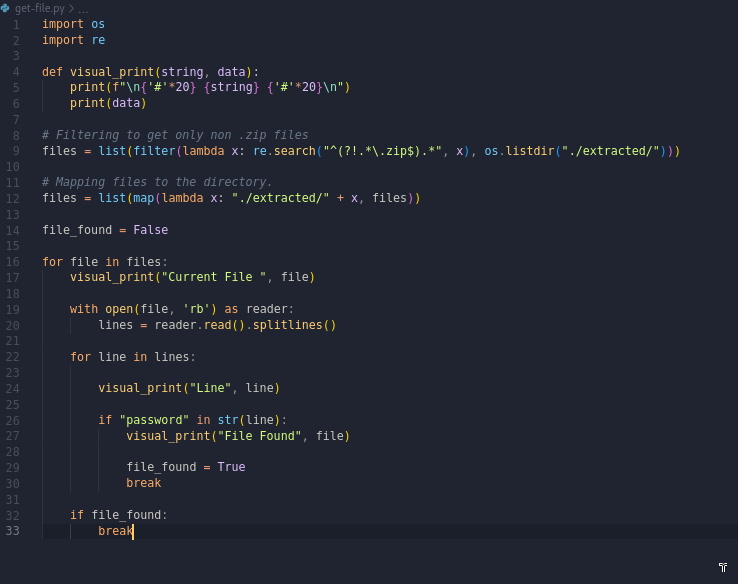
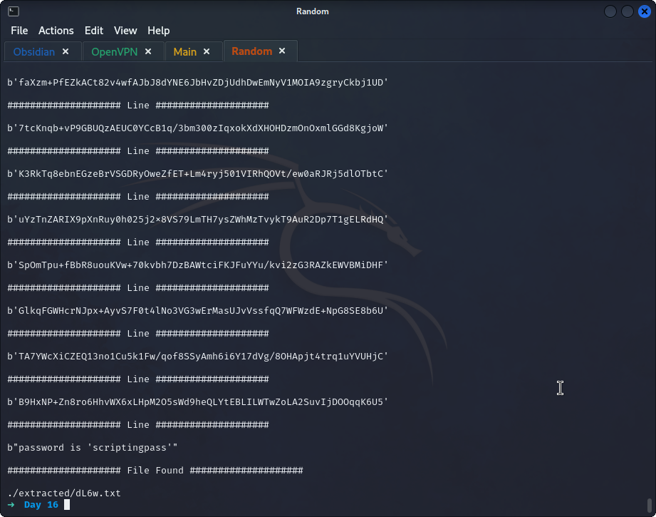

## **Extraction**
>	- Wrote a python script that iterates over `zip` files extracting them and counts the number of non-zip files.
>	- 

## **Metadata**
>	- Wrote a python script that uses the `exiftool` module to extract metadata from the unzipped files, and counts the occurrence of `Version: 1.1` in all the files.
>	- 

## **Password Extraction**
>	- Wrote a python script to read the extracted files and search for the `password` within each file.
>	- 