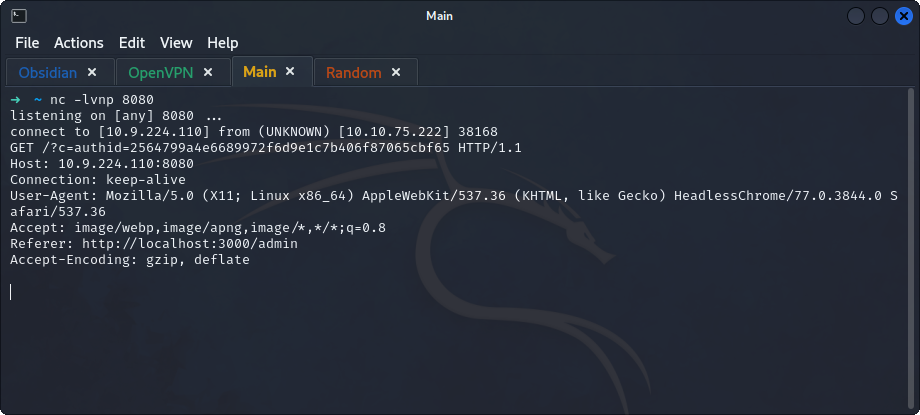

## **Enumeration**
>	- Accessing the website `10.10.242.240:3000` and registering a user to log in.
>	- 
>	- Viewing the `source code` to see the tags surrounding the submitted entry.
>	- 
>	- The formulated payload should be `
Hello
`.
>	- 
>	- From the entry made by `john`, looks like the admin logs in from time to time. So, use the payload `
Hello
`, run a `nc` listener on the attack machine, and wait for the `admin` to log in.