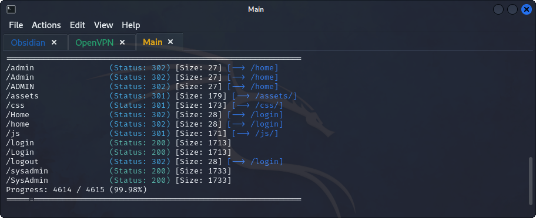
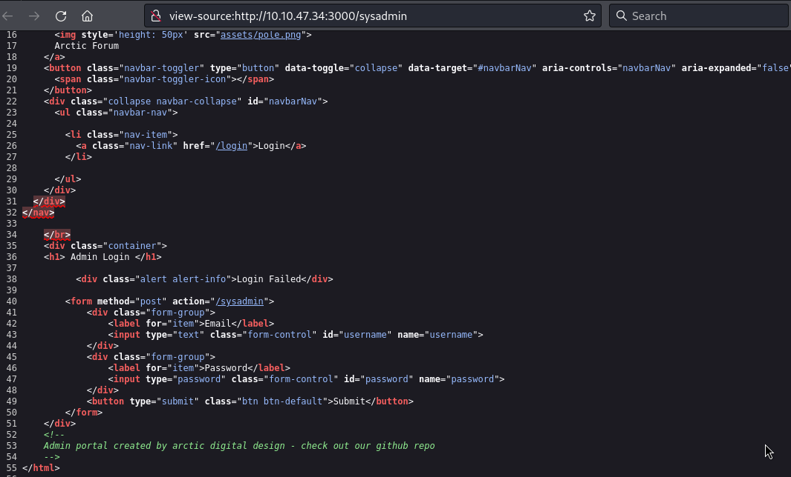
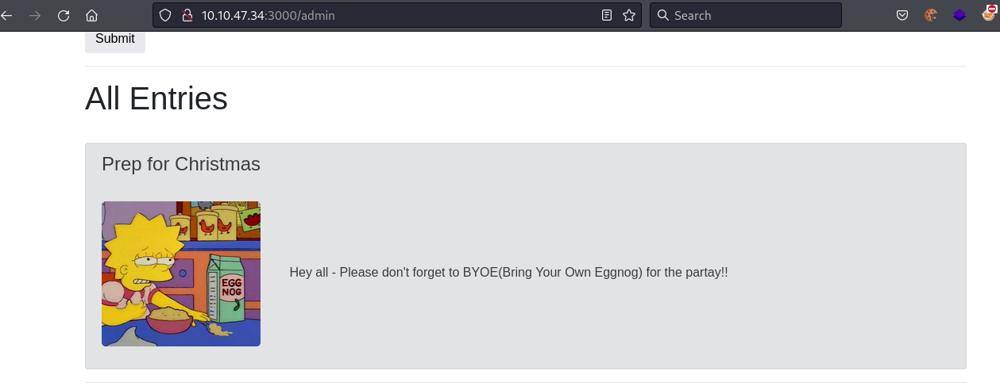

## **Enumeration**
>	- Accessing the website on `http://10.10.47.34:3000`.
>	- Use `gobuster dir -u http://10.10.47.34:3000/ -w /usr/share/dirb/wordlists/common.txt` to search for common hidden directories.
>	- Accessing `/sysadmin` directory and viewing the source code of the page.
>	- There is a comment at the end for the creator of this admin portal. Their repository can be found here [GitHub](https://github.com/ashu-savani/arctic-digital-design).
>	- After accessing the repository, the default credentials can be found which are `admin:defaultpass`.