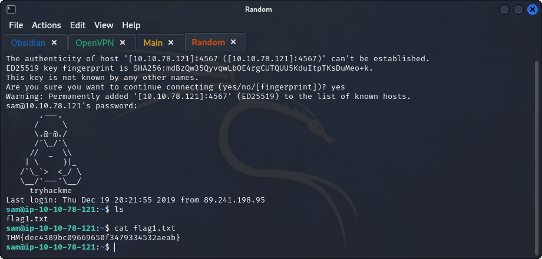
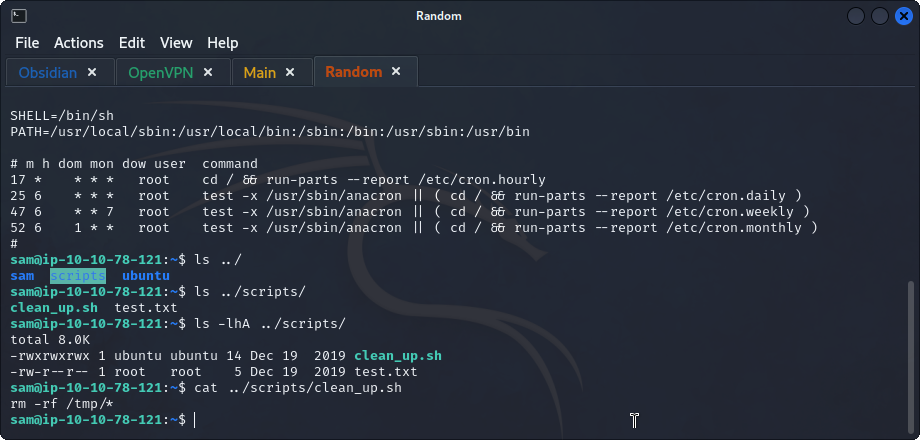

## **Enumeration**
>	- Using `nmap` to scan for services and their versions.
```
nmap -sV 10.10.78.121
```
>	- 
>	- Using `hydra -l sam -P /usr/share/wordlists/rockyou.txt 10.10.78.121 -t 4 ssh -s 4567 -V` to crack `sam`'s password.
>	- Accessing the machine check the password using `ssh sam@10.10.78.121 -p 4567`. 
>	- The flag is found.

## **Privilege Escalation**
>	- Showing `crontabs` using `cat /etc/crontab`.
>	- Looking around in the machine, `scripts` directory can be found.
>	- The `clean_up.sh` could be a `cron job`, `cat`ing the file to see what it does.
>	- To prove its a `cron job`, put dummy files in `/tmp/` directory and see if they get removed.
>	- Edit the script file and to change the permissions on the second flag located in `/home/ubuntu/flag2.txt`.
>	- Now wait for a minute and try to `cat` the second flag.