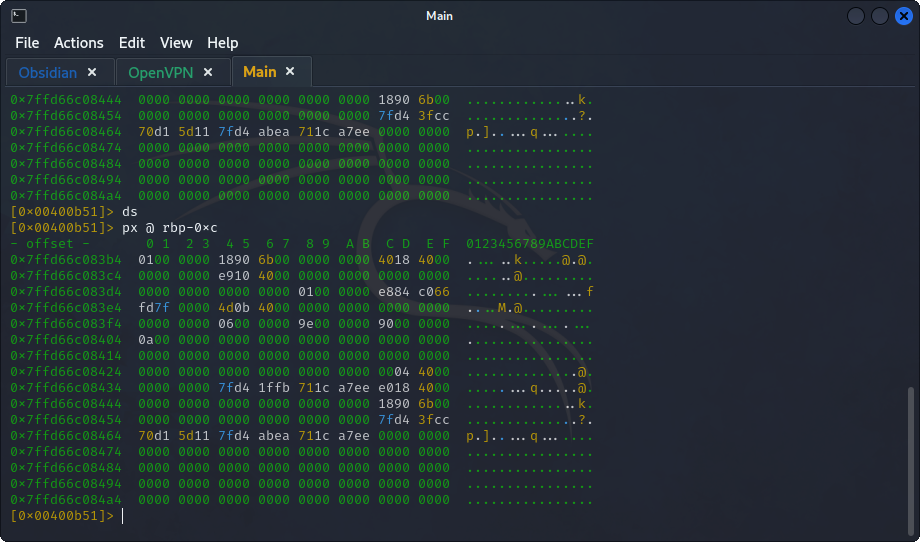

## **Reverse Engineering**
>	- Open the file using `r2 -d ./file1` to use `radare2` which is a framework for analyzing binaries.
>	- Use `aa` command to start the analysis.
>	- Run `afl | grep main` to get the entry point "main" of the program.
>	- Run `pdf @main` to examine the assembly code (print disassembly function).
>	- Use `db 0x00400b51` to set a break-point at the `mov` command of `var_ch`, make sure its set by using `pdf @main` once again and looking for a `b` next to the address.
>	- Use `dc` to run the program.
>	- Check the value of `var_ch` by using `px @ rbp-0xc` before the execution of the `mov dword [var_ch], 4` command and after, move the execution using `ds`.
>	- Reload the program using `ood` and set a break-point at `0x00400b62` the `imul` command.
>	- Run the program with `dc` and check the value of `eax` register using `dr`. The value before is `1` and move the execution using `ds` and get the value after the `imul` execution.
>	- Move the execution with `ds` to reach the execution of the `mov` command for `var_4h` and check the value of `var_4h` with `px @ 0x00400b62`