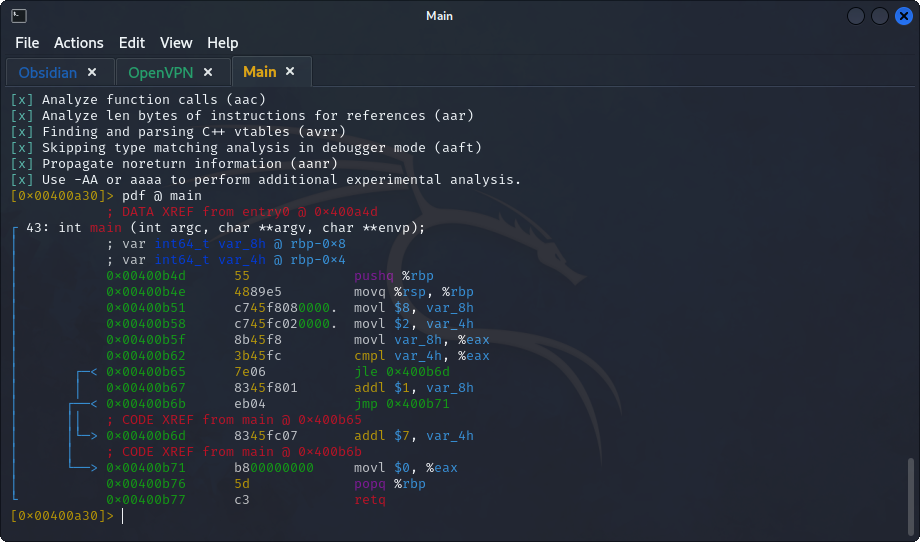
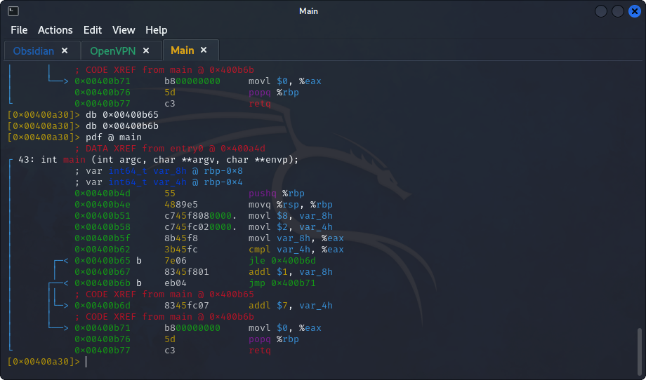
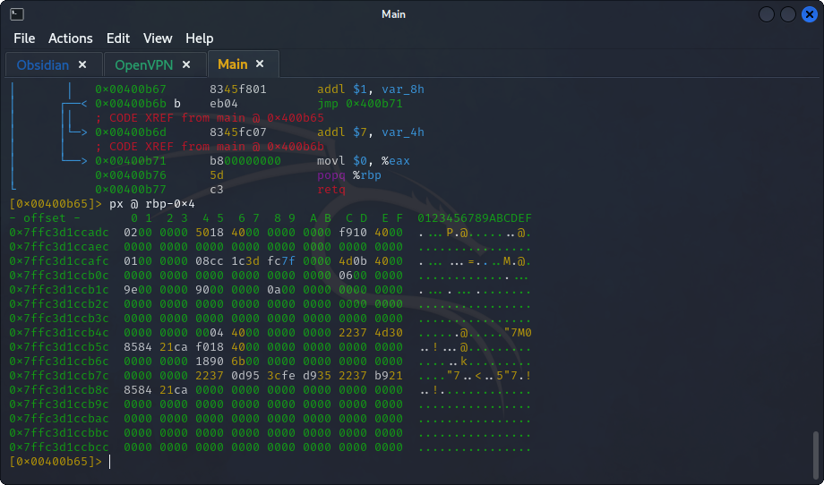
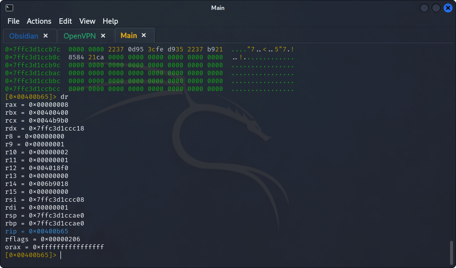
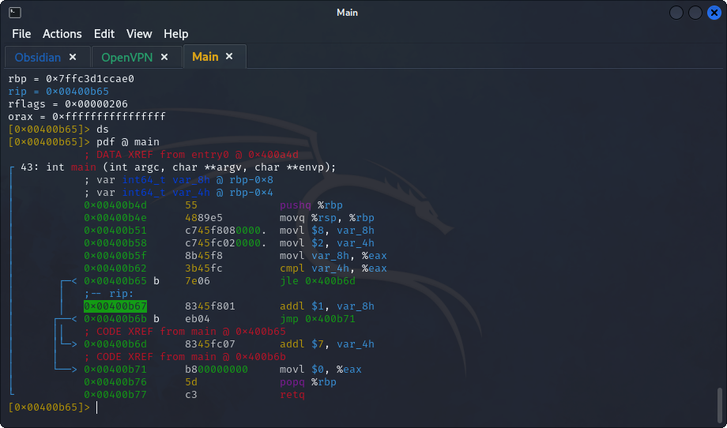
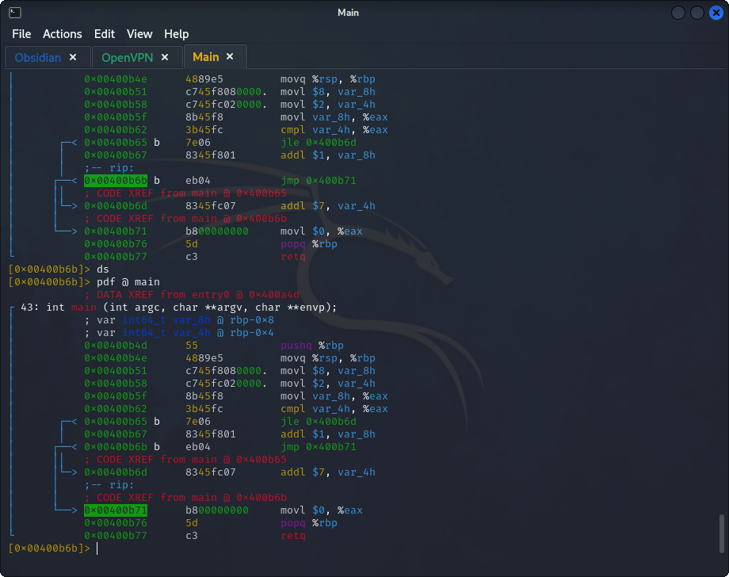
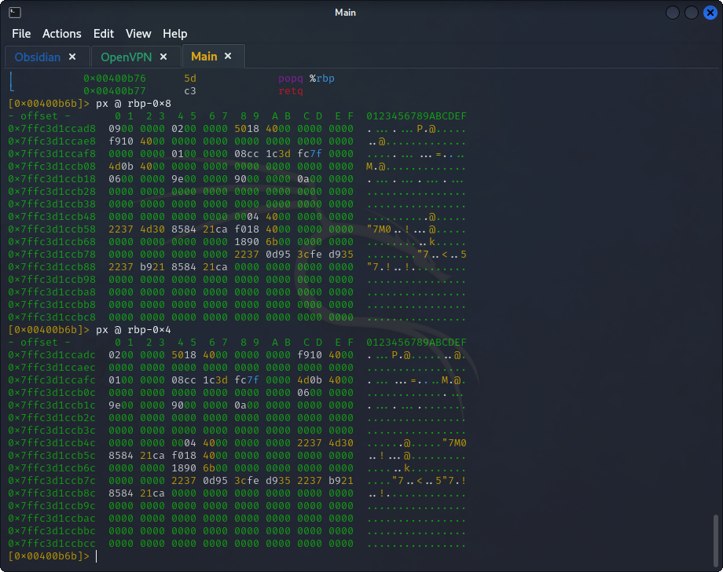

## **Reverse Engineering**
>	- Use `r2 -d ./if2` to run `radare2` and analyze the assembly code.
>	- Use `e asm.syntax=att` to change the syntax to `AT&T`.
>	- Use `aaa` to start the analysis of the code.
>	- Show the `main` function using `pdf @ main`. 
>	- Put 2 break-points using the `bp` command, 1 at `jle` command, and the other at `jmp` to check for the value that the `jle` command going to compare.
>	- Start the execution using `dc` and check the values of `var_4h` using `px @ rbp-0x8` and the register `eax` using `dr`, which are in the comparison.
>	- So, the comparison is `8 <= 2` which is `FALSE`, and the `jle` is not executed, this can be seen by moving the execution with `ds` and checking the pointer location.
>	- With the `jle` command not executing, the `jmp` command is for sure going to be executed since its an unconditional jump.
>	- Now before the zeroing of the `eax` register, check the values of `var_8h` and `var_4h`.