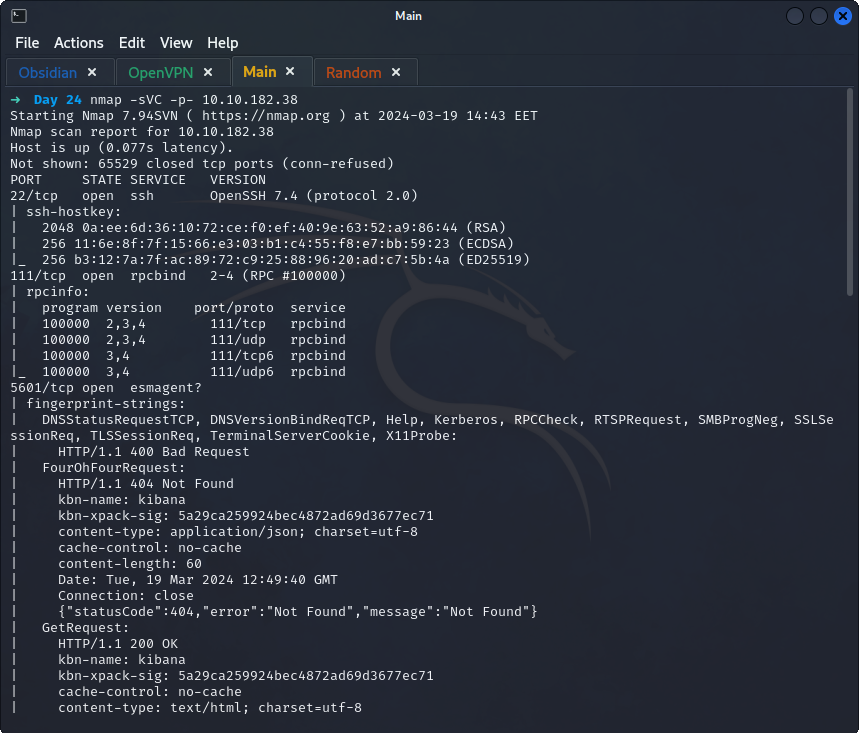
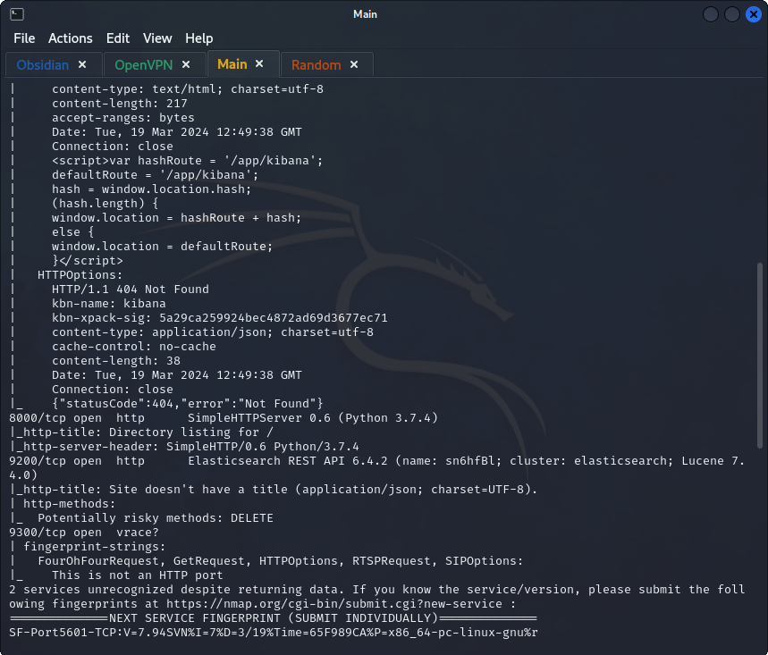
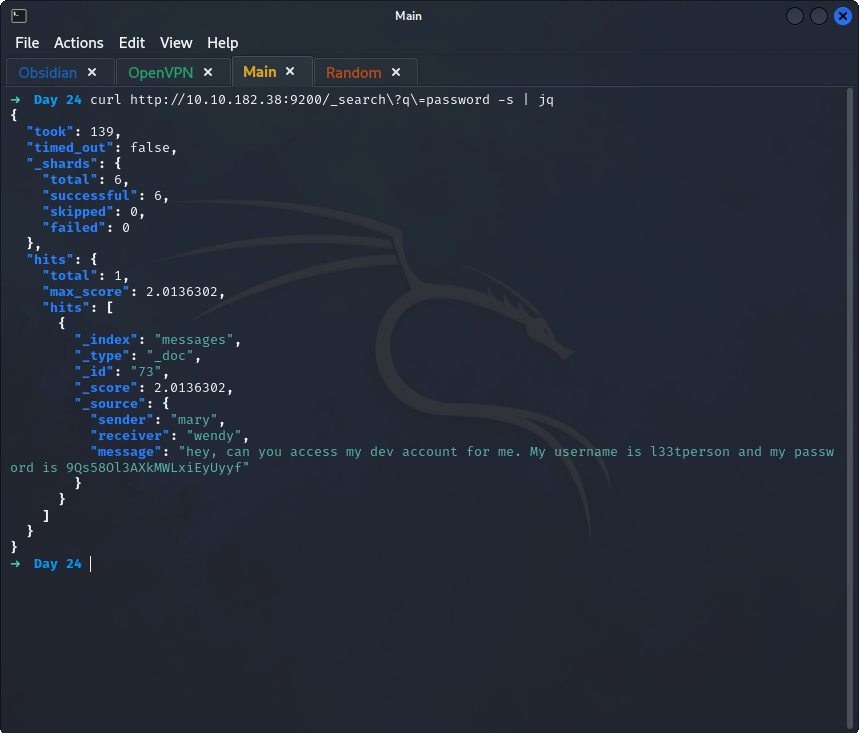
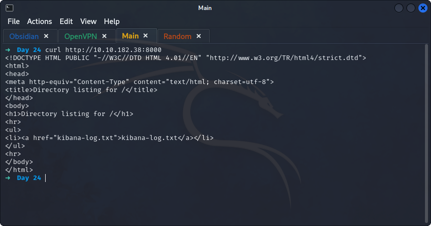
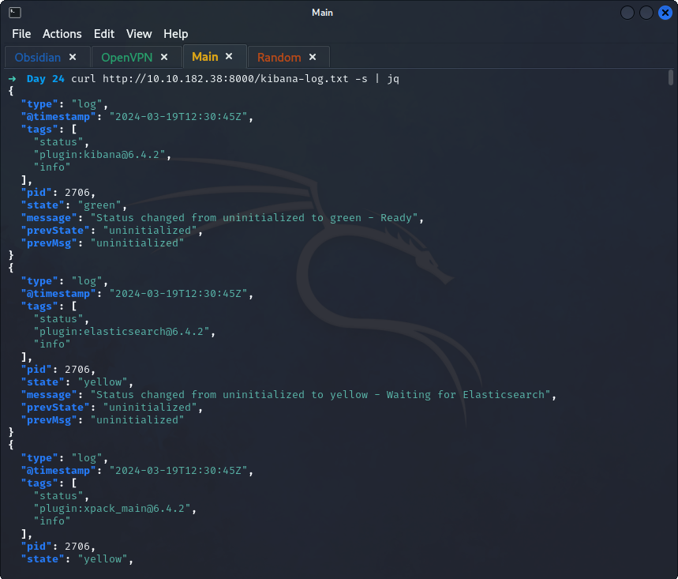
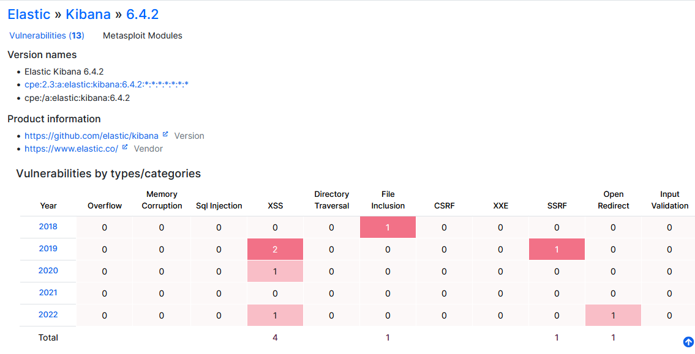
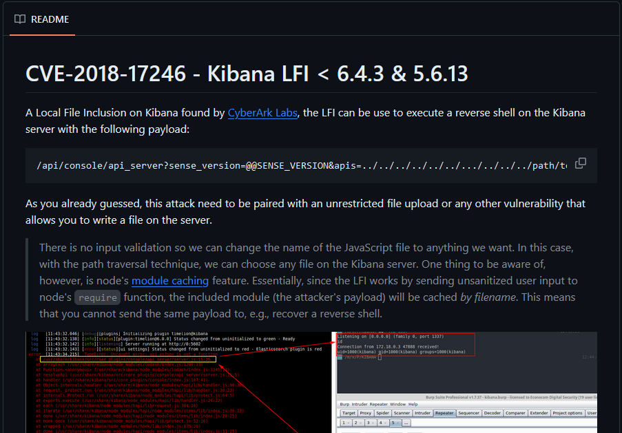
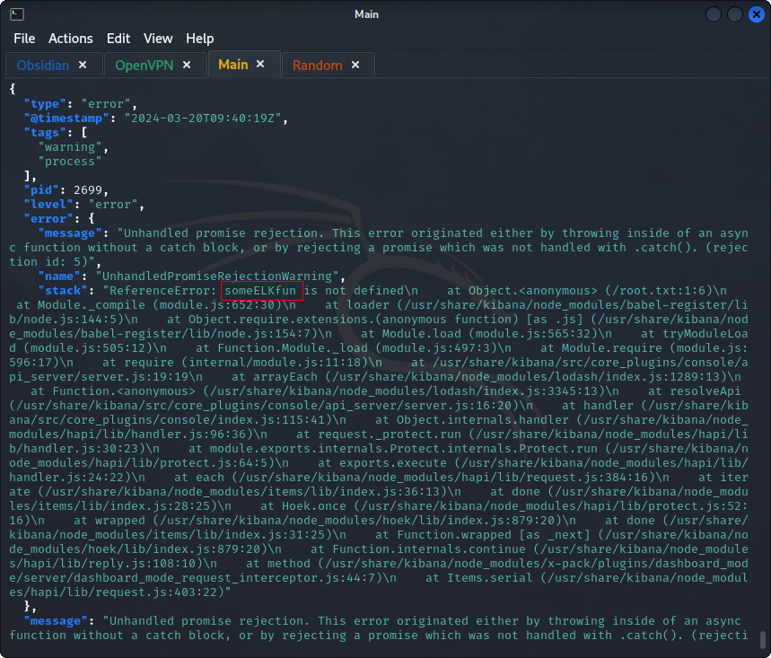

## *Enumeration*
>	- Using `nmap` to perform version, vulnerability, and service scanning on all ports.
```
nmap -sVC -p- 10.10.182.38
```
>	- 
>	- Services running:
>		- `ssh` on port `22`
>		- `rpcbind` on port `111`
>		- `kibana` on port `5601`
>		- `http server` on port `8000`
>		- `Elasticsearch` on port `9200`
>		- `unkonwn` on port `9300`
>	- Since the first question is about databases, look into the `elasticsearch` service.
>	- A quick google search shows how to interact with an `elasticsearch` database. Using `/_search?q=password` to search for the string `password`.
>	- Using `curl http://10.10.182.38:8000` to view the server.
>	- Dumping the log file hosted on the server using `curl http://10.10.182.38:8000/kibana-log.txt -s | jq`.
>	- From the log dump, the version can be seen `kibana@6.4.2`
>	- Using `cvedetails` to search for exploits for the version found.
>	- Checking the `2018` vulnerability, CVE-2018-17246. With a quick google search, a [GitHub](https://github.com/mpgn/CVE-2018-17246) repository is found.
>	- Adding this path `/api/console/api_server?sense_version=@@SENSE_VERSION&apis=../../../../../../.../../../../root.txt` to the URL.
>	- **NOTE: IP changed**
>	- The website loads indefinitely, `curl`ing the server that contained the `kibana-log.txt` with `curl http://10.10.222.16:8000/kibana-log.txt -s | jq`.
>	- At the bottom, the `root.txt` content is seen in the error.