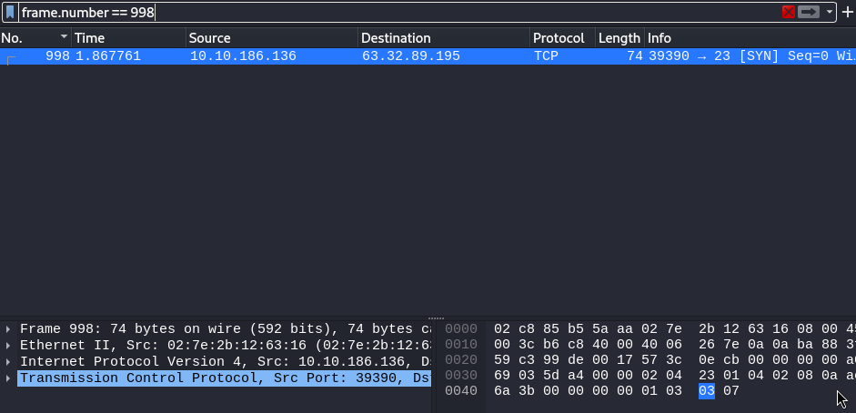
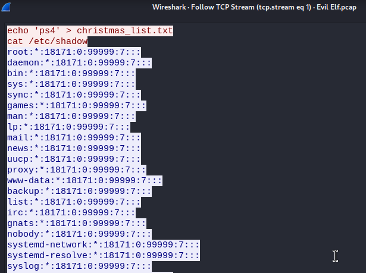
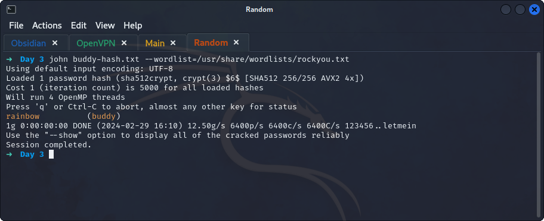

## **Wireshark**
>	- Applying a filter based on packet number with `frame.number == 998`.
>	- By `follow`ing the stream of this packet, it can be seen that there is a file called `christmas_list.txt` that exists.
>	- It can be seen that a `cat` command of the `/etc/shadow` file is ran, we can pick the required account's hash from it.
>	- Copy `buddy`'s hash `buddy:$6$3GvJsNPG$ZrSFprHS13divBhlaKg1rYrYLJ7m1xsYRKxlLh0A1sUc/6SUd7UvekBOtSnSyBwk3vCDqBhrgxQpkdsNN6aYP1:18233:0:99999:7:::` and use `john` to crack it.