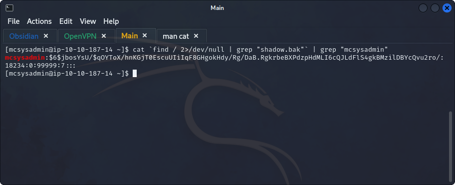

## **Enumeration**
>	- Accessing the machine using `ssh mcsysadmin@10.10.187.14` and the provided password.
>	- Get number of files using `ls | wc -l`.
>	- Get file containing string "password" using `grep -l -e "password" -f *`.
>	- Get the IP in a file by using `cat file* | grep -E -o "([0-9]{1,3}[\.]){3}[0-9]{1,3}"`.
>	- Get user counts by using `ls -la /home`.
>	- Get `sha1` hash of `file8` using `sha1sum file8`.
>	- Since `/etc/shadow` isn't accessible by current user, search for a `shadow.bak` file and `cat` its content using the following.
```
cat `find / 2>/dev/null | grep "shadow.bak"` | grep "mcsysadmin"
```
>	