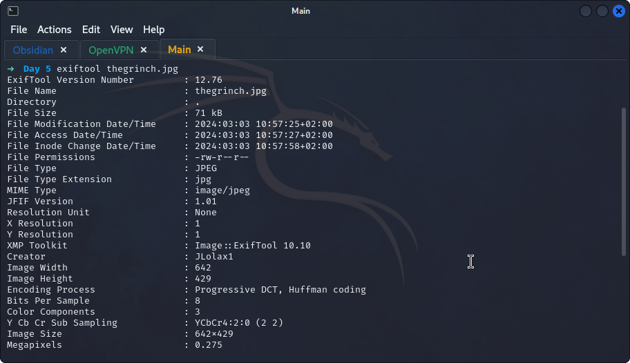
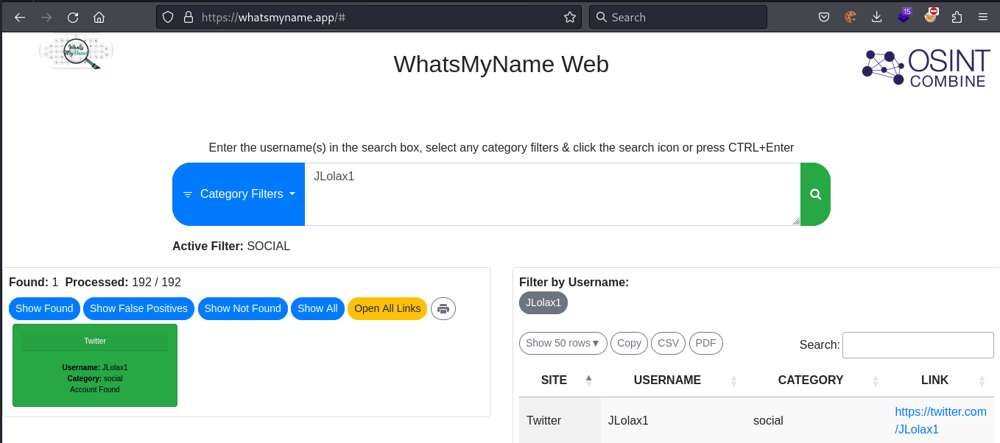
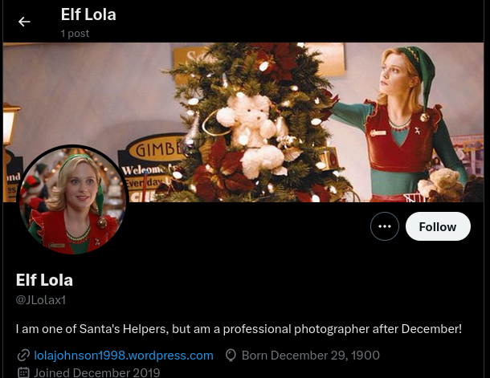
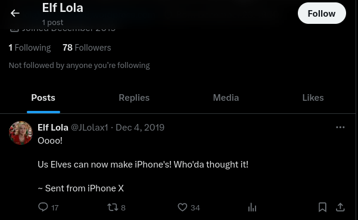
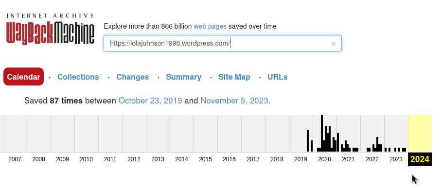
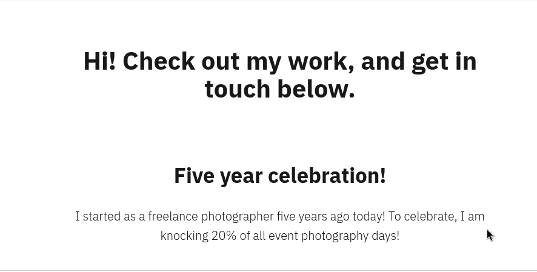
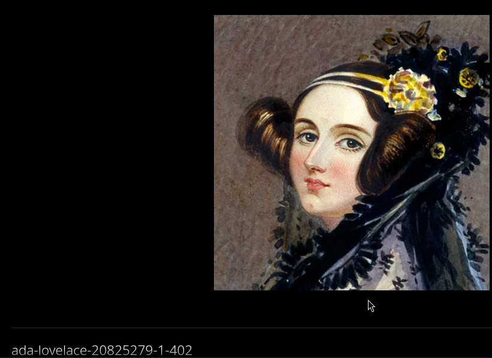

# **Reconnaissance**
>	- Using the downloaded image `thegrinch.jpg` to extract `exif` data using `exiftool thegrinch.jpg`.
>	- The creator `JLolax1` can be found.
>	- Using `https://whatsmyname.app/` and to get the accounts with the username `Jlolax1`, a twitter account can be found.
>	- Accessing the twitter account, a date of birth and occupation can be found.
>	- Going to the posts, a post can be found that was sent from `iPhone X`.
>	- Accessing Lola's portfolio website `https://lolajohnson1998.wordpress.com/` and using `Wayback Machine` website to find older archived versions.
>	- Accessing October 23rd's 2019 snapshot to see if relevant data is present.
>	- Deducting five years to get the start date which is `23/10/2014`.
>	- Accessing the image of a woman on the old snapshot to get he name `Ada Lovelace`.