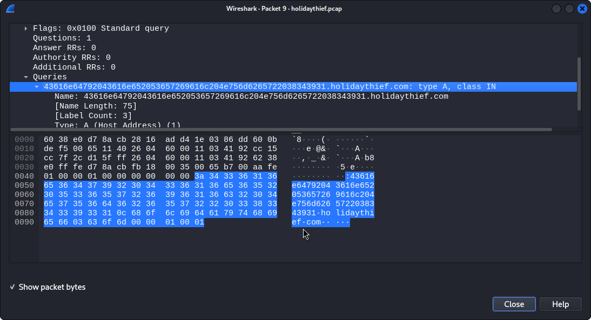
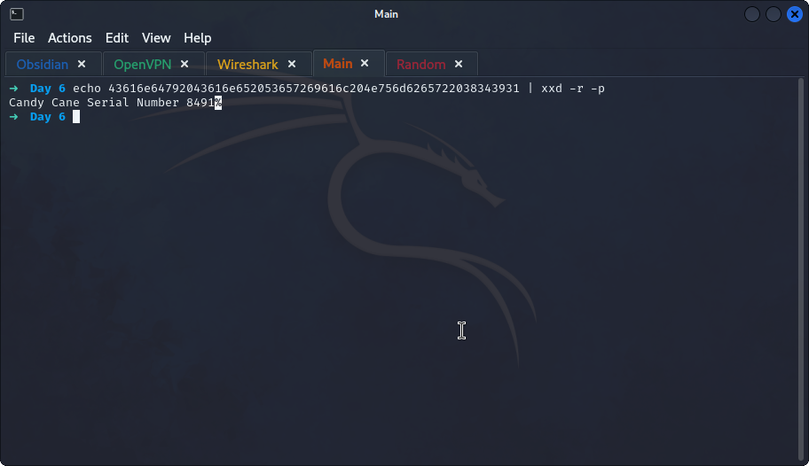
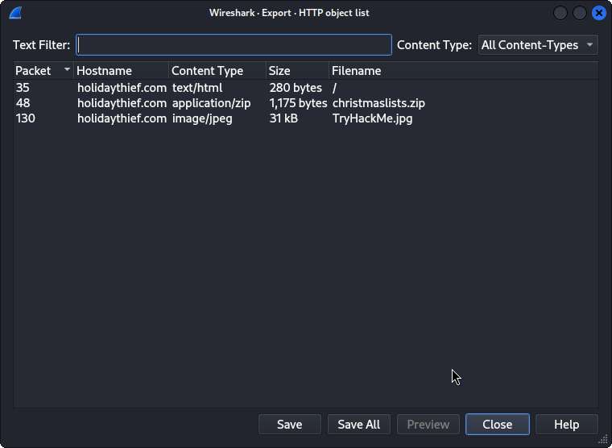
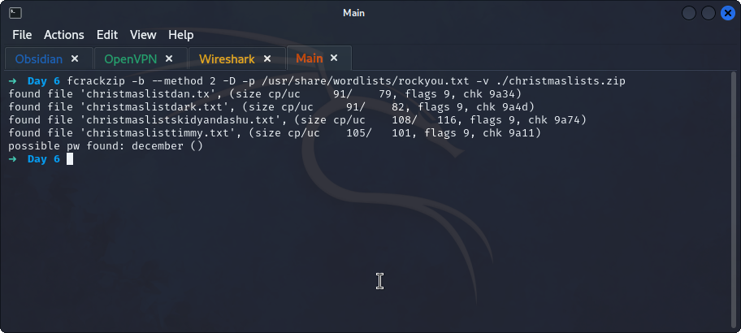
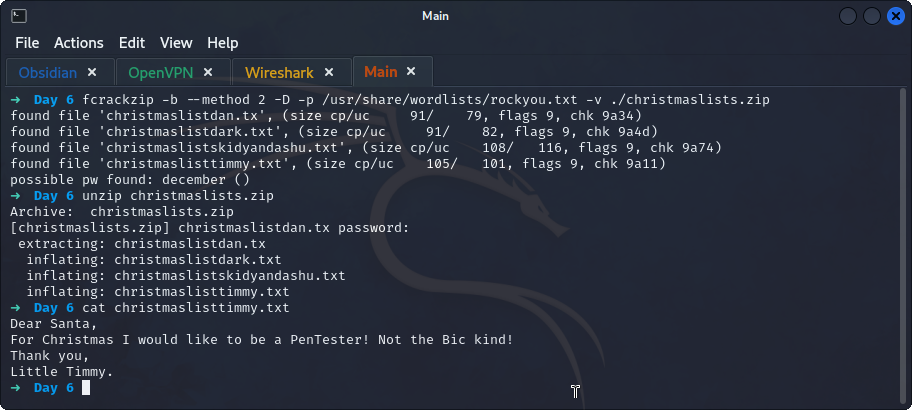
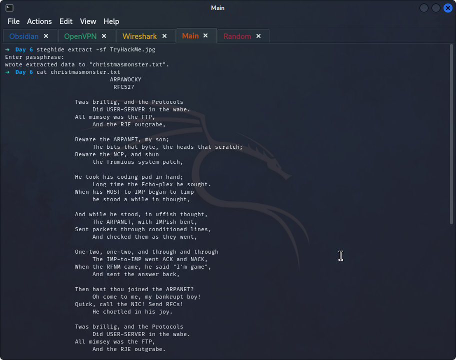

## **Wireshark**
>	- Applying a `dns` filter and checking the first packet, check the `queries` section and decode it using `echo 43616e64792043616e652053657269616c204e756d6265722038343931 | xxd -r -p`.
>	- Access the object list that can be exported by going to `File > Export Objects > HTTP` and saving all the files.
>	- Trying to extract the `christmaslists.zip` file shows a password, so, using `fcrackzip -b --method 2 -D -p /usr/share/wordlists/rockyou.txt -v ./christmaslists.zip` to crack it.
>	- A file shows that contains Timmy's Christmas list, unzipping the file with the cracked password and `cat`ing Timmy's `.txt` file.
>	- The image could contain a hidden message, using `steghide extract -sf TryHackMe.jpg` to check.
