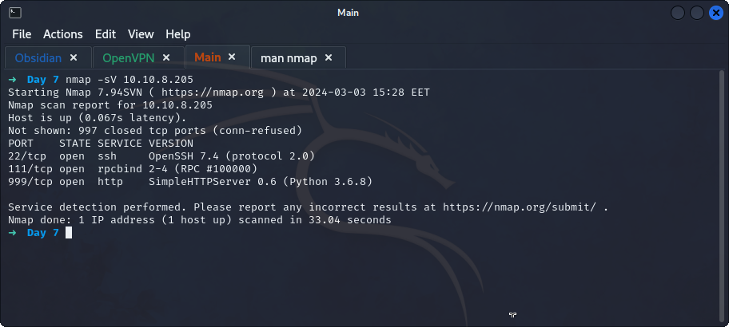

## **Nmap**
>	- Using the default nmap scan using `nmap 10.10.8.205`.
>	- Using `nmap -O --osscan-guess 10.10.8.205` to aggressively scan and give guesses.
>	- Using `nmap -sV 10.10.8.205` to scan for service versions.
>	- Accessing `http://10.10.8.205:999` or `curl`ing it in terminal to view the page and get the file.