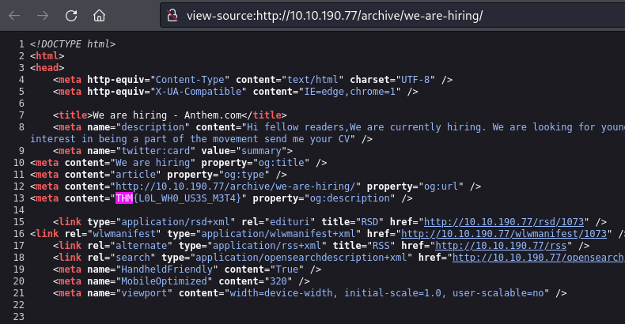

## *Enumeration*
>	- Using `nmap` to perform service, version, and vulnerability scan.
```
nmap -sVC -v 10.10.190.77
```
>	- 
>	- A quick google search will show that `robots.txt` file tells web crawlers which URLs is accessible.
>	- Going to `http://10.10.190.77/robots.txt`, a password can be found at the top.
>	- The `CMS` can be seen as well, which is `Umbraco`.
>	- The `nmap` scan shows the domain name `Anthem.com`.
>	- Going to this post.
>	- The poem is the clue, searching for it on google shows the answer `Solomon Grundy`
>	- Going to the other post.
>	- A possible naming convention could be used which is the initials of first and last name `SG@Anthem.com`.
>	- Inspecting the source code of the website gives us a the second flag.
>	- Inspecting the first post page gives us the first flag.
>	- Inspecting the second post pages gives us the fourth flag.
>	- Going to John Doe's page, the third flag can be seen.

## *Gaining Access*
>	 - Using the username `SG` and the found password to log in with `remmina`.
>	 - Going to the C directory and showing hidden files.
>	 - The `backup` directory contains a `restore.txt` file. The current user can't run it but can change the security permissions, add the user.
>	 - Access the `restore.txt` file and view it.
>	 - Now open `powershell` as administrator, view the user `administrator` directory.