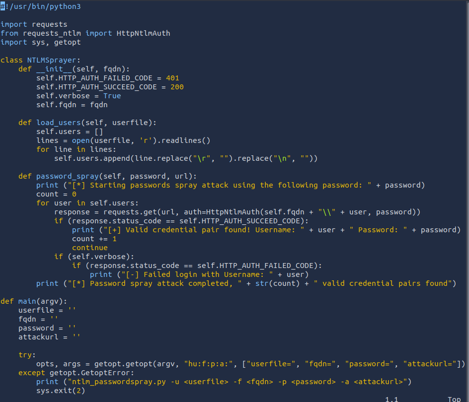
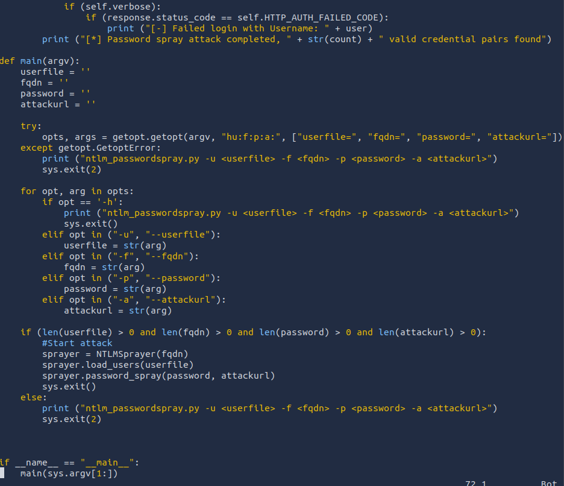

## *Debugging DNS*
- DNS will be a part of AD testing because Kerberos relies on DNS to create tickets. Tickets can't be associated with IPs, so DNS is a must.
- Two options
	- Hardcode DNS entries into `/etc/hosts` but this might not work well when testing a lot of hosts.
	- Spend time debugging to get it to work.
- #### *Steps*
	- `ping <DC-ip>` to verify the network is active.
	- `nslookup <FQDN> <DC-ip>` to verify that the DNS server is active.
	- `nslookup <FQDN>` if a different response than the above is received, there is something wrong with DNS configuration.
## *Gaining Initial Access*
- Two popular methods for gaining access to that first set of AD credentials are OSINT and Phishing.
- #### *OSINT*
	- Users that ask questions on public forums such as Stack Overflow but leak sensitive information in the question.
	- Developers that upload scripts to services such as GitHub with credentials hardcoded.
	- Credentials being disclosed in pas breaches since employees used their work accounts to sign up for other external websites. Websites such as `HaveIBeenPwned` and `DeHashed` to determine if someone's info have been in a data breach.
- #### *Phishing*
	- Enticing users to either provide their credentials on a malicious web page or ask them to run a specific application that would install a Remote Access Trojan (RAT) in the background.
## *NetNTLM*
- Used for authentication by using a challenge-response-based scheme.
- This authentication mechanism is heavily used by the services on a network. However, services that use NetNTLM can also be exposed to the internet.
- The application acts as a middle-man between the user and the DC, so the DC does the actual verification.
- For example
	- Internally-hosted Exchange (Mail) servers that expose an Outlook Web App (OWA) login portal.
	- RDP service of a server being exposed to the internet.
	- Exposed VPN endpoint that were integrated with AD.
	- Web applications that are internet-facing and make use of NetNTLM.
- #### *Brute-force Login Attacks*
	- Testing the credentials found in the `Gaining Initial Access`.
	- Also can be used to recover an initial set of AD credentials.
	- Since most AD environments have account lockout, we won't be able to perform a full brute-force attack, instead perform a password spraying attack.
	- Instead of trying different passwords for the same user which would trigger the lockout, we use 1 password and attempt to authenticate with all the usernames we have acquired.
	- However, these types of attacks can be detected due to the amount of failed authentications.
	- 
	- 
## *LDAP Bind Credentials*
- LDAP is another method of AD authentication that applications can use.
- Similar to NetNTLM, but here the application directly verifies the user's credentials.
- The application has a pair of AD credentials that it uses to first query the LDAP and then verify the AD user's credentials.
- Used by third-party applications such as Gitlab, Jenkins, Custom developed web applications, Printers, and VPNs.
- If any of these applications or services are exposed to the internet, the same type of attacks as those used against NTLM authenticated systems can be used.
- Since a service using LDAP has a pair of AD credentials, we can attempt to recover the AD credentials used to gain authenticated access to AD.
- #### *Authentication Process*
	- User sends printing requests with AD username and password to the Network Connected Printer.
	- The printer uses its AD credentials to create an LDAP bind request.
	- DC provides bind response back to the printer.
	- Printer requests LDAP user search from DC.
	- DC send User search response.
	- Printer sends LDAP bind request with user credentials to the DC.
	- DC sends Bind response to the printer.
	- User is authenticated and print job is accepted.
- Configuration files are often stored in plaintext since the security model relies on keeping the location and storage configuration file secure rather than its content.
- #### *LDAP Pass-back Attacks*
	- A common attack against network devices such as printers.
	- This attack can be performed when we gain access to a device's configuration where the LDAP parameters are specified.
	- This can be for example, the web interface of a network printer.
	- Usually, the credentials for these interfaces are kept to the default ones, such as `admin:admin` or `admin:password` .
	- We can alter the LDAP configuration, such as the IP or hostname of the LDAP server, which will force the device to attempt LDAP authentication with our rogue device.
	- We can intercept this authentication attempt to recover the LDAP credentials.
	- A simple netcat listener won't work, since before the printer sends over the credentials, it is trying to negotiate the LDAP authentication method details.
		- It will use this negotiation to select the most secure authentication method that both the printer and LDAP server support.
		- If the authentication method is too secure, the credentials will not be transmitted in cleartext.
		- With some authentication methods, the credentials will not be transmitted over the network at all.
	- **Hosting a Rogue LDAP Server**
		- Use OpenLDAP to host a server.
		- Reconfigure the LDAP server using `sudo dpkg-reconfigure -p low slapd` and press No when requested if you want to skip server configuration.
			- For the DNS domain name, provide `za.tryhackme.com` and the same goes for the Organization name.
			- Provide an Administrator password of your choice.
			- Select MDB as the LDAP database to use.
			- For the last two options, ensure the database isn't removed when purged (No).
			- Move old database files before a new one is created (Yes).
		- Before using the rogue LDAP, make it vulnerable by downgrading the supported authentication methods.
			- Make it support only PLAIN and LOGIN authentication methods.
			- To do this, create a new `ldif` file with the following content
				`#olcSaslSecProps.ldif`
				`dn: cn=config`
				`replace: olcSaslSecProps`
				`olcSaslSecProps: noanonymous,minssf=0,passcred`
			- The file has the following properties
				- `olcSaslSecProps` specifies the SASL security properties.
				- `noanonymous` disables mechanisms that support anonymous login.
				- `minssf` specifies the minimum acceptable security strength with 0, meaning no protection.
		- Now use the `ldif` file to patch our LDAP server using `sudo ldapmodify -Y EXTERNAL -H ldapi:// -f ./olcSaslSecProps.ldif && sudo service slapd restart`.
		- Confirm the configuration using `ldapsearch -H ldap:// -x -LLL -s base -b "" supportedSASLMechanisms`.
	- **Capturing LDAP Credentials**
		- After the configuration of the rogue LDAP server, the authentication should be in plaintext.
		- Use `tcpdump` to capture the credentials `sudo tcpdump -SX -i breachad tcp port 389`.
		- 389 is the port used for LDAP.
## *Authentication Relays*
- Attacks against broader network authentication protocols.
- In Windows networks, there are a significant amount of services talking to each other, allowing users to make use of the services provided on the network.
- These services have to use built-in authentication methods to verify the identity of incoming connections.
- #### *Server Message Block (SMB)*
	- Allows clients to communicate with a server (like a file share). In AD networks, SMB governs everything from inter-network file sharing to remote administration.
	- Even the out of paper alert from printers is the work of SMB.
	- Security of earlier versions of SMB had a lot of vulnerabilities and exploits used to recover credentials or gain code execution on devices.
	- Often organisations don't enforce the use of the new versions of SMB since legacy systems do not support them.
	- Some of the exploits for NetNLTM authentication
		- Since NTLM challenges can be intercepted, we can use offline cracking techniques to recover the password associated with the NTLM challenge. However this is slower than cracking NTLM hashes directly.
		- We can use our rogue device to stage a man in the middle attack, relaying the SMB authentication between the client and the server, which will provide us with an active authenticated session and access the target server.
	- **LLMNR, NBT-NS, and WPAD**
		- Use Responder to attempt to intercept the NetNTLM challenge to crack it. There are usually a lot of these challenges in the network.
		- Some security solutions even perform a sweep of entire IP ranges to recover information from hosts.
		- Sometimes due to stale DNS records, these authentication challenges can end up hitting your rogue device instead of the intended host.
		- Responder allows us to peform MITM attack by poisoning the responses during NetNTLM authentication, tricking the client into talking to you instead of the actual server they wanted to connect to.
		- On a real LAN, Responder will attempt to poison any Link-Local Multicast Name Resolution (LLMNR), NetBIOS Name Service (NBT-NS), and Web Proxy Auto-Discovery (WPAD) requests that are detected.
		- On large Windows networks, these protocols allow hosts to perform their own local DNS resolution for all hosts on the same local network.
		- Rather than exhausting network resources like DNS servers, hosts can first attempt to determine if the host is on the same local network by sending out LLMNR requests and seeing if any hosts respond.
		- The NBT-NS is the precursor protocol to LLMNR, and WPAD requests are made to try and find a proxy for future HTTP(s) connections.
		- These requests are broadcasted on local network, so our rogue device will receive them.
		- Usually, these requests would be dropped since they are not meant for our host, but Responder actively listens to the requests and send poisoned responses telling the requesting hosts that our IP is associated with the requested hostname.
		- Responder attempts to force the client to connect to our attacking machine. In the same line, it starts to host several servers such as SMB, HTTP, SQL, and others to capture these requests and force authentication.
	- **Intercepting NetNTLM Challenge**
		- Responder tries to win the race condition by poisoning the connections to ensure that you intercept the connection.
		- This means that Responder is usually limited to poisoning authentication challenges on the local network.
		- Although Responder would be able to intercept and poison more authentication requests when executed from our rogue device connected to the LAN of an organization, but this behavior can be disruptive and thus detected.
		- By poisoning authentication requests, normal network authentication attempts would fail, meaning users and services would not connect to the hosts and shares they intend to.
		- Responder can be downloaded through [here](https://github.com/lgandx/Responder).
		- `sudo responder -I <interface>` in our case is `breachad`.
		- Responder now listens for any LLMNR, NBT-NS, and WPAD requests, it usually takes a lot of time to receive an SMBv2 connection which Responder can use to entice and extract an NTLMv2-SSP response.
		- Copy the NTLMv2-SSP hash to a text file, and then use the password list to crack it `hashcat -m 5600 <hash-file> <pass-file> --force`.
	- **Relaying the Challenge**
		- Sometimes instead of capturing the challenge, we can relay it but this is a bit more difficult to do without prior knowledge of the accounts since this attack depends on the permissions of the associated account.
			- SMB signing should either be disabled or enabled but not enforced. When we perform a relay, we make minor changes to the request to pass it along. If SMB signing is enabled, we won't be able to forge the message request, and the server would reject it.
			- The associated account needs the relevant permissions on the server to access the requested resources. Ideally, we would want to relay the challenge and response of an account with admin privilege over the server.
			- Since we don't have foothold on the AD, some guesswork is involved into what accounts with permissions on which hosts. If we had already breached AD, we could perform some initial enumeration first, which is usually the case.
		- This is why blind relays are not usually used, you would first breach AD using another method and then perform enumeration to determine the privileges associated with the compromised account.
		- From here, we can perform lateral movement for privilege escalation across the domain.
		- Process of relay attacks
			- User sends NTLM Negotiate which the attacker intercepts with poisoning.
			- Attacker fowards NTLM Authenticate on behalf of the user to the server.
			- Server responds with NTLM Challenge back to the attacker.
			- Attacker forwards the Challenge to the user.
			- User sends challenge response created by encrypting challenge with user's hash to the attacker.
			- Attacker forwards challenge response to server.
			- Server grants access.
			- Attacker sends Access Denied error to the user.
			- Attacker accesses server resources.
## *Microsoft Deployment Toolkit*
- Large organizations need tools to deploy and manage the infrastructure. Microsoft provides this tool to do that, but misconfigurations could be exploited to breach AD.
- #### *MDT and SCCM*
	- MDT is a service that assists with automating the deployment of Microsoft OSs, large organizations use these services to deploy new images since the base images can be maintained and updated in a central location.
	- Usually, MDT is integrated with Microsoft's System Center Configuration Manager (SCCM), which manages all updates for all Microsoft applications, services, and OSs.
	- MDT helps IT team to preconfigure and manage boot images, just plug the new machine in a network cable and everything happens automatically.
	- They can make changes to the boot image like installing default software.
	- SCCM can be seen as almost an expansion and the big brother to MDT. After the software is installed, SCCM does this type of patch management, it allows the IT team to review available updates to all software installed across the infrastructure.
	- The team can also test these patches in a sandbox environment to ensure they are stable before centrally deploying them to all domain-joined machines.
- #### *PXE Boot*
	- Large organization use PXE boot to allow new devices that are connected to the network to load and install the OS directly over a network connection.
	- MDT can be used to create, manage, and host PXE boot images.
	- PXE boot is usually integrated with DHCP, which means that if DHCP assigns an IP lease, the host is allowed to request the PXE boot image and start the network OS installation process.
	- Communication flow is as follows
		- User sends DHCP Discover (requests IP address, PXE service info) to DHCP server.
		- DHCP server sends DHCP Offer (sends open IP and PXE service info) to User.
		- User sends DHCP Request (accepts IP address) to the DHCP server.
		- DHCP server sends DHCP Acknowledge to the User.
		- User performs Boot Service Discover with MDT server.
		- MDT server sends Server Acknowledge (sends PXE boot information) to User.
		- User requests PXE Boot via TFTP from the MDT server.
		- MDT server delivers PXE Boot via TFTP to the User.
	- We can exploit the PXE boot image for two different reasons
		- Inject a privilege escalation vector, such as a Local Administrator account.
		- Perform password scarping attacks to recover AD credentials used during the install.
- #### *PXE Boot Image Retrieval*
	- Since DHCP is a bit finicky, we will skip the part where we attempt to request an IP and the PXE boot preconfigure details from DHCP.
	- The first piece of info regarding PXE Boot preconfigure received via DHCP is the IP of MDT server.
	- The second piece of info is the names of the BCD files. These store the info relevant to PXE boot for the different types of architecture.
	- Usually, you would use TFTP to request each of these BSD files and enumerate the configuration of all of them.
	- After initial info recovered from DHCP, enumerate and retrieve the PXE boot image.
	- Download BCD file using TFTP to read the configuration of the MDT server, TFTP is trickier than FTP, since we can't list files.
	- Instead we send a file request, and the server will connect back to us via UDP to transfer the file.
	- The BCD files are always located in `/tmp/` directory on the MDT server.
	- Initiate the TFTP transfer using `tftp -i <MDT-ip> Get "\Tmp\<BCD-file>.bcd" conf.bcd`, get the MDT server IP using `nslookup thmmdt.za.tryhackme.com`.
	- With the BCD files recovered, use [powerpxe](https://github.com/wavestone-cdt/powerpxe) to read its contents.
	- Powerpxe is a PowerShell script that automatically performs this type of attack but usually with varying results, so it is better to perform a manual approach.
	- Recover the locations of the PXE boot images from the BCD file using Get-WimFile function of powerpxe
		`Import-Module .\PowerPXE.ps1`
		`$BCDFile = "conf.bcd"`
		`Get-WimFile -bcdFile $BCDFile`
	- WIM files are bootable images in the Windows Imaging Format (WIM).
	- After getting the location of the PXE Boot image, use TFTP again to download this image using `tftp -i <MDT-ip> Get "<pxe-boot-image-loc>" pxeboot.wim`.
- #### *Recovering Credentials from a PXE Boot Image*
	- After recovering the PXE boot image, we can exfiltrate stored credentials. It should be noted that there are various attacks that we could stage. We could inject a local administrator user.
	- Use powerpxe to recover the credentials, or do it manually by extracting the image and looking for the bootstrap.ini file, where these type of credentials are often stored.
	- `Get-FindCredentials -WimFile pxeboot.wim`
- **NOTE: Make sure to do a cleanup of the working directory**
## *Configuration Files*
- Suppose we were lucky enough to cause a breach that gave us access to a host on the organization's network.
- In this case, configuration files are a great avenue to explore to recover AD credentials.
- Depending on the host that was breached, various configuration files may be of value
	- Web app config files
	- Service config files
	- Registry keys
	- Centrally deployed apps.
- Several enumeration scripts, such as [Seatbelt](https://github.com/GhostPack/Seatbelt) is useful.
- #### *Configuration File Credentials*
	- From centrally deployed applications.
	- Usually, these applications need a method to authenticate to the domain during both the installation and execution phases.
	- For example, McAfee Enterprise Endpoint Security, it embeds the credentials used during installation to connect back to the orchestrator in a file called ma.db.
	- This database file can be retrieved and read with local access to the host to recover the associated AD service account.
	- Read the database file using `sqlitebrowser ma.db`.
	- Make note of the DOMAIN, AUTH_USER, and AUTH_PASSWD field entries, the AUTH_PASSWD is encrypted, but luckily, McAfee encrypts this with a known key.
	- Use the old python2 script to decrypt the password found [here](https://funoverip.net/2016/02/mcafee-sitelist-xml-password-decryption/).
	- An updated script used with python3 can be found [here](https://github.com/funoverip/mcafee-sitelist-pwd-decryption).
## *Mitigations*
- User awareness and training, since they are the weakest link. Making sure that they should be careful about disclosing sensitive information such as credentials and to not trust suspicious emails.
- Limit the exposure of AD services and applications online, not all applications must be accessible from the internet, especially those that support NTLM and LDAP authentication. Instead these applications should be placed in an intranet that can be accessible through a VPN. The VPN can then support multi-factor authentication for added security.
- Enforce Network Access Controls, NAC can prevent attackers from connecting rogue devices on the network. However, it will require a bit of effort since legitimate devices will have to be allowlisted.
- Enforce SMB Signing, which stops Relay Attacks.
- Follow the principle of least privileges, in most cases, an attacker will be able to recover a set of AD credentials. By following least privilege principle, the risk associated with these credentials being compromised can be significantly reduced.