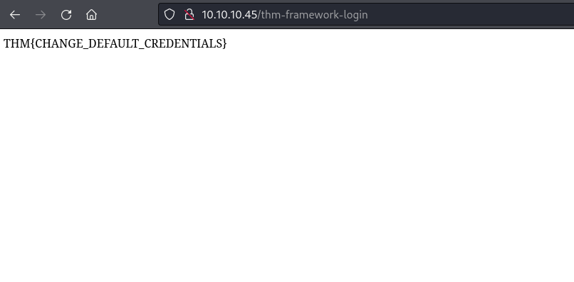

## *Task 1*
>	- Manually
>	- Automated
>	- OSINT
## *Manual Discovery*
>	- Visiting `/robots.txt` shows the disallowed directory `/staff-portal`.
>	- Downloading the `favicon` of the website and getting its MD5 hash using `curl https://static-labs.tryhackme.cloud/sites/favicon/ | md5sum`, then comparing that hash to the OWASP favicon database.
>	- Viewing the `/sitemap.xml` to view the directories that the owner wishes to be listed on a search engine.
>	- Using `curl http://10.10.102.128/ -v` to view the headers of the website.
>	- Viewing the source code of the website, the framework's documentation can be found through a commented link.
>	- The documentation lists a directory to look in with default credentials.
>	- Accessing the directory `/thm-framework-login` and using the credentials `admin:admin`.
## *OSINT*
>	- The operator `site:` is used to only show results for a specific website.
>	- Wappalyzer is a tool that identifies the technologies used by a website.
>	- Wayback Machine is web page scraper that is used as a historical archive of websites.
>	- GitHub can be used to search for the company's repository and depending on the access controls view source codes and configurations.
>	- S3 buckets are cloud storage services provided by Amazon. Naming format is `https://<name>.s3.amazonaws.com`, some common conventions are `<name>-assets`, `<name>-www`, `<name>-public`, and `<name>-private`.
## *Automated Discovery*
>	- Using `ffuf -w /usr/share/wordlists/seclists/Discovery/Web-Content/common.txt -u http://10.10.10.45/FUZZ`.
>	- Using `dirb http://10.10.10.45/ /usr/share/wordlists/seclists/Discovery/Web-Content/common.txt`.
>	- Using `gobuster dir -u http://10.10.10.45/ -w /usr/share/wordlists/seclists/Discovery/Web-Content/common.txt`.