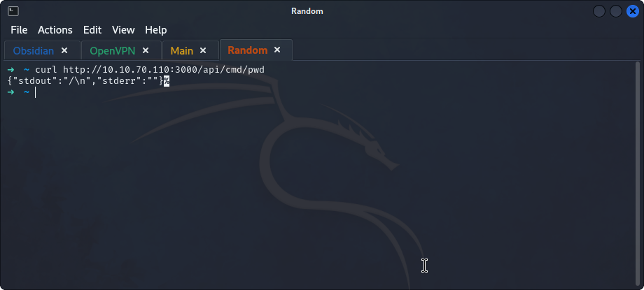
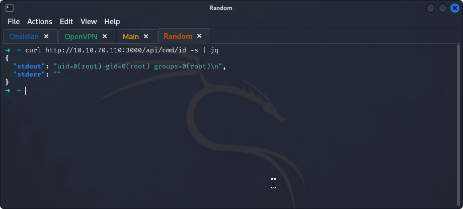
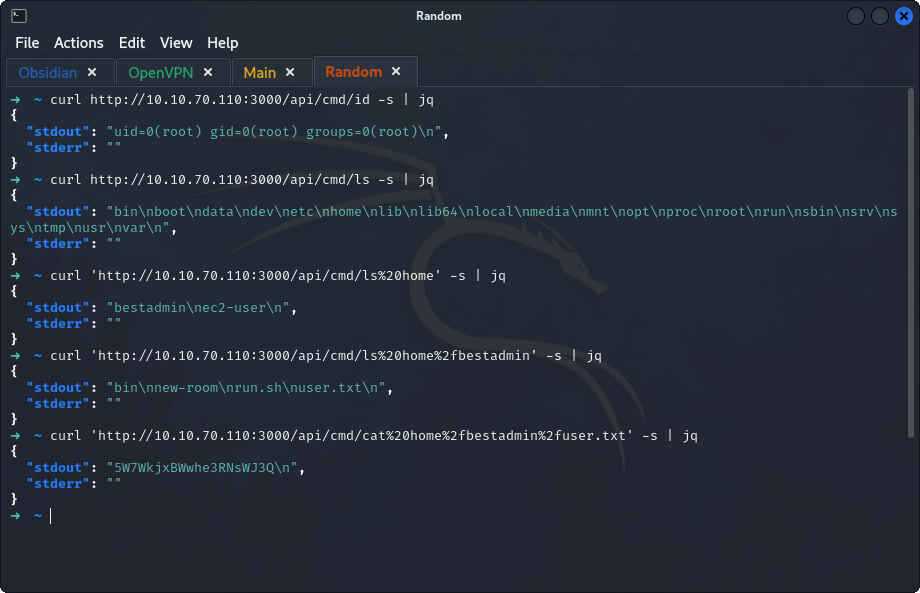

## **Enumeration**
>	- From the tip from `Elf McSkidy`, test out the endpoint `/api/cmd` with `curl http://10.10.70.110:3000/api/cmd/pwd`.
>	- Use `| jq` to parse the returned `JSON` object.
>	- Using a multiple `ls`s to view the directories, the `user.txt` file can be found.