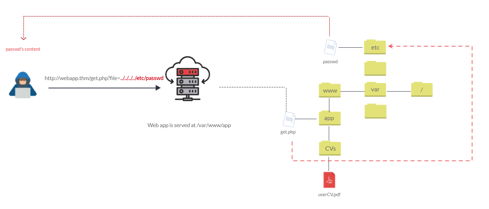

- File inclusion vulnerabilities are commonly found and exploited in various programming languages for web applications, such as PHP that are poorly written and implemented.
- The main issue of these vulnerabilities is the input validation, in which the user inputs are not sanitized or validated, and the user controls them. 
- When the input is not validated, the user can pass any input to the function, causing the vulnerability.
- By default, an attacker can leverage file inclusion vulnerabilities to leak data, such as code, credentials or other important files related to the web application or operating system.
- If the attacker can write files to the server by any other means, file inclusion might be used in tandem to gain remote command execution (RCE).
- ## *Path Traversal*
	- A web security vulnerability allows an attacker to read operating system resources, such as local files on the server running an application.
	- The attacker exploits this vulnerability by manipulating and abusing the web application's URL to locate and access files or directories stored outside the application's root directory.
	- It occurs when the user's input is passed to a function such as file_get_contents in PHP. It's important to note that the function is not the main contributor to the vulnerability. Often poor input validation or filtering is the cause of the vulnerability.
	- 
	- We can test out the URL parameter by adding payloads to see how the web application behaves.
	- Path traversal attacks, also known as the dot-dot-slash attack, take advantage of moving the directory one step up using the double dots `../`.
	- If the attacker finds the entry point, which in this case `get.php?file=`, then the attacker may send something as follows, `http://webapp.thm/get.php?file=../../../../etc/passwd`.
	- Similarly, if the web application runs on a Windows server, the attacker needs to provide Windows paths.
	- For example, if the attacker wants to read the `boot.ini` file located in `c:\boot.ini`, then the attacker can try the following depending on the target OS version:
		- `http://webapp.thm/get.php?file=../../../../boot.ini`
		- `http://webapp.thm/get.php?file=../../../../windows/win.ini`
- ## *Local File Inclusion*
	- An LFI vulnerability allows the attacker to include and read local files on the server, which could contain sensitive data.
	- Occurs due to a developer's lack of security awareness, and lack of user input validation/sanitization.
	- #### Risk
		- Sensitive data leakage.
		- LFI could be chained to perform Remote Code Execution (RCE) on the server.
	- #### Identifying and Testing for LFI
		- HTTP parameters are used to manipulate parameters and inject attack payloads.
		- An HTTP GET/POST parameters that pass an argument or data to the web application to perform a specific operation.
		- After the entry point is found &uarr; we need to understand how this data could be processed within the application.
		- The following PHP functions could cause this kind of vulnerability
			- `include`
			- `require`
			- `include_once`
			- `require_once`
		- **Steps**
			- Find an entry point that could be via GET, POST, COOKIE, or HTTP header values.
			- Enter a valid input to see how the web server behaves.
			- Enter invalid inputs, including special characters and common file names.
			- Don't always trust what you supply in input forms is what you intended! Use either a browser address bar or a tool such as Burpsuite.
			- Look for errors while entering invalid input to disclose the current path of the web application; if there are no errors, then trial and error might be your best option.
			- Understand the input validation and if there are any filters.
			- Try the inject a valid entry to read sensitive files
	- Files that are useful to read after finding the vulnerability
		- `/etc/issue`
		- `/etc/passwd`
		- `/etc/shadow`
		- `/etc/group`
		- `/etc/hosts`
		- `/etc/motd`
		- `/etc/mysql/my.cnf`
		- `/proc/[0-9]*/fd/[0-9]* ` (first number is the PID, second is the file descriptor)
		- `/proc/self/environ`
		- `/proc/version`
		- `/proc/cmdline`
	- #### Techniques
		- Direct File Inclusion, like `?file=/etc/passwd`.
		- Using `..` to get out of the current directory and traverse the other directories for data, like `?file=../../../../../../../etc/passwd`.
		- Adding a Null character like `?file=../../../../../../etc/passwd%00`.
		- Bypassing filter using `....//` like `?file=....//....//....//etc/passwd`.
		- Bypassing keyword filter using `?file=../../../../etc/passwd/.`.
		- URL encoding techniques like double encoding `?file=%252e%252e%252fetc%252fpasswd`.
		- Depending on the web application type, some wrappers can be used like PHP Filter and PHP DATA, like `?file=php://filter/resource=/etc/passwd`.
		- **PHP Filter**
			- To read PHP files using the above technique, some encoding could be required first using `base64` or `ROT13`, like `?file=php://filter/read=string.rot13/resource=/etc/passwd` and `?file=php://filter/convert.base64-encode/resource=/etc/passwd`, and afterwards decode the leaked data.
		- **PHP DATA**
			- Used to include raw plain text or `base64` encoded data. It is used to include images on the current page.
			- Encode the data using `echo <data> | base64` then use the encoded data inside the parameter `?file=data://text/plain;base64,<data>`.
			- Using this technique, we can encode PHP code and include it into PHP data wrapper.
- ## *Remote File Inclusion*
	- RFI is a technique to include remote files into a vulnerable application.
	- Occurs when improperly sanitizing user input, allowing an attacker to inject an external URL into include function.
	- One requirement for RFI is that the `allow_url_fopen` option needs to be on.
	- #### *Risk*
		- Higher than LFI since RFI vulnerabilities allow an attacker to gain Remote Command Execution (RCE) on the server.
		- Other consequences of a successful RFI attack include
			- Sensitive Information Disclosure
			- Cross-site Scripting (XSS)
			- Denial of Service (DoS)
	- An external server must communicate with the application server for a successful RFI attack where the attacker hosts malicious files on their server.
	- Then the malicious file is injected into the include function via HTTP requests, and the content of the malicious file executes on the vulnerable application server.
	- For example, hosting a file like 
		`<?php`
		`print execute('hostname');`
		`?>`
	 on our server then inputting the URL should execute the command.
	 
- ## *Remediation*
	- Keep system and services, including web application frameworks, updated with the latest version.
	- Turn off PHP errors to avoid leaking the path of the application and other potentially revealing information.
	- A Web Application Firewall (WAF) is a good option to help mitigate web application attacks.
	- Disable some PHP features that cause file inclusion vulnerabilities if your web app doesn't need them, such as `allow_url_fopen` on and `allow_url_include`.
	- Carefully analyze the web application and allow only protocols and PHP wrappers that are in need.
	- Never trust user input, and make sure to implement proper input validation against file inclusion.
	- Implement whitelisting for file names and locations as well as blacklisting.