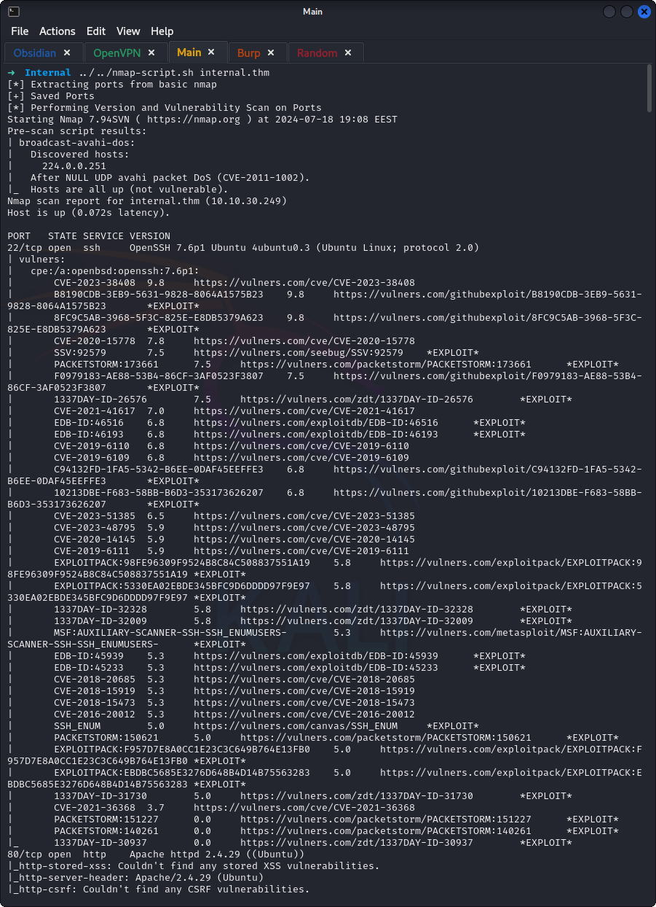
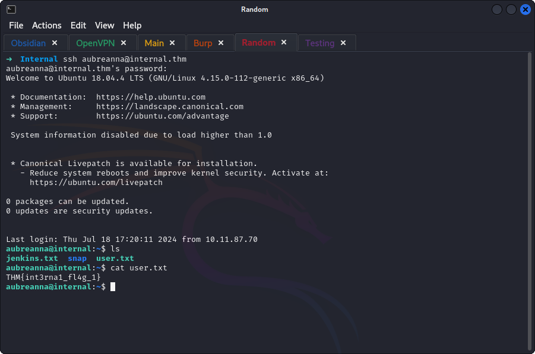
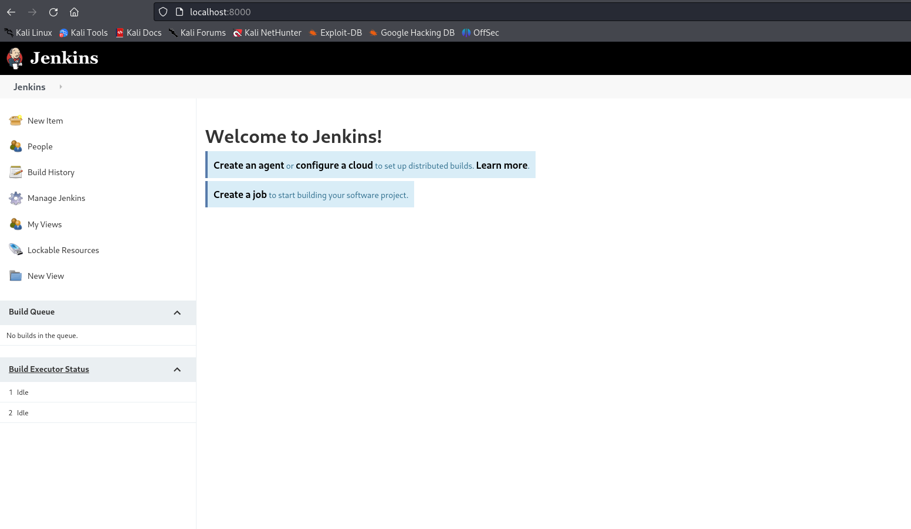

## **Enumeration**
>	- Running nmap script to get the open ports, their services and vulnerabilities.  
>	- Using `gobuster` to enumerate directories. 
>	- Visiting the pages found.
>	- `/blog` page loads. 
>	- `/javascript` page requires permissions, and `/phpmyadmin` loads but default credentials don't work. 
>	- From the nmap scan, a login page could be found at `/blog/wp-login.php`. 

## **Exploitation**
>	- Using `wpscan` to scan the login page.  
>	- A user `admin` was found, trying to get the password using `wpscan --url internal.thm/blog -U admin -P /usr/share/wordlists/rockyou.txt `. 
>	- Changing the `404` page to load a reverse shell. 
>	- Opening an `nc` listener and loading the page by visiting `/`.

## **Enumeration v2**
>	- Spawning a bash shell using `python3 -c 'import pty;pty.spawn("/bin/bash")`.
>	- After traversing the machine, credentials were found in `/opt/wp-save.txt`. 
>	- `SSH`ing into the machine with the found credentials.
>	- `User.txt` is found. 
>	- The `jenkins.txt` file shows an internal server. 
>	- Using SSH Port Forwarding using `ssh -L 8000:172.17.0.2:8080 aubreanna@internal.thm` to make the server available to us. 
>	- Now visiting `localhost:8000` should show us the internal server. 
>	- Getting the post request through burp and saving it. 
>	- Changing the password parameter to be fuzzable and keeping the username as admin. 
>	- Using `ffuf` to fuzz the credentials. 
>	- No correct password, figured I would try another tool. Using `hydra localhost -f http-form-post "/j_acegi_security_check:j_username=^USER^&j_password=^PASS^&from=%2F&Submit=Sign+in&Login=Login:Invalid username or password" -s 8000 -V -l admin -P /usr/share/wordlists/rockyou.txt `. 
>	- 

## **Privilege Escalation**
>	- After searching online for jenkins reverse shell, found a script to be run in `Manage Jenkins > Tools and Actions > Script Console`. 
>	- After traversing the machine, root credentials were found in `/opt/note.txt`. 
>	- `SSH`ing into the machine with root credentials and getting the flag. 